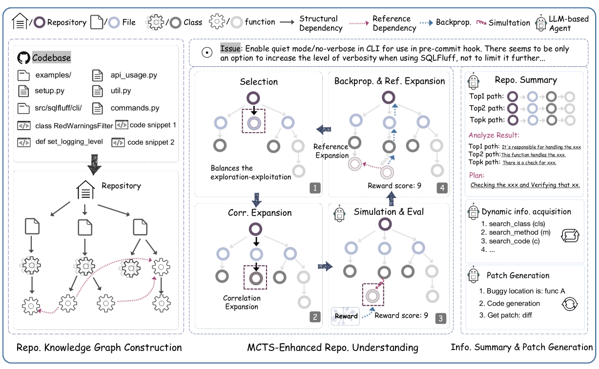
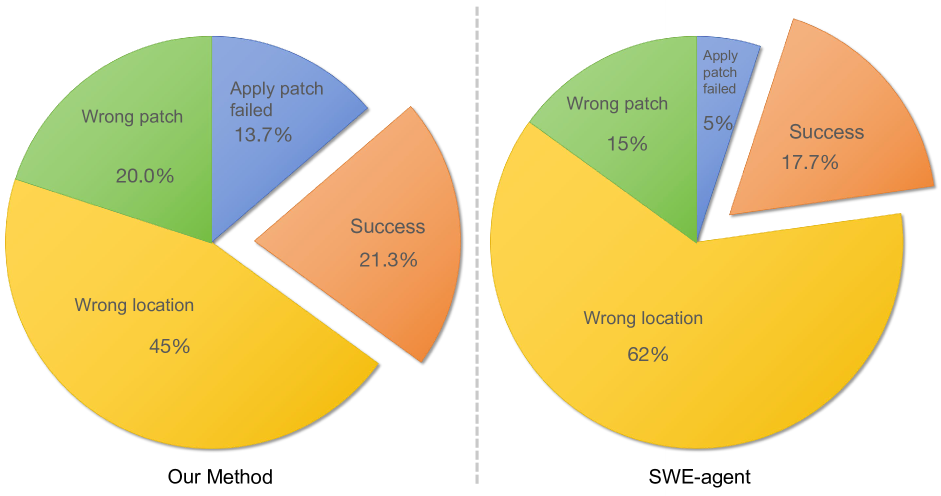

# 探索软件仓库全貌：一窥其奥秘。

发布时间：2024年06月03日

`Agent

这篇论文介绍了一种新型的自动软件工程（ASE）方法，名为RepoUnderstander，它旨在引导代理深入理解整个代码库。该方法通过构建代码库知识图谱和采用蒙特卡洛树搜索策略来增强代理的理解能力，并利用代码库级知识进行总结、分析和规划。这种方法特别强调了代理在处理软件系统全局上下文和内部依赖方面的能力，这与Agent分类下的研究方向相符，即关注如何设计和实现能够理解和操作复杂系统的智能代理。` `软件工程` `知识图谱`

> How to Understand Whole Software Repository?

# 摘要

> 近期，基于大型语言模型（LLM）的代理推动了自动软件工程（ASE）的重大发展。尽管现有方法在处理代码局部信息方面表现出色，但它们在捕捉软件系统全局上下文和内部依赖方面存在局限。借鉴人类软件工程师的经验，我们认为全面理解整个代码库是ASE的关键。然而，这一目标面临诸多挑战，如代码输入冗长、信息嘈杂、依赖关系复杂等。为此，我们推出了RepoUnderstander，一种新型ASE方法，旨在引导代理深入理解整个代码库。我们首先通过构建代码库知识图谱，以自顶向下的方式简化代码库的复杂性。接着，我们采用蒙特卡洛树搜索策略，增强代理对代码库的理解能力。此外，我们还指导代理利用代码库级知识进行总结、分析和规划，使其能够灵活地获取信息并生成补丁，有效解决GitHub上的实际问题。实验结果显示，RepoUnderstander在SWE-bench Lite基准测试中相比SWE-agent提升了18.5%，证明了其卓越的性能和有效性。

> Recently, Large Language Model (LLM) based agents have advanced the significant development of Automatic Software Engineering (ASE). Although verified effectiveness, the designs of the existing methods mainly focus on the local information of codes, e.g., issues, classes, and functions, leading to limitations in capturing the global context and interdependencies within the software system. From the practical experiences of the human SE developers, we argue that an excellent understanding of the whole repository will be the critical path to ASE. However, understanding the whole repository raises various challenges, e.g., the extremely long code input, the noisy code information, the complex dependency relationships, etc. To this end, we develop a novel ASE method named RepoUnderstander by guiding agents to comprehensively understand the whole repositories. Specifically, we first condense the critical information of the whole repository into the repository knowledge graph in a top-to-down mode to decrease the complexity of repository. Subsequently, we empower the agents the ability of understanding whole repository by proposing a Monte Carlo tree search based repository exploration strategy. In addition, to better utilize the repository-level knowledge, we guide the agents to summarize, analyze, and plan. Then, they can manipulate the tools to dynamically acquire information and generate the patches to solve the real-world GitHub issues. Extensive experiments demonstrate the superiority and effectiveness of the proposed RepoUnderstander. It achieved 18.5\% relative improvement on the SWE-bench Lite benchmark compared to SWE-agent.

[Arxiv](https://arxiv.org/abs/2406.01422)