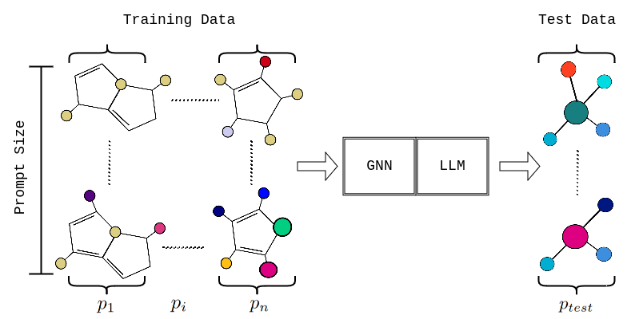
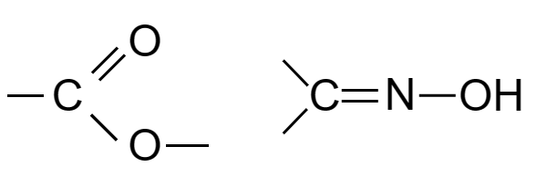
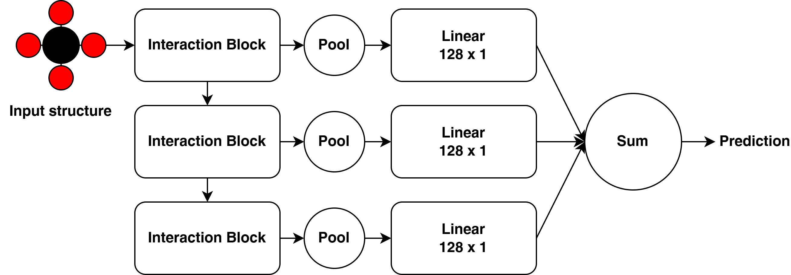
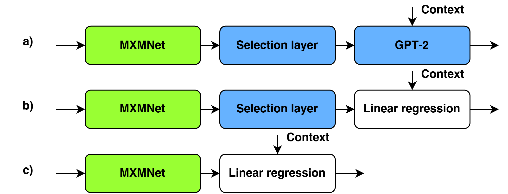

# 物理属性情境学习：快速适应分布外的分子图结构

发布时间：2024年06月03日

`LLM应用

理由：这篇论文探讨了大型语言模型（LLM）在特定应用场景下的能力，即通过情境学习预测非典型材料属性。它描述了一个复合模型，结合了GPT-2和几何感知的图神经网络，以提高在特定数据集上的性能。这种应用展示了LLM在材料科学领域的实际应用潜力，因此属于LLM应用类别。` `材料科学` `机器学习`

> In-Context Learning of Physical Properties: Few-Shot Adaptation to Out-of-Distribution Molecular Graphs

# 摘要

> 大型语言模型通过情境学习，能够仅凭少量示例就适应新任务，这种能力在推理阶段尤为突出。我们在此研究中提出疑问：是否能借助情境学习预测非典型材料属性？然而，对于结构属性预测，若无途径将原子级几何特征有效传递给变压器模型，这一设想难以实现。为此，我们构建了一个复合模型，其中GPT-2与几何感知的图神经网络协同工作，以情境信息为导向。通过将QM9数据集中的分子按共同子结构分组，并以此进行情境学习，我们的模型在处理非典型示例时表现卓越，超越了传统图神经网络的性能。

> Large language models manifest the ability of few-shot adaptation to a sequence of provided examples. This behavior, known as in-context learning, allows for performing nontrivial machine learning tasks during inference only. In this work, we address the question: can we leverage in-context learning to predict out-of-distribution materials properties? However, this would not be possible for structure property prediction tasks unless an effective method is found to pass atomic-level geometric features to the transformer model. To address this problem, we employ a compound model in which GPT-2 acts on the output of geometry-aware graph neural networks to adapt in-context information. To demonstrate our model's capabilities, we partition the QM9 dataset into sequences of molecules that share a common substructure and use them for in-context learning. This approach significantly improves the performance of the model on out-of-distribution examples, surpassing the one of general graph neural network models.

[Arxiv](https://arxiv.org/abs/2406.01808)