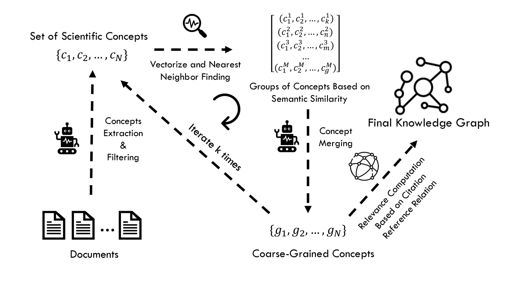
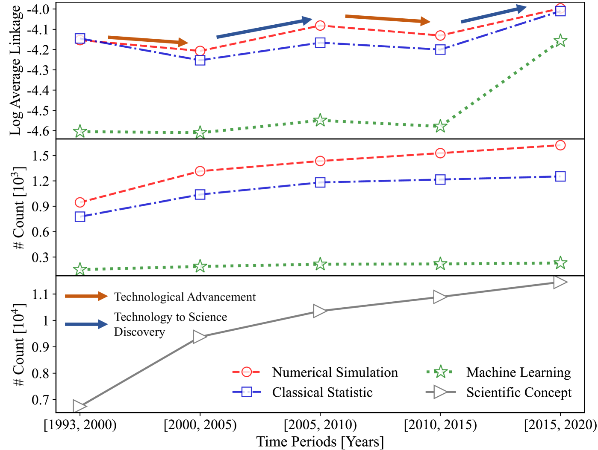
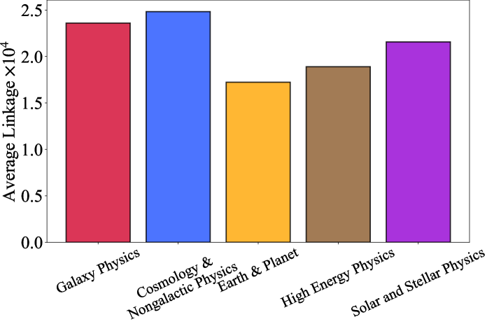

# 天文研究中，借助大语言模型构建的知识图谱，正量化着跨学科科学发现的驱动力。

发布时间：2024年06月03日

`LLM应用

这篇论文摘要描述了使用大型语言模型（LLM）从大量天文学文献中提取关键概念，并构建知识图谱以分析和预测科学发现的过程。这种方法利用了LLM的能力来处理和分析大规模数据集，特别是在跨学科研究中识别关键因素。因此，这项工作属于LLM的应用领域，具体是在科学研究和知识发现中的应用。` `天文学` `科学研究`

> Knowledge Graph in Astronomical Research with Large Language Models: Quantifying Driving Forces in Interdisciplinary Scientific Discovery

# 摘要

> 为了推动科学发现，识别并预测跨学科研究成功的关键因素至关重要。然而，量化天文学中新思想与技术进步的融合程度，以及这些技术如何促进科学突破，目前尚无有效方法。大型语言模型因其能从海量文献中提取关键概念的能力，成为量化这些过程的新工具。本研究利用大型语言模型，从1993至2024年间发表的297,807篇天文学文献中提取了24,939个概念，构建了一个知识图谱。图谱中概念间的链接强度基于它们通过引用关系的关联性。通过分析不同时间段内的关联性，我们评估了数值模拟和机器学习对天文学的影响。知识图谱揭示了两个发展阶段：技术整合阶段和科学探索阶段。尽管机器学习在天文学中取得了显著进展，但在人工智能与天文学的交叉领域，新概念的缺乏可能成为阻碍机器学习进一步革新天文学的瓶颈。

> Identifying and predicting the factors that contribute to the success of interdisciplinary research is crucial for advancing scientific discovery. However, there is a lack of methods to quantify the integration of new ideas and technological advancements in astronomical research and how these new technologies drive further scientific breakthroughs. Large language models, with their ability to extract key concepts from vast literature beyond keyword searches, provide a new tool to quantify such processes. In this study, we extracted concepts in astronomical research from 297,807 publications between 1993 and 2024 using large language models, resulting in a set of 24,939 concepts. These concepts were then used to form a knowledge graph, where the link strength between any two concepts was determined by their relevance through the citation-reference relationships. By calculating this relevance across different time periods, we quantified the impact of numerical simulations and machine learning on astronomical research. The knowledge graph demonstrates two phases of development: a phase where the technology was integrated and another where the technology was explored in scientific discovery. The knowledge graph reveals that despite machine learning has made much inroad in astronomy, there is currently a lack of new concept development at the intersection of AI and Astronomy, which may be the current bottleneck preventing machine learning from further transforming the field of astronomy.

[Arxiv](https://arxiv.org/abs/2406.01391)