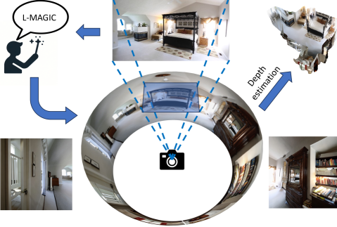
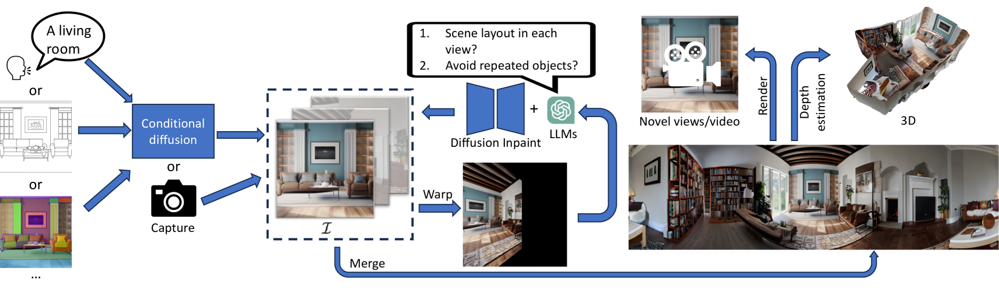
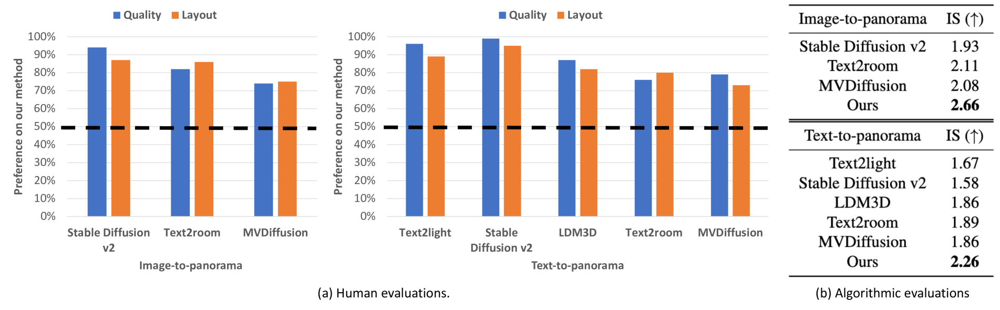
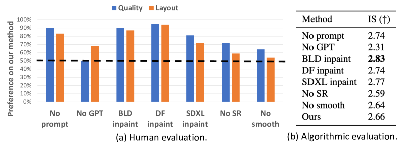
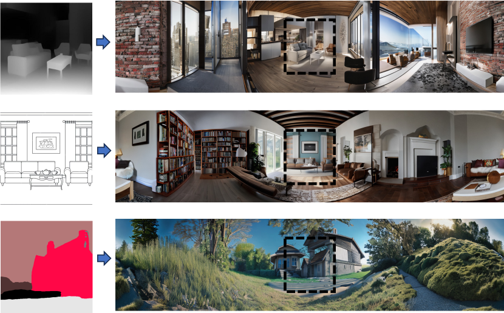
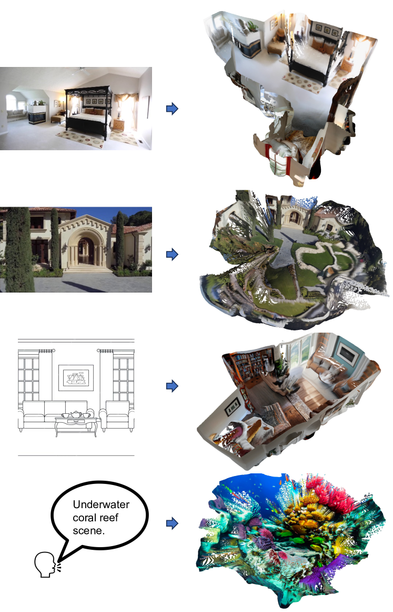
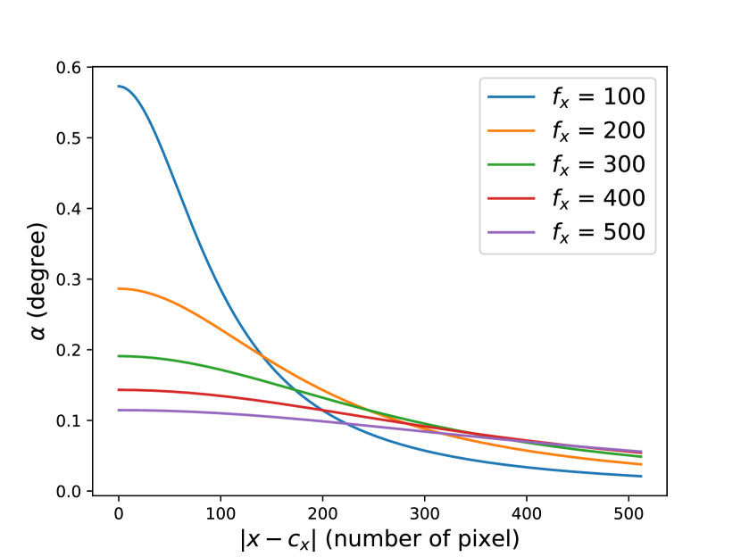

# L-MAGIC：借助语言模型，生成连贯图像的魔法

发布时间：2024年06月03日

`LLM应用

这篇论文介绍了一种名为L-MAGIC的方法，该方法利用大型语言模型（LLM）来辅助生成360度全景场景的多视角图像。这种方法不需要对预训练模型进行微调，能够实现零-shot性能，并通过超分辨率和多视角融合技术提高图像质量。L-MAGIC在生成全景场景的布局和视角渲染方面超越了现有技术，并且在人类评估中获得了高偏好率。此外，该方法能够接受多种输入模式，并结合深度估计技术实现3D点云生成和动态场景的流畅探索。因此，这篇论文属于LLM应用类别，因为它展示了如何将LLM技术应用于图像生成领域，以解决特定的技术挑战。` `计算机视觉` `虚拟现实`

> L-MAGIC: Language Model Assisted Generation of Images with Coherence

# 摘要

> 在生成AI技术飞速发展的今天，从单张图片生成全景场景仍是一大挑战。现有技术多依赖于扩散模型进行迭代或多视角修复，但常因缺乏全局场景布局先验而导致输出中出现重复物体，或需耗时的人工文本输入来精细调整每个视角。为此，我们创新性地提出了L-MAGIC方法，它巧妙地结合了大型语言模型，在生成360度全景场景的多视角时提供智能指导。L-MAGIC无需对预训练模型进行微调，即能保证零-shot性能，并通过超分辨率和多视角融合技术进一步提升图像质量。实验结果显示，L-MAGIC生成的全景场景在布局和视角渲染上均超越了现有技术，人类评估中偏好率高达70%以上。此外，L-MAGIC能灵活接受包括文本、深度图、草图等多种输入模式，并结合深度估计技术，实现3D点云生成和动态场景的流畅探索。代码及演示视频已公开，详情请访问GitHub和YouTube链接。

> In the current era of generative AI breakthroughs, generating panoramic scenes from a single input image remains a key challenge. Most existing methods use diffusion-based iterative or simultaneous multi-view inpainting. However, the lack of global scene layout priors leads to subpar outputs with duplicated objects (e.g., multiple beds in a bedroom) or requires time-consuming human text inputs for each view. We propose L-MAGIC, a novel method leveraging large language models for guidance while diffusing multiple coherent views of 360 degree panoramic scenes. L-MAGIC harnesses pre-trained diffusion and language models without fine-tuning, ensuring zero-shot performance. The output quality is further enhanced by super-resolution and multi-view fusion techniques. Extensive experiments demonstrate that the resulting panoramic scenes feature better scene layouts and perspective view rendering quality compared to related works, with >70% preference in human evaluations. Combined with conditional diffusion models, L-MAGIC can accept various input modalities, including but not limited to text, depth maps, sketches, and colored scripts. Applying depth estimation further enables 3D point cloud generation and dynamic scene exploration with fluid camera motion. Code is available at https://github.com/IntelLabs/MMPano. The video presentation is available at https://youtu.be/XDMNEzH4-Ec?list=PLG9Zyvu7iBa0-a7ccNLO8LjcVRAoMn57s.

[Arxiv](https://arxiv.org/abs/2406.01843)