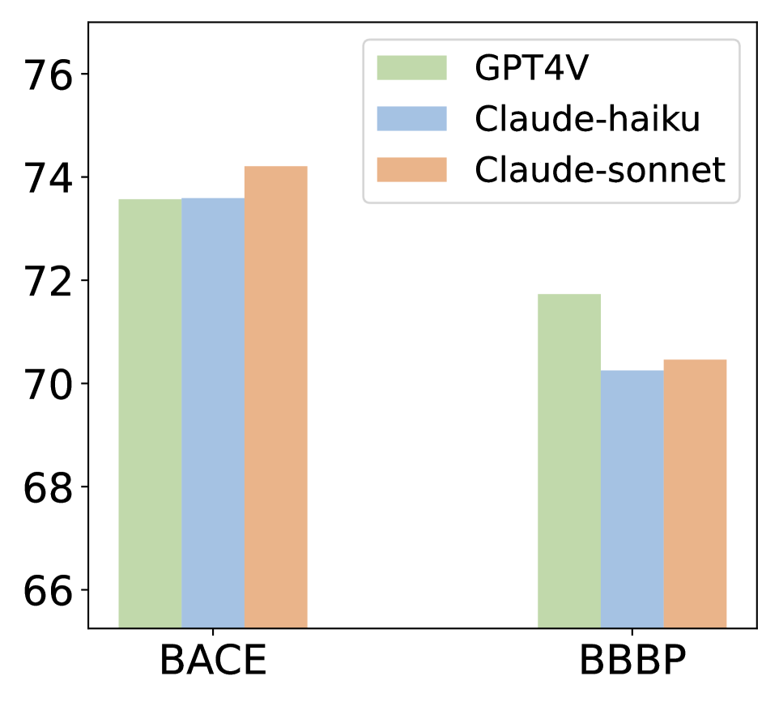

# 大型语言模型（LLM）与图神经网络（GNN）相辅相成：通过蒸馏技术，将 LLM 应用于多模态图学习，以提升学习效果。

发布时间：2024年06月03日

`LLM应用

这篇论文介绍了一种新的框架GALLON，它结合了大型语言模型（LLMs）和图神经网络（GNNs）的优势，通过将多模态知识整合到多层感知器（MLP）中，以提高分子特性预测的准确性和效率。这种方法特别关注于如何利用LLMs和GNNs来处理分子数据中的文本和视觉信息，以及图结构信息。因此，这篇论文属于LLM应用类别，因为它展示了如何将LLMs应用于特定的实际问题——分子特性预测。` `药物发现`

> LLM and GNN are Complementary: Distilling LLM for Multimodal Graph Learning

# 摘要

> 图神经网络（GNNs）的进步，让复杂分子结构的特性预测能力大增。但分子数据不仅限于图结构，还包括GNNs难以处理的文本和视觉信息。为此，我们提出了一种新框架——GALLON（大型语言模型蒸馏的图学习），它通过将多模态知识整合到多层感知器（MLP）中，巧妙结合了LLMs和GNNs的优势。这一方法不仅融合了分子的文本与视觉信息，还利用了GNNs的结构分析力。实验证明，我们的蒸馏MLP模型在分子特性预测上，无论是准确性还是效率，都有显著提升。

> Recent progress in Graph Neural Networks (GNNs) has greatly enhanced the ability to model complex molecular structures for predicting properties. Nevertheless, molecular data encompasses more than just graph structures, including textual and visual information that GNNs do not handle well. To bridge this gap, we present an innovative framework that utilizes multimodal molecular data to extract insights from Large Language Models (LLMs). We introduce GALLON (Graph Learning from Large Language Model Distillation), a framework that synergizes the capabilities of LLMs and GNNs by distilling multimodal knowledge into a unified Multilayer Perceptron (MLP). This method integrates the rich textual and visual data of molecules with the structural analysis power of GNNs. Extensive experiments reveal that our distilled MLP model notably improves the accuracy and efficiency of molecular property predictions.

[Arxiv](https://arxiv.org/abs/2406.01032)