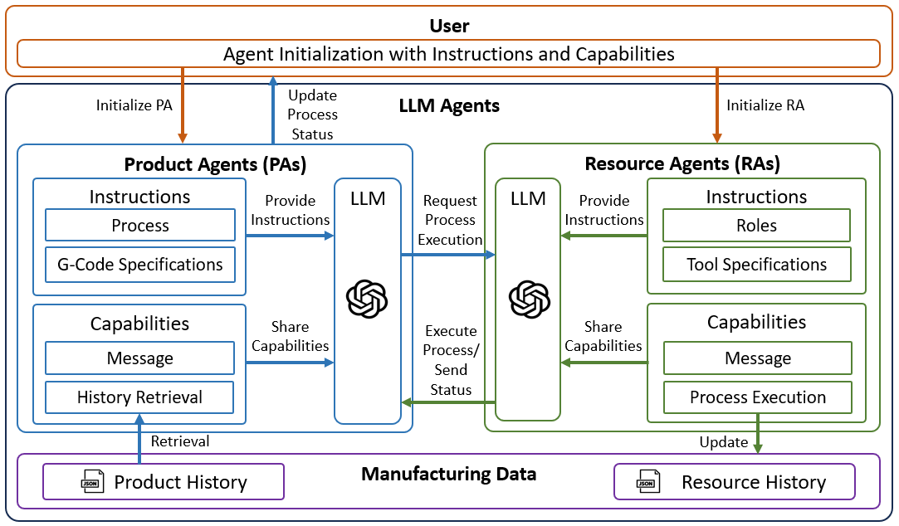
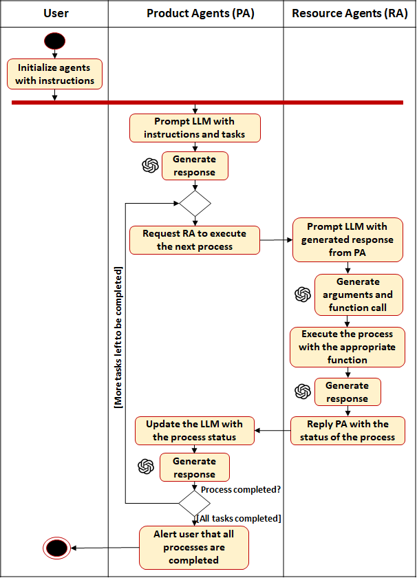
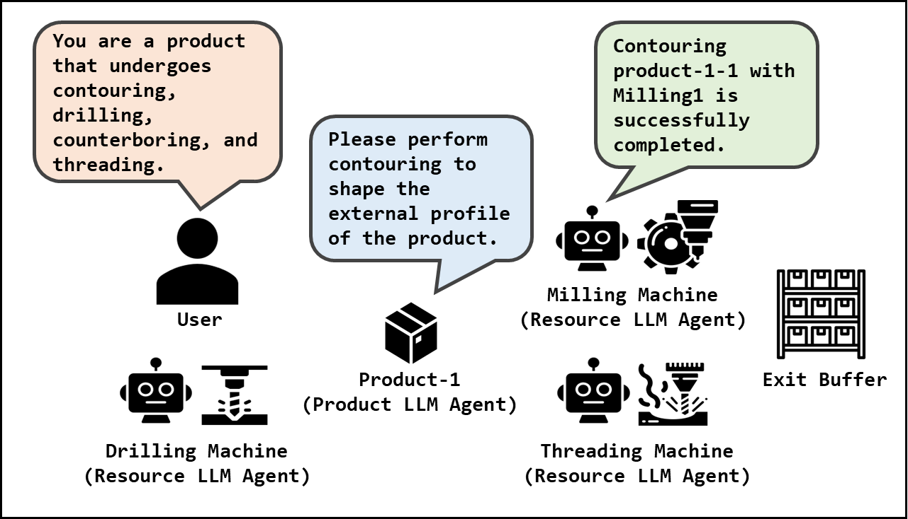
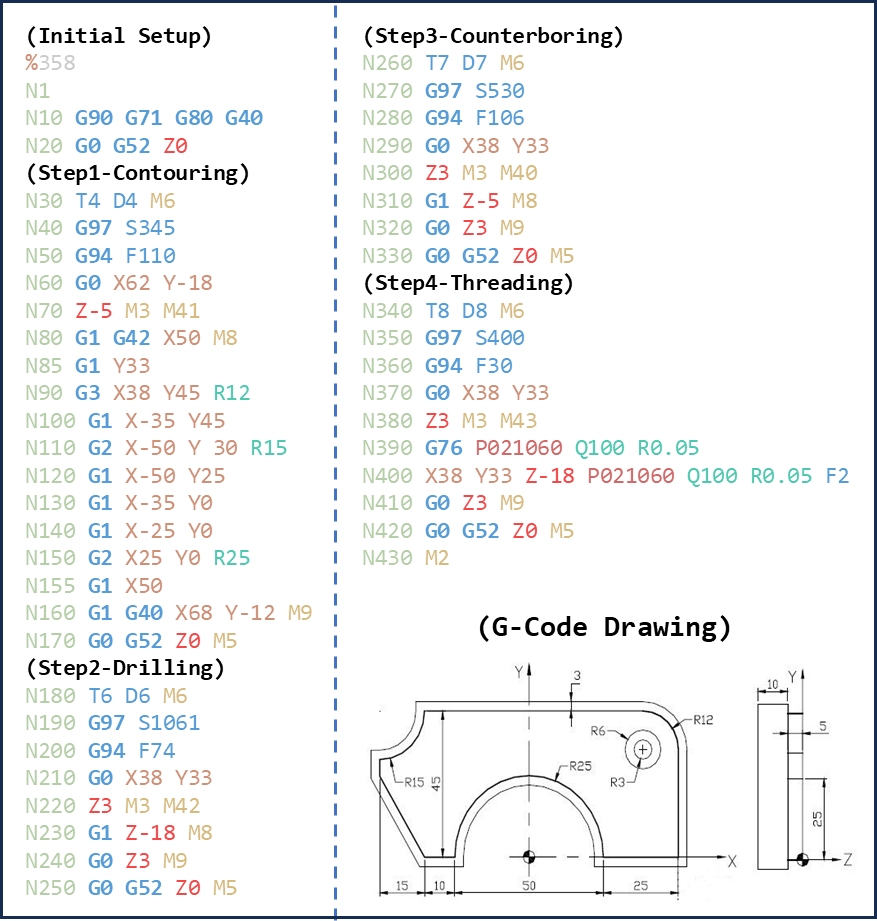
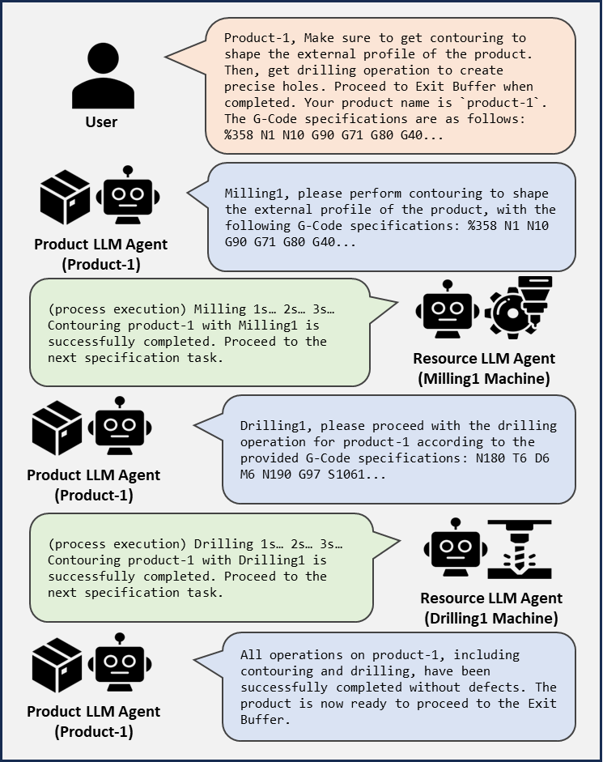

# 大型语言模型赋能的多代理制造系统

发布时间：2024年06月03日

`Agent

这篇论文主要探讨了如何通过引入大型语言模型（如GPT-3.5和GPT-4）来增强多代理系统在制造业中的应用。论文提出了一种新框架，旨在提高代理的自然语言交流能力、理解人类指令的能力以及操作的灵活性。这些改进使得代理系统能更好地适应环境变化和生产调整，从而在制造业中发挥更大的作用。因此，这篇论文应归类于Agent，因为它专注于通过大型语言模型提升代理系统的功能和效率。` `制造业`

> Large Language Model-Enabled Multi-Agent Manufacturing Systems

# 摘要

> 传统制造业在应对环境变化和生产调整时显得力不从心。尽管多代理系统提升了适应与协调，但在快速理解人类指令、操作灵活性及自然语言协调方面仍有提升空间。GPT-3.5和GPT-4等大型语言模型的引入，使得代理能够自然语言交流并依据人类指令做出决策，从而强化了多代理制造系统。本研究提出了一种新框架，通过大型语言模型增强制造代理的能力，使其更适应性强，能处理特定情境下的指令。案例研究证实了这一框架的实用性，展示了代理间如何高效沟通、理解任务并执行制造流程，包括精确的G代码分配。研究强调，持续整合大型语言模型至多代理制造系统，并开发高级代理通信协议，对于打造更灵活的制造系统至关重要。

> Traditional manufacturing faces challenges adapting to dynamic environments and quickly responding to manufacturing changes. The use of multi-agent systems has improved adaptability and coordination but requires further advancements in rapid human instruction comprehension, operational adaptability, and coordination through natural language integration. Large language models like GPT-3.5 and GPT-4 enhance multi-agent manufacturing systems by enabling agents to communicate in natural language and interpret human instructions for decision-making. This research introduces a novel framework where large language models enhance the capabilities of agents in manufacturing, making them more adaptable, and capable of processing context-specific instructions. A case study demonstrates the practical application of this framework, showing how agents can effectively communicate, understand tasks, and execute manufacturing processes, including precise G-code allocation among agents. The findings highlight the importance of continuous large language model integration into multi-agent manufacturing systems and the development of sophisticated agent communication protocols for a more flexible manufacturing system.

[Arxiv](https://arxiv.org/abs/2406.01893)