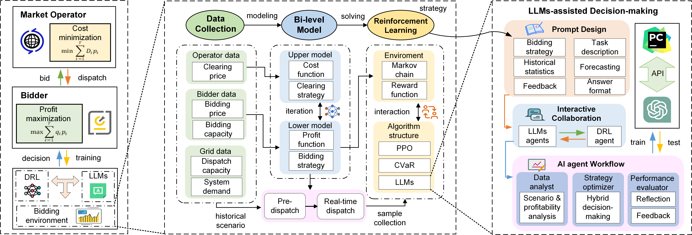
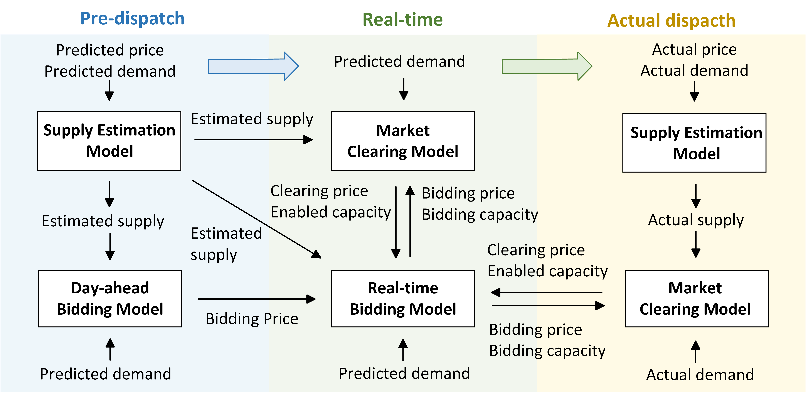
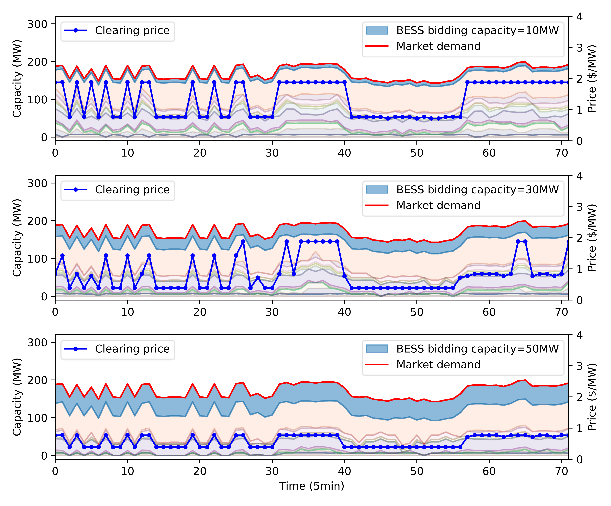
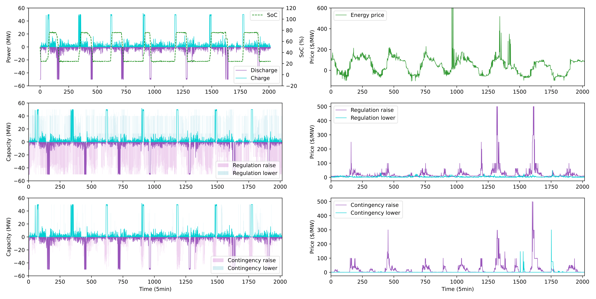
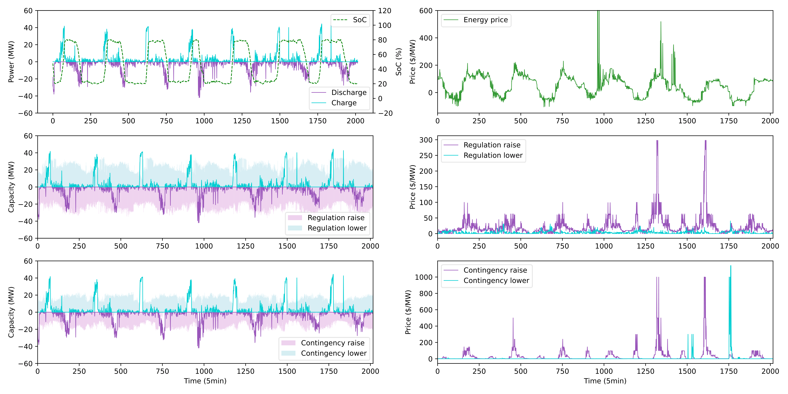
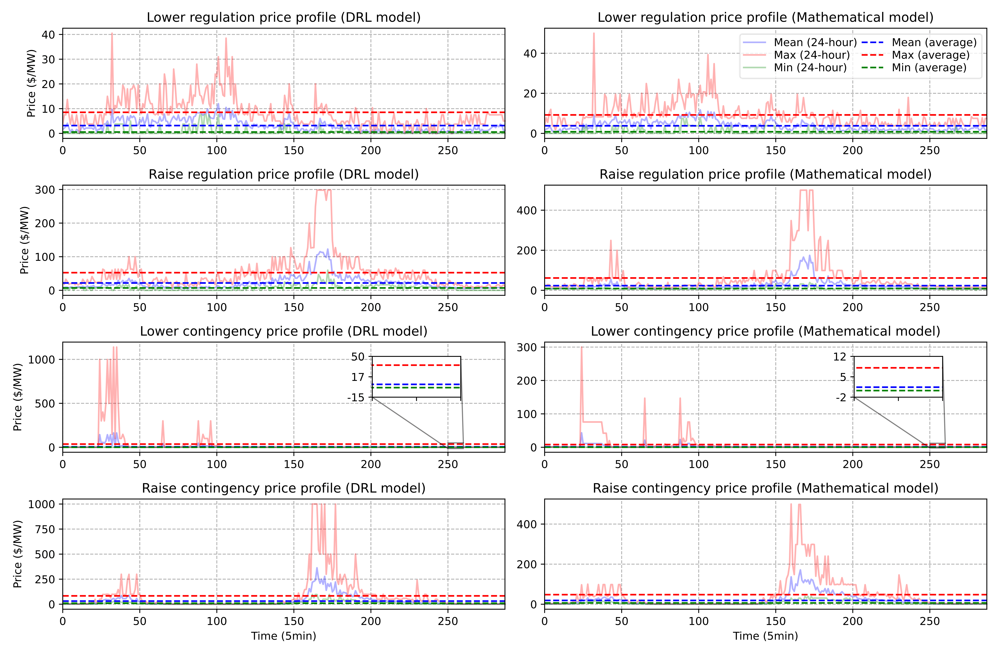
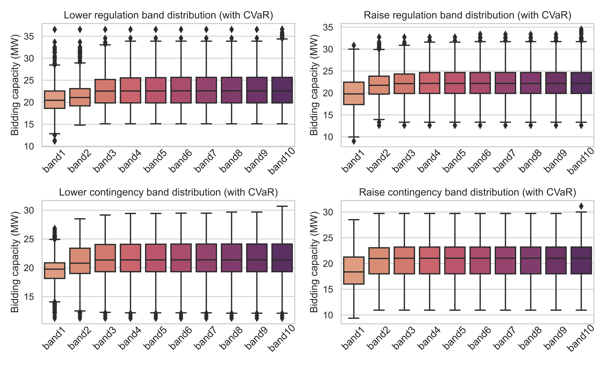
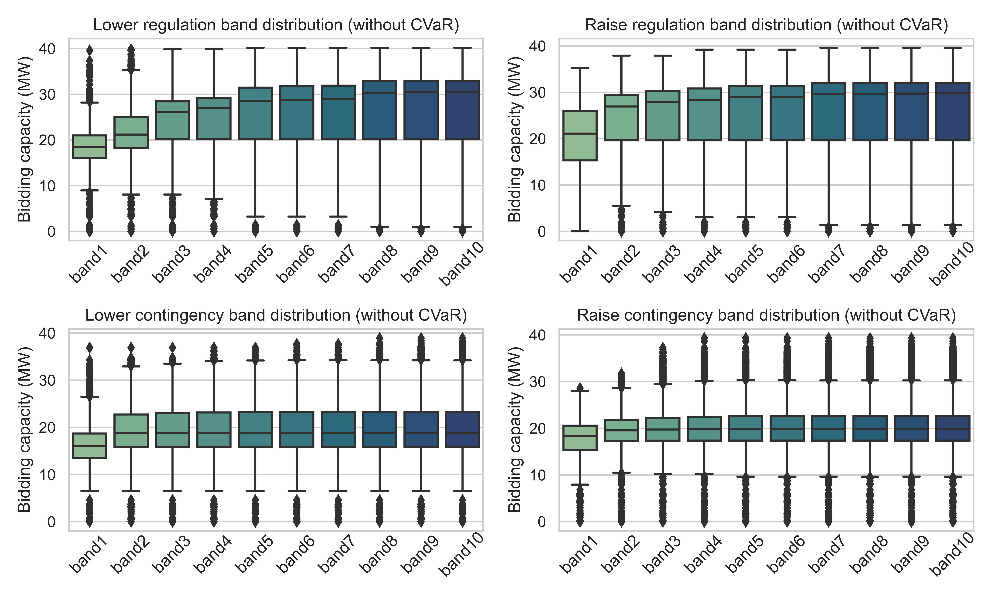
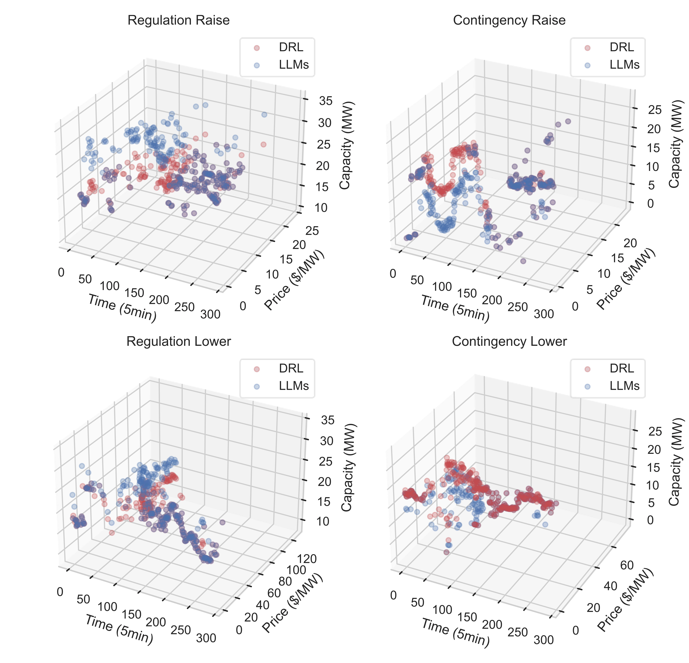
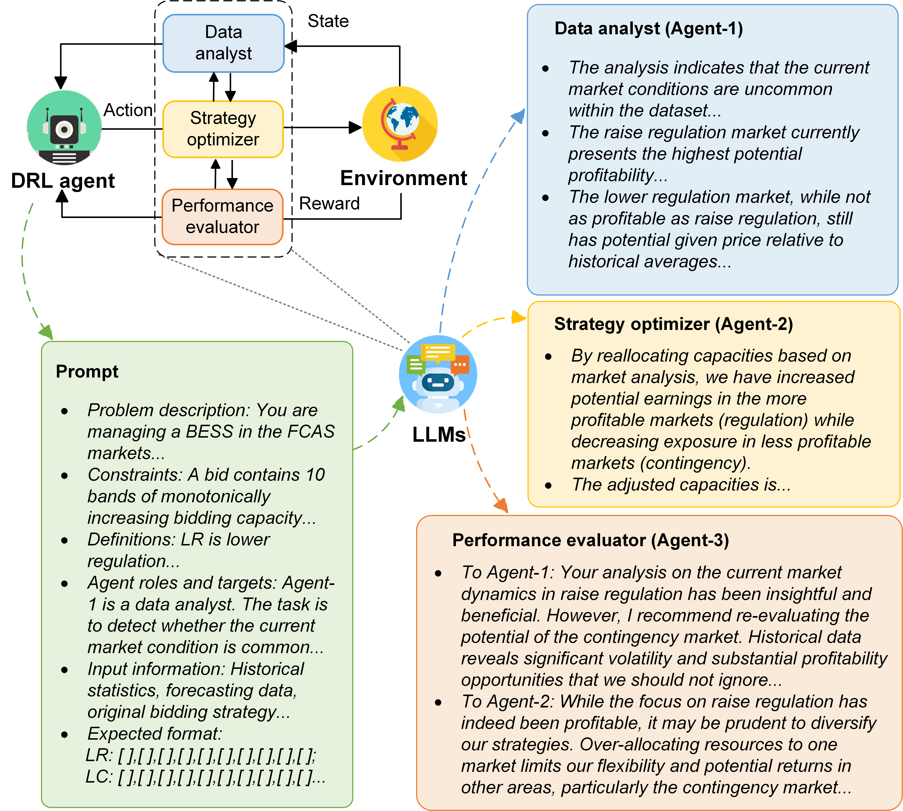

# 借助大型语言模型，电池储能系统在辅助服务市场中的最优投标策略：基于AI代理的探索

发布时间：2024年06月03日

`Agent

这篇论文主要讨论了在澳大利亚国家电力市场（NEM）中，如何利用深度强化学习（DRL）和大型语言模型（LLMs）来优化电池储能系统（BESS）的投标策略。文中提出了一种基于条件风险值（CVaR）的DRL算法，以及一个由LLMs辅助的AI代理交互决策框架，以提高在不确定新场景中策略的时效性、可靠性和可解释性。这个框架通过条件混合决策和自我反思机制，有效减少了由不确定性引起的利润损失，并提高了投标盈利性。因此，这篇论文更符合Agent分类，因为它主要关注于使用AI代理（包括DRL和LLMs）来解决实际问题。` `电力市场` `储能技术`

> Large Language Model Assisted Optimal Bidding of BESS in FCAS Market: An AI-agent based Approach

# 摘要

> 澳大利亚国家电力市场（NEM）为了鼓励电池储能系统（BESS）提供频率控制辅助服务（FCAS），近年来进行了向短期投标规则和更快速服务要求转变的改革。然而，现有投标优化方法常忽视FCAS市场流程的关键细节，导致市场投标过程描述失真。为此，我们基于实际投标数据和最新市场规则，将BESS投标问题转化为深度强化学习（DRL）问题。此外，市场信息预测的不完美导致DRL代理决策波动，增加了利润风险。因此，我们开发了基于条件风险值（CVaR）的DRL算法，以提升投标策略的风险抵御能力。即使在训练有素的DRL模型中，也存在在罕见场景下性能下降的问题。为此，我们提出了一个由大型语言模型（LLMs）辅助的AI代理交互决策框架，通过条件混合决策和自我反思机制，提高了在不确定新场景中策略的时效性、可靠性和可解释性。实验证明，该框架有效减少了由不确定性引起的利润损失，相比基准方法，实现了更高的投标盈利性。

> To incentivize flexible resources such as Battery Energy Storage Systems (BESSs) to offer Frequency Control Ancillary Services (FCAS), Australia's National Electricity Market (NEM) has implemented changes in recent years towards shorter-term bidding rules and faster service requirements. However, firstly, existing bidding optimization methods often overlook or oversimplify the key aspects of FCAS market procedures, resulting in an inaccurate depiction of the market bidding process. Thus, the BESS bidding problem is modeled based on the actual bidding records and the latest market specifications and then formulated as a deep reinforcement learning (DRL) problem. Secondly, the erratic decisions of the DRL agent caused by imperfectly predicted market information increases the risk of profit loss. Hence, a Conditional Value at Risk (CVaR)-based DRL algorithm is developed to enhance the risk resilience of bidding strategies. Thirdly, well-trained DRL models still face performance decline in uncommon scenarios during online operations. Therefore, a Large Language Models (LLMs)-assisted artificial intelligence (AI)-agent interactive decision-making framework is proposed to improve the strategy timeliness, reliability and interpretability in uncertain new scenarios, where conditional hybrid decision and self-reflection mechanisms are designed to address LLMs' hallucination challenge. The experiment results demonstrate that our proposed framework has higher bidding profitability compared to the baseline methods by effectively mitigating the profit loss caused by various uncertainties.

[Arxiv](https://arxiv.org/abs/2406.00974)