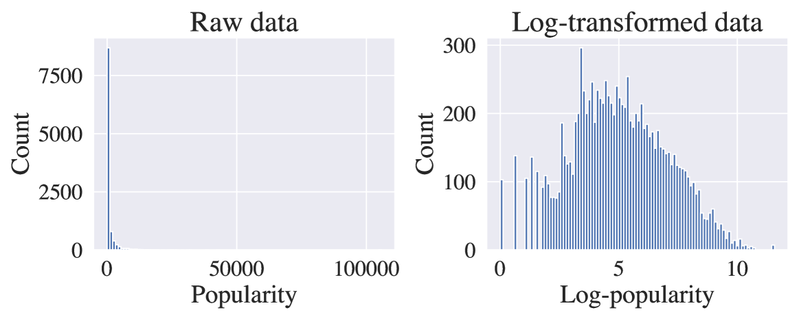
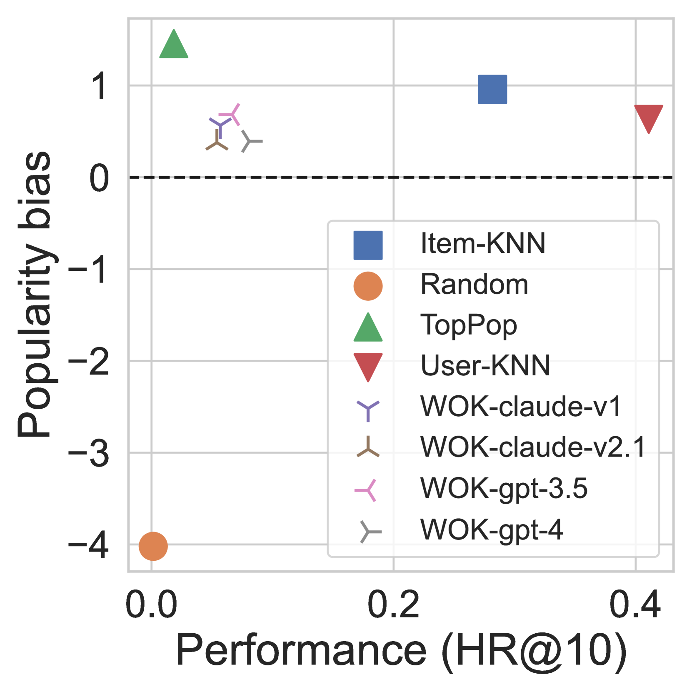
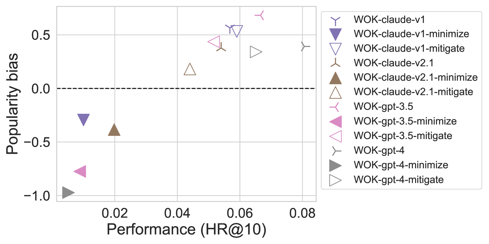
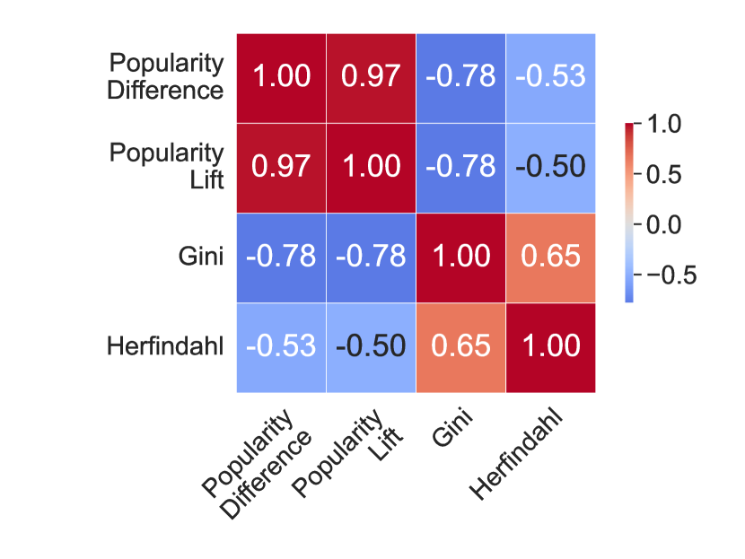
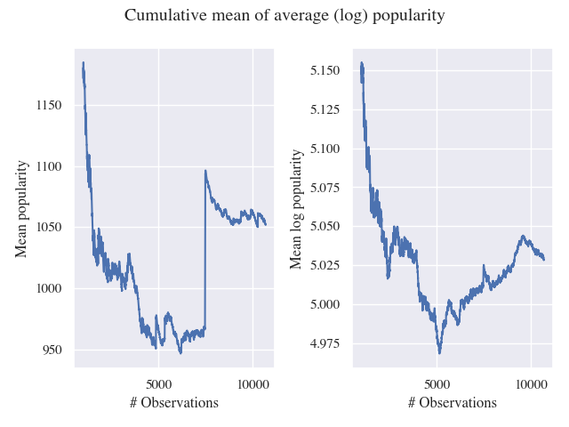

# 大型语言模型在推荐系统中的应用：探究流行度偏差的影响

发布时间：2024年06月03日

`LLM应用

这篇论文主要探讨了大型语言模型（LLMs）在推荐系统中的应用，特别是在处理流行度偏差问题上的作用。论文通过提出新的衡量流行度偏差的指标，并对比了基于LLM的推荐系统与传统系统的性能，发现LLM推荐系统在未采取明确措施的情况下，展现出的流行度偏差较小。这一研究属于LLM在特定应用场景（即推荐系统）中的实际应用和效果评估，因此应归类为LLM应用。` `推荐系统` `数据偏差`

> Large Language Models as Recommender Systems: A Study of Popularity Bias

# 摘要

> 推荐系统中的流行度偏差问题——即流行项目被过度推荐，而忽略了那些不那么热门但可能同样相关的项目——仍然是一个棘手的难题。近期，通用大型语言模型（LLMs）被融入推荐系统架构，这一进展引发了关于可能加剧流行度偏差的担忧，因为LLM的训练数据很可能以流行项目为主。然而，这也为通过提示调整来纠正偏差提供了新契机。我们的研究深入探讨了这一矛盾，考察LLMs在推荐系统中是加剧还是缓解了流行度偏差。我们提出了一种衡量流行度偏差的新方法，通过讨论现有指标并引入一个满足多项需求的新指标。基于这一新指标，我们在电影推荐任务上对比了基于LLM的推荐系统与传统系统，发现即使未采取明确措施，LLM推荐系统展现出的流行度偏差也较小。

> The issue of popularity bias -- where popular items are disproportionately recommended, overshadowing less popular but potentially relevant items -- remains a significant challenge in recommender systems. Recent advancements have seen the integration of general-purpose Large Language Models (LLMs) into the architecture of such systems. This integration raises concerns that it might exacerbate popularity bias, given that the LLM's training data is likely dominated by popular items. However, it simultaneously presents a novel opportunity to address the bias via prompt tuning. Our study explores this dichotomy, examining whether LLMs contribute to or can alleviate popularity bias in recommender systems. We introduce a principled way to measure popularity bias by discussing existing metrics and proposing a novel metric that fulfills a series of desiderata. Based on our new metric, we compare a simple LLM-based recommender to traditional recommender systems on a movie recommendation task. We find that the LLM recommender exhibits less popularity bias, even without any explicit mitigation.

[Arxiv](https://arxiv.org/abs/2406.01285)