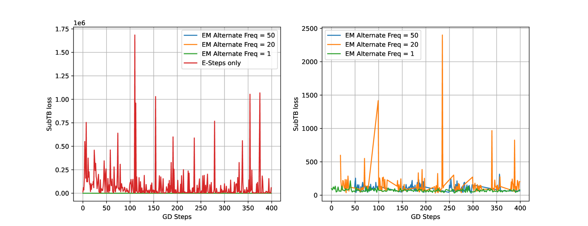

# 从大型语言模型中提取潜在逻辑树，揭示事件序列背后的逻辑结构

发布时间：2024年06月03日

`Agent

这篇论文主要描述了一种利用大型语言模型（LLMs）来生成基于逻辑树的解释的工具，该工具旨在为高风险系统中的事件序列提供定制化的洞察。这种方法特别强调了在Agent系统中的应用，其中Agent需要理解和解释复杂的事件序列，并基于这些解释做出决策。论文中提到的摊销期望最大化（EM）学习框架和GFlowNet生成逻辑树样本的方法，都是为了优化Agent在处理事件序列时的性能和适应性。因此，这篇论文更适合归类到Agent分类中。` `医疗保健` `机器人`

> Latent Logic Tree Extraction for Event Sequence Explanation from LLMs

# 摘要

> 在医疗保健或机器人等高风险系统中，大量的事件序列不断涌现。我们旨在开发一种高效且即插即用的工具，利用大型语言模型（LLMs）生成基于逻辑树的解释，为每个事件序列提供定制化的洞察。我们的方法基于时间点过程模型，通过似然函数评估逻辑树的质量。我们提出了一种摊销期望最大化（EM）学习框架，将逻辑树作为潜在变量处理。在E步骤中，我们利用LLM的先验知识和事件序列的似然性来评估逻辑树的后验分布。尽管LLM提供了高质量的先验，但后验分布的离散组合特性使得无法得到封闭解。因此，我们采用可学习的GFlowNet生成逻辑树样本，这是一种专为结构化离散变量设计的多样化生成器。在M步骤中，我们利用这些逻辑规则近似后验的边缘化，优化模型参数和LLM先验参数。在线应用中，我们的轻量级模型将通过几次迭代，从LLMs中提取出每个事件序列最相关的规则。实证结果表明，我们的框架在性能和适应性方面表现出色。

> Modern high-stakes systems, such as healthcare or robotics, often generate vast streaming event sequences. Our goal is to design an efficient, plug-and-play tool to elicit logic tree-based explanations from Large Language Models (LLMs) to provide customized insights into each observed event sequence. Built on the temporal point process model for events, our method employs the likelihood function as a score to evaluate generated logic trees. We propose an amortized Expectation-Maximization (EM) learning framework and treat the logic tree as latent variables. In the E-step, we evaluate the posterior distribution over the latent logic trees using an LLM prior and the likelihood of the observed event sequences. LLM provides a high-quality prior for the latent logic trees, however, since the posterior is built over a discrete combinatorial space, we cannot get the closed-form solution. We propose to generate logic tree samples from the posterior using a learnable GFlowNet, which is a diversity-seeking generator for structured discrete variables. The M-step employs the generated logic rules to approximate marginalization over the posterior, facilitating the learning of model parameters and refining the tunable LLM prior parameters. In the online setting, our locally built, lightweight model will iteratively extract the most relevant rules from LLMs for each sequence using only a few iterations. Empirical demonstrations showcase the promising performance and adaptability of our framework.

[Arxiv](https://arxiv.org/abs/2406.01124)