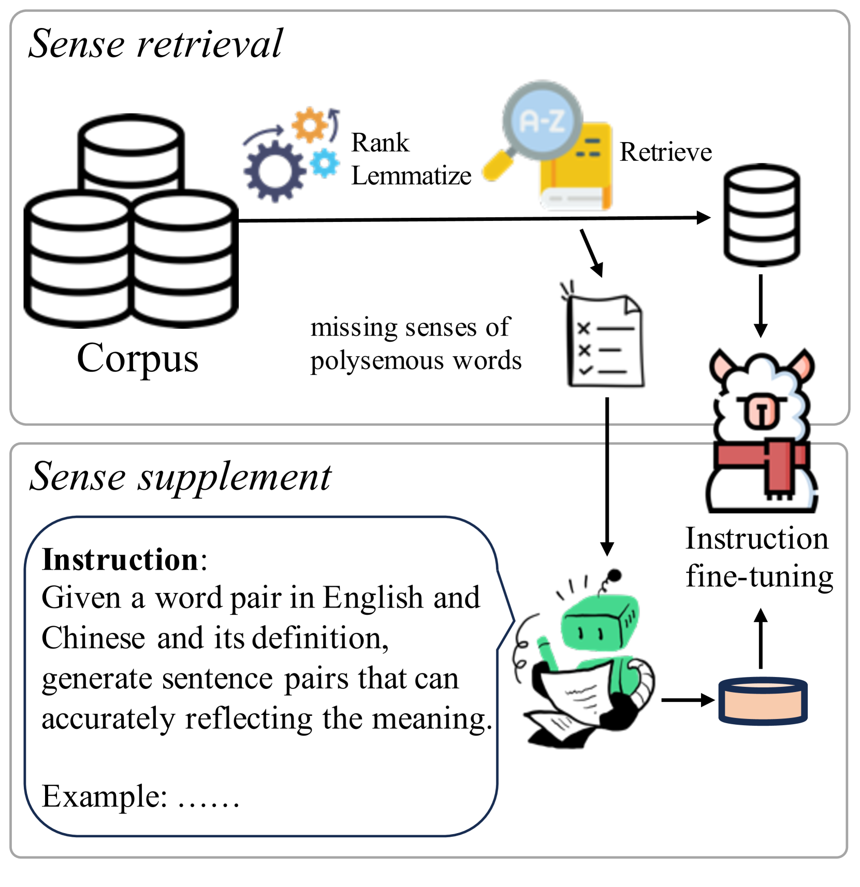
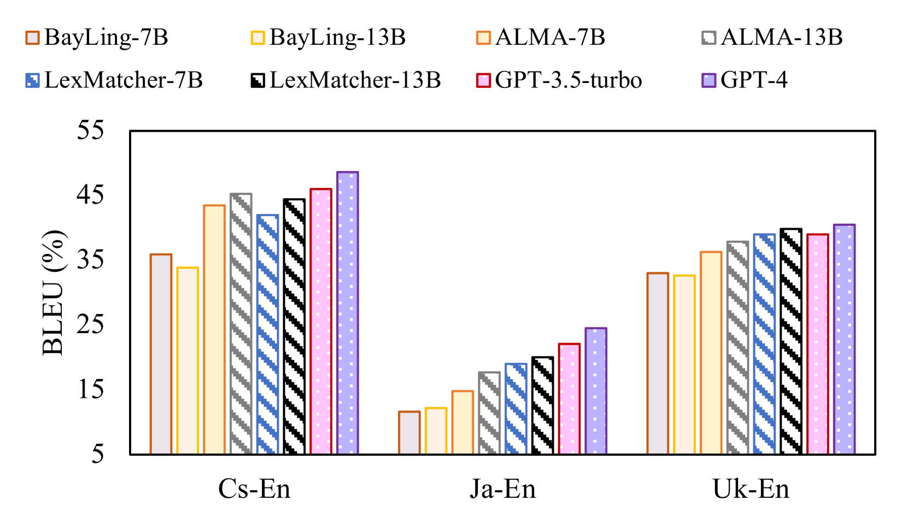
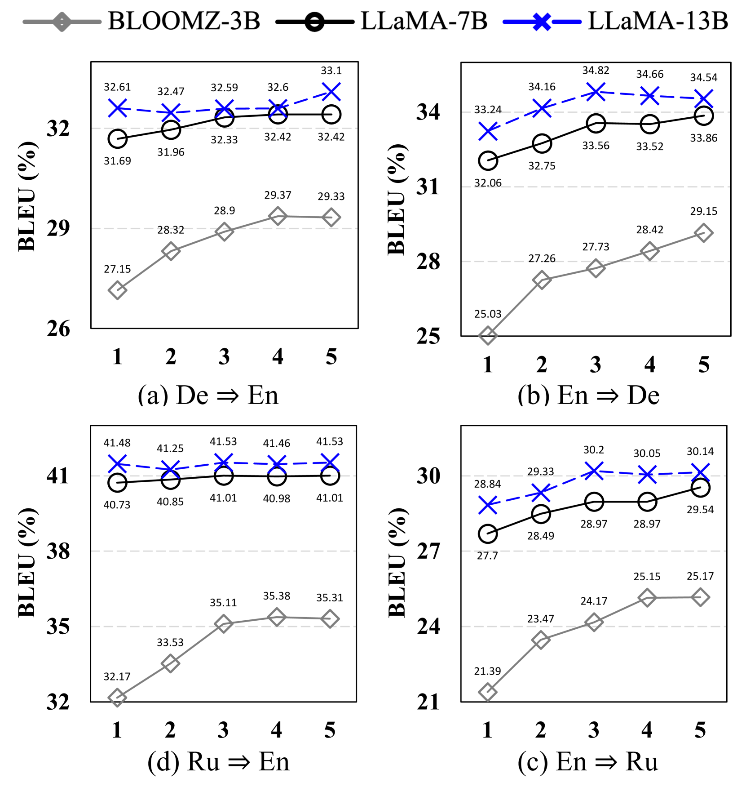
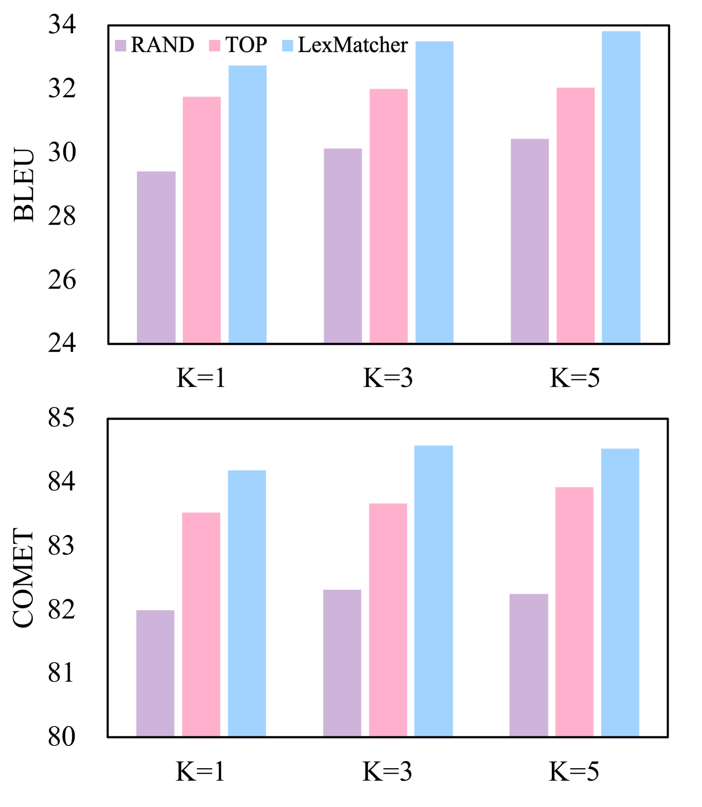
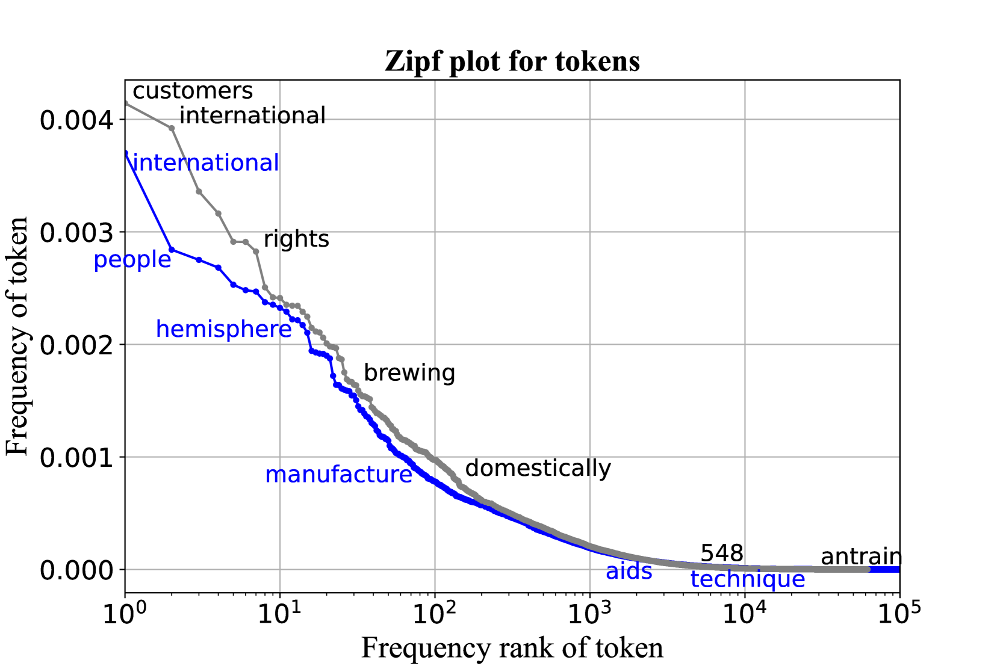
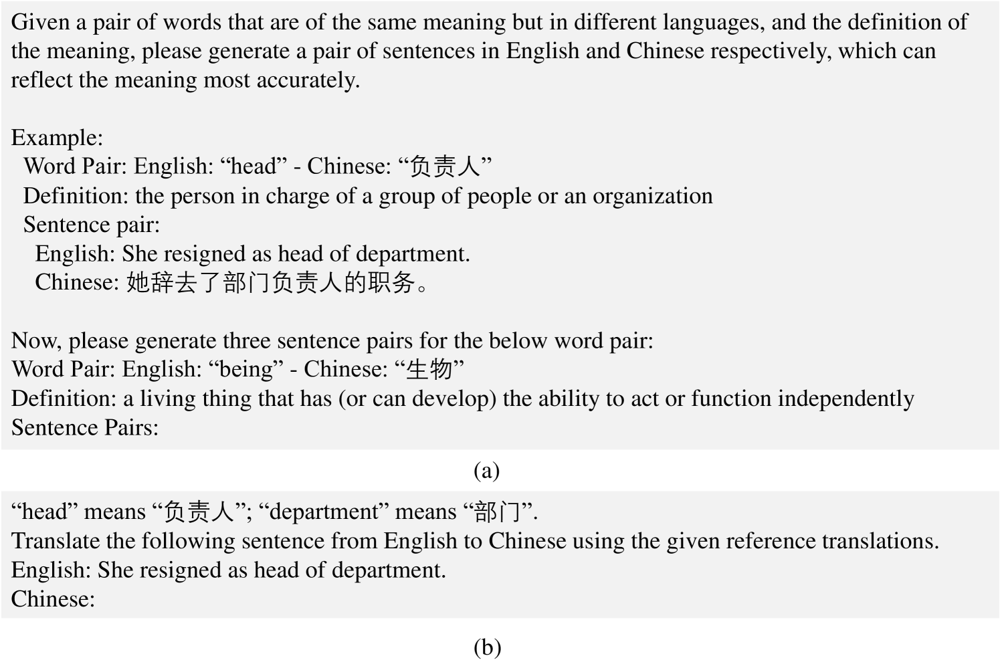

# LexMatcher：聚焦字典，优化基于大型语言模型的机器翻译数据收集

发布时间：2024年06月03日

`LLM应用

这篇论文摘要描述了一种名为 LexMatcher 的方法，该方法利用双语词典构建了一个数据集，用于微调大型语言模型（LLMs）以提高机器翻译的性能。这种方法特别关注于覆盖词典中的语义，并通过合成数据补充多义词的罕见语义。论文中提到，使用 LLaMA2 作为基础模型，LexMatcher 在 WMT2022 测试集上超越了传统基准，并在词义消歧和专业术语翻译等任务中展现了显著的性能提升。这表明论文主要关注于 LLM 在机器翻译领域的应用，因此应归类为LLM应用。` `机器翻译` `语言模型`

> LexMatcher: Dictionary-centric Data Collection for LLM-based Machine Translation

# 摘要

> 近期，开源大型语言模型（LLMs）在机器翻译领域的微调引起了广泛关注，这标志着研究重心从传统神经机器翻译转向了数据驱动的方法。尽管如此，机器翻译中指令微调所需的数据收集仍是一个相对未被深入探索的领域。本文提出的 LexMatcher 方法，通过利用双语词典，巧妙地构建了一个数据集，该数据集的设计重点在于覆盖词典中的语义。该数据集由现有语料库的一部分和一小部分合成的数据组成，后者专门用于补充多义词的罕见语义。以 LLaMA2 为基础模型，我们的方法不仅在 WMT2022 测试集上超越了传统基准，还在词义消歧和专业术语翻译等任务中展现了显著的性能提升。这些成果充分证明了 LexMatcher 在提升基于 LLM 的机器翻译性能方面的有效性。

> The fine-tuning of open-source large language models (LLMs) for machine translation has recently received considerable attention, marking a shift towards data-centric research from traditional neural machine translation. However, the area of data collection for instruction fine-tuning in machine translation remains relatively underexplored. In this paper, we present LexMatcher, a simple yet effective method for data collection that leverages bilingual dictionaries to generate a dataset, the design of which is driven by the coverage of senses found in these dictionaries. The dataset comprises a subset retrieved from an existing corpus and a smaller synthesized subset which supplements the infrequent senses of polysemous words. Utilizing LLaMA2 as our base model, our approach outperforms the established baselines on the WMT2022 test sets and also exhibits significant performance improvements in tasks related to word sense disambiguation and specialized terminology translation. These results underscore the effectiveness of LexMatcher in enhancing LLM-based machine translation.

[Arxiv](https://arxiv.org/abs/2406.01441)