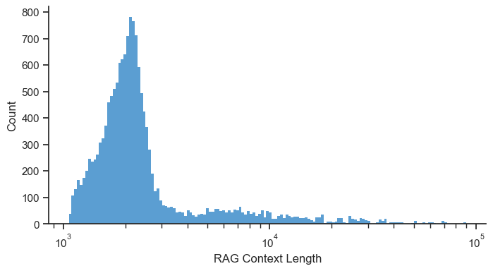

# Luna：高效精准捕捉语言模型幻觉的评估基石

发布时间：2024年06月03日

`RAG

理由：这篇论文主要讨论了Retriever Augmented Generation (RAG) 系统在工业应用中面临的挑战，即如何检测并减少模型生成的与检索上下文不符的“幻觉”信息。论文提出了一种名为Luna的解决方案，专门针对RAG环境下的幻觉检测进行优化。因此，这篇论文的内容与RAG系统的应用和改进紧密相关，属于RAG分类。` `语言模型`

> Luna: An Evaluation Foundation Model to Catch Language Model Hallucinations with High Accuracy and Low Cost

# 摘要

> 通过整合外部知识检索机制，Retriever Augmented Generation (RAG) 系统显著提升了语言模型的能力。但在工业应用中，这些系统面临一个关键挑战：如何检测并减少模型生成的与检索上下文不符的“幻觉”信息。为确保 LLMs 在多变工业环境中的响应既可靠又准确，解决这一问题至关重要。现有的幻觉检测技术难以同时满足准确、快速且经济的要求。为此，我们推出了 Luna：一款基于 DeBERTA-large（440M）的编码器，专为 RAG 环境下的幻觉检测优化。实证显示，Luna 在幻觉检测上不仅超越了 GPT-3.5，还大幅降低了成本和延迟，分别达 97% 和 96%。其轻量级设计及跨行业、跨领域的泛化能力，使 Luna 成为工业 LLM 应用的理想之选。

> Retriever Augmented Generation (RAG) systems have become pivotal in enhancing the capabilities of language models by incorporating external knowledge retrieval mechanisms. However, a significant challenge in deploying these systems in industry applications is the detection and mitigation of hallucinations: instances where the model generates information that is not grounded in the retrieved context. Addressing this issue is crucial for ensuring the reliability and accuracy of responses generated by large language models (LLMs) in diverse industry settings. Current hallucination detection techniques fail to deliver accuracy, low latency, and low cost simultaneously. We introduce Luna: a DeBERTA-large (440M) encoder, finetuned for hallucination detection in RAG settings. We demonstrate that Luna outperforms GPT-3.5 and commercial evaluation frameworks on the hallucination detection task, with 97% and 96% reduction in cost and latency, respectively. Luna is lightweight and generalizes across multiple industry verticals and out-of-domain data, making it an ideal candidate for industry LLM applications.

[Arxiv](https://arxiv.org/abs/2406.00975)