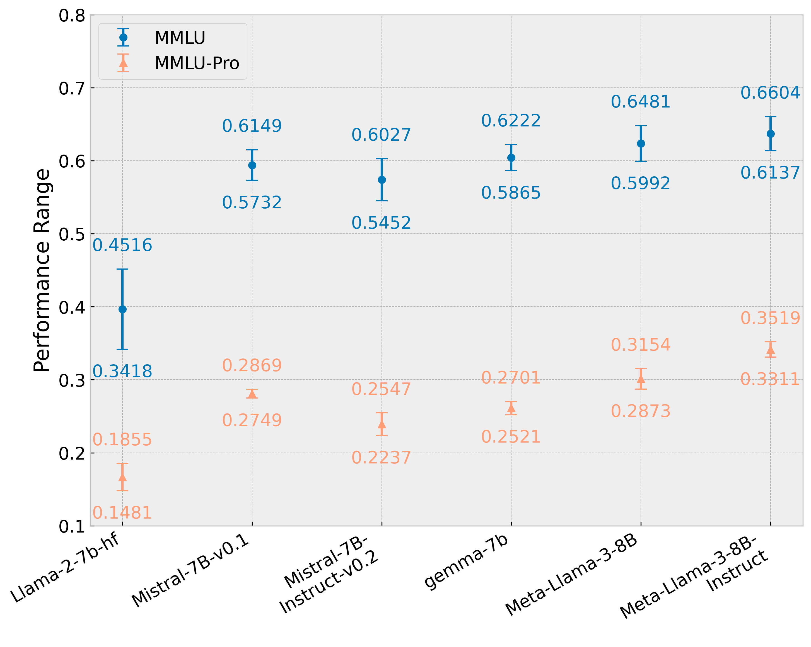

# MMLU-Pro：打造更稳健、更具挑战性的多任务语言理解新标杆

发布时间：2024年06月03日

`LLM理论

理由：这篇论文主要介绍了MMLU-Pro这个增强版数据集，它旨在提升现有大规模语言模型在语言理解和推理方面的测试基准。论文通过实验验证了MMLU-Pro在提高测试难度和模型稳定性方面的效果，并强调了其在衡量模型复杂推理能力上的有效性。这属于对大规模语言模型（LLM）理论性能测试和评估方法的探讨，因此归类为LLM理论。` `人工智能` `基准测试`

> MMLU-Pro: A More Robust and Challenging Multi-Task Language Understanding Benchmark

# 摘要

> 在大规模语言模型时代，MMLU等基准测试推动了AI在语言理解和推理方面的极限。但随着模型性能的提升，这些基准上的表现已开始趋于平稳，难以区分不同模型的能力。为此，我们推出了MMLU-Pro，一个增强版数据集，它通过引入更多推理难题并扩展选项至十个，提升了MMLU的挑战性。实验表明，MMLU-Pro使准确性下降了16%至33%，同时增强了在不同提示下的稳定性，模型对提示变化的敏感性从4-5%降至2%。此外，使用思维链推理的模型在MMLU-Pro上表现更佳，这与原始MMLU的结果相反，显示MMLU-Pro更侧重于复杂推理。我们的评估证实，MMLU-Pro是一个更有效的基准，能更准确地衡量该领域的进步，为AI的发展提供了新的挑战和机遇。

> In the age of large-scale language models, benchmarks like the Massive Multitask Language Understanding (MMLU) have been pivotal in pushing the boundaries of what AI can achieve in language comprehension and reasoning across diverse domains. However, as models continue to improve, their performance on these benchmarks has begun to plateau, making it increasingly difficult to discern differences in model capabilities. This paper introduces MMLU-Pro, an enhanced dataset designed to extend the mostly knowledge-driven MMLU benchmark by integrating more challenging, reasoning-focused questions and expanding the choice set from four to ten options. Additionally, MMLU-Pro eliminates the trivial and noisy questions in MMLU. Our experimental results show that MMLU-Pro not only raises the challenge, causing a significant drop in accuracy by 16% to 33% compared to MMLU but also demonstrates greater stability under varying prompts. With 24 different prompt styles tested, the sensitivity of model scores to prompt variations decreased from 4-5% in MMLU to just 2% in MMLU-Pro. Additionally, we found that models utilizing Chain of Thought (CoT) reasoning achieved better performance on MMLU-Pro compared to direct answering, which is in stark contrast to the findings on the original MMLU, indicating that MMLU-Pro includes more complex reasoning questions. Our assessments confirm that MMLU-Pro is a more discriminative benchmark to better track progress in the field.

[Arxiv](https://arxiv.org/abs/2406.01574)