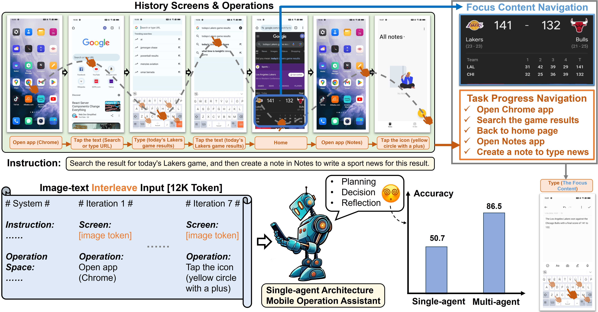
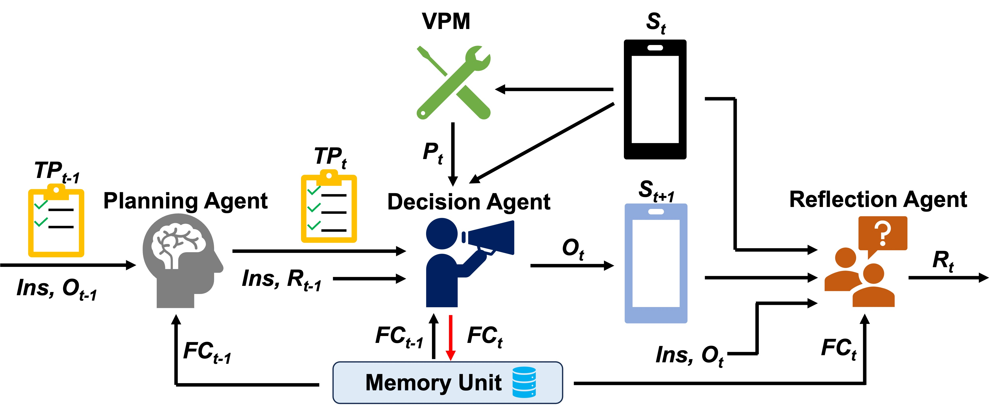
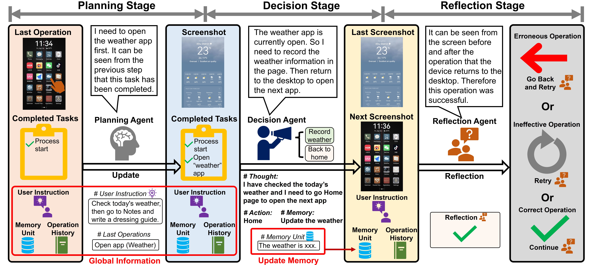
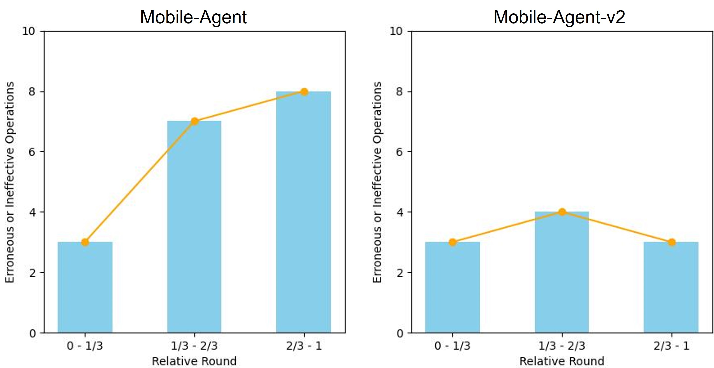
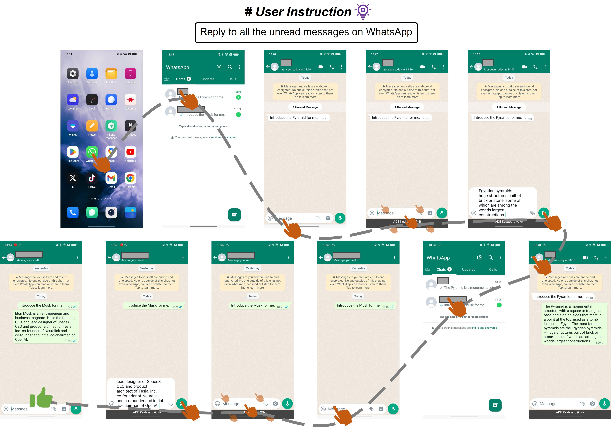
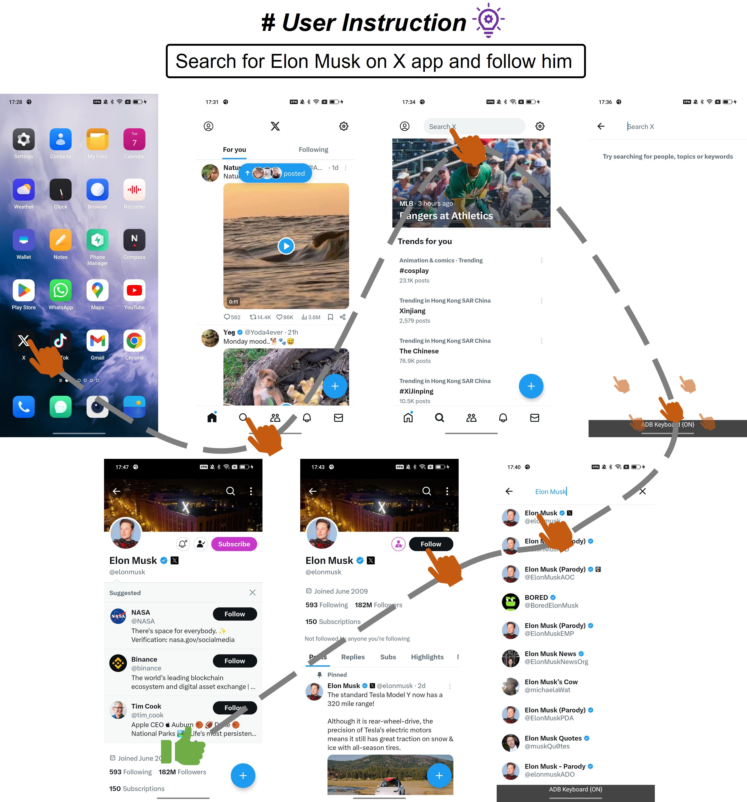
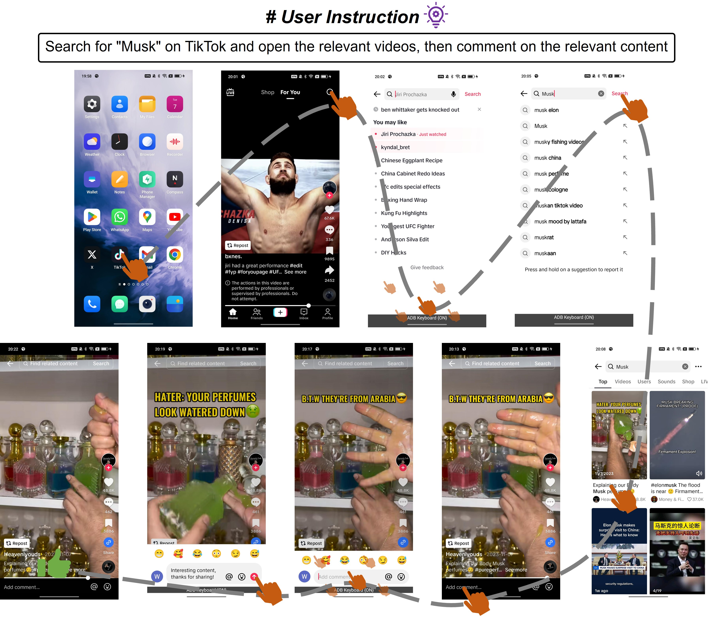
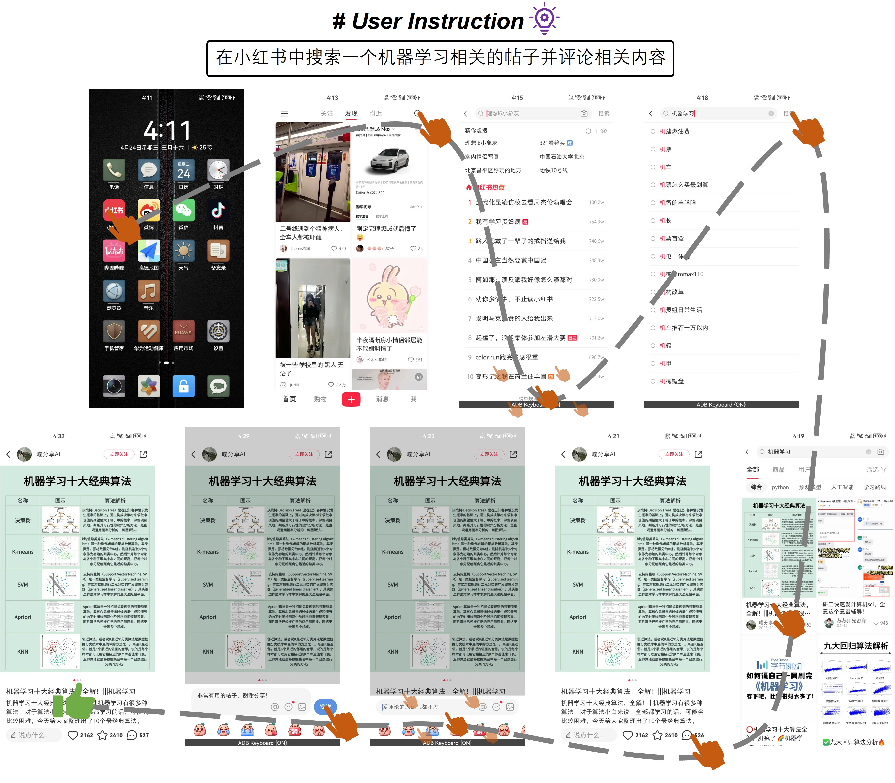
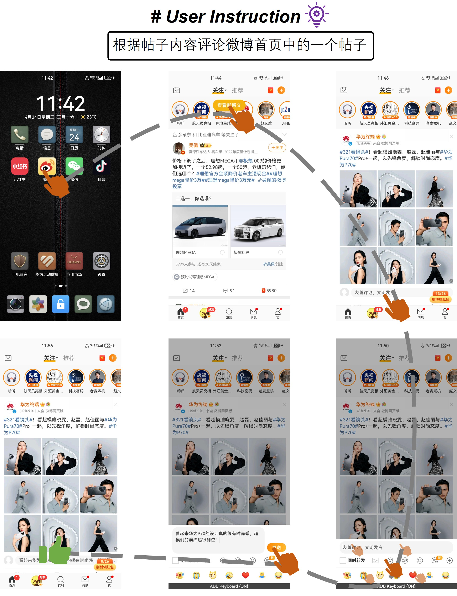
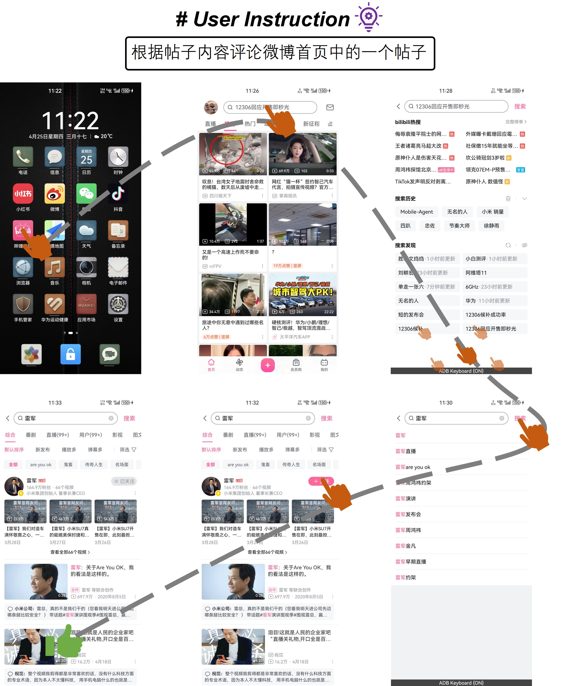

# Mobile-Agent-v2：多代理协作助力移动设备操作，实现精准导航

发布时间：2024年06月03日

`Agent

这篇论文介绍了一种专为移动设备操作辅助设计的多代理架构，名为Mobile-Agent-v2。该架构包含规划、决策和反思三个代理，用于优化任务进度导航和焦点内容导航，并纠正操作错误。这与Agent分类相关，因为它涉及多个代理的设计和应用，以提高移动设备操作任务的效率。` `移动设备` `人工智能`

> Mobile-Agent-v2: Mobile Device Operation Assistant with Effective Navigation via Multi-Agent Collaboration

# 摘要

> 移动设备操作任务正成为多模态AI应用的新宠。尽管多模态大型语言模型（MLLMs）受限于训练数据，难以有效担任操作助手，但通过工具调用增强能力的MLLM基代理正逐步进入这一领域。然而，在现有单一代理架构下，任务进度导航和焦点内容导航两大挑战变得异常复杂，主要受限于过长的令牌序列和交错的文本-图像数据格式。为此，我们推出了Mobile-Agent-v2，一种专为移动设备操作辅助设计的多代理架构，包含规划、决策和反思三个代理。规划代理优化历史操作导航，记忆单元随任务进度更新以保持焦点内容，反思代理则负责纠正操作错误。实验显示，Mobile-Agent-v2相比单一代理架构，任务完成效率提升了30%以上。相关代码已在https://github.com/X-PLUG/MobileAgent开源。

> Mobile device operation tasks are increasingly becoming a popular multi-modal AI application scenario. Current Multi-modal Large Language Models (MLLMs), constrained by their training data, lack the capability to function effectively as operation assistants. Instead, MLLM-based agents, which enhance capabilities through tool invocation, are gradually being applied to this scenario. However, the two major navigation challenges in mobile device operation tasks, task progress navigation and focus content navigation, are significantly complicated under the single-agent architecture of existing work. This is due to the overly long token sequences and the interleaved text-image data format, which limit performance. To address these navigation challenges effectively, we propose Mobile-Agent-v2, a multi-agent architecture for mobile device operation assistance. The architecture comprises three agents: planning agent, decision agent, and reflection agent. The planning agent generates task progress, making the navigation of history operations more efficient. To retain focus content, we design a memory unit that updates with task progress. Additionally, to correct erroneous operations, the reflection agent observes the outcomes of each operation and handles any mistakes accordingly. Experimental results indicate that Mobile-Agent-v2 achieves over a 30% improvement in task completion compared to the single-agent architecture of Mobile-Agent. The code is open-sourced at https://github.com/X-PLUG/MobileAgent.

[Arxiv](https://arxiv.org/abs/2406.01014)