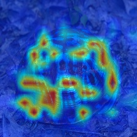

# MultiMax：探索稀疏与多模态的注意力学习之道

发布时间：2024年06月03日

`LLM理论

理由：这篇论文主要探讨了SoftMax函数的局限性，并提出了一种新的分段可微函数——MultiMax，以解决SoftMax在保持多模态性和实现稀疏性之间的权衡问题。这种研究是对现有机器学习算法中使用的函数进行理论上的改进和优化，特别是在图像分类、语言建模和机器翻译等领域的应用，属于对大型语言模型（LLM）理论层面的深入研究。因此，将其归类为LLM理论。` `机器学习`

> MultiMax: Sparse and Multi-Modal Attention Learning

# 摘要

> SoftMax 广泛应用于现代机器学习算法中，它将输入向量转化为概率分布，并集中概率质量于大值项。然而，作为 Argmax 的平滑近似，SoftMax 将大量概率质量分散至其他项，导致解释性差和噪声问题。尽管 SoftMax 的变体能实现稀疏性，但它们通常需要不同的损失函数，且不保持多模态特性。我们发现，这种多模态与稀疏性之间的权衡限制了 SoftMax 及其变体的表达力。为此，我们提出了一种分段可微函数——MultiMax，它能根据输入项的范围自适应调整输出分布，有效解决了这一矛盾。经过详尽的分析与评估，我们证明 MultiMax 在抑制无关项的同时，成功保持了多模态性，显著提升了图像分类、语言建模和机器翻译的效果。相关代码已公开于 https://github.com/ ZhouYuxuanYX/MultiMax。

> SoftMax is a ubiquitous ingredient of modern machine learning algorithms. It maps an input vector onto a probability simplex and reweights the input by concentrating the probability mass at large entries. Yet, as a smooth approximation to the Argmax function, a significant amount of probability mass is distributed to other, residual entries, leading to poor interpretability and noise. Although sparsity can be achieved by a family of SoftMax variants, they often require an alternative loss function and do not preserve multi-modality. We show that this trade-off between multi-modality and sparsity limits the expressivity of SoftMax as well as its variants. We provide a solution to this tension between objectives by proposing a piece-wise differentiable function, termed MultiMax, which adaptively modulates the output distribution according to input entry range. Through comprehensive analysis and evaluation, we show that MultiMax successfully produces a distribution that supresses irrelevant entries while preserving multimodality, with benefits in image classification, language modeling and machine translation. The code is available at https://github.com/ ZhouYuxuanYX/MultiMax.

[Arxiv](https://arxiv.org/abs/2406.01189)