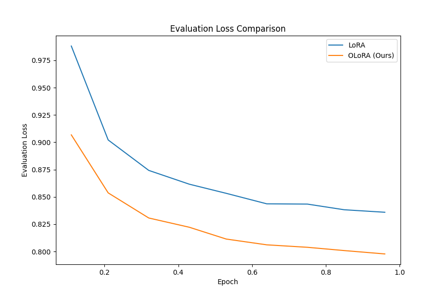

# OLoRA：大型语言模型的正交低秩自适应

发布时间：2024年06月03日

`LLM理论

理由：这篇论文主要探讨了大型语言模型（LLMs）的微调技术，特别是介绍了低秩适应（LoRA）的优化版本OLoRA。论文的核心贡献在于通过QR分解实现正交矩阵初始化，从而加速了LLM训练的收敛速度，并保持了LoRA的效率优势。这些内容主要涉及LLM的理论改进和优化，因此归类为LLM理论。` `机器学习`

> OLoRA: Orthonormal Low-Rank Adaptation of Large Language Models

# 摘要

> 大型语言模型（LLMs）的兴起为自然语言处理带来了革命性的变革，使其在理解和生成类人文本方面达到了前所未有的水平。然而，微调这些模型的计算成本和时间成本仍然是一大难题。低秩适应（LoRA）作为一种创新方法，通过减少可训练参数并采用高效微调技术，为解决这些问题提供了希望。本文中，我们介绍了OLoRA，这是对LoRA的进一步优化，它通过QR分解实现正交矩阵初始化，大幅加快了LLM训练的收敛速度，同时保持了LoRA的效率优势，如减少的可训练参数和GPU内存使用。实证研究表明，OLoRA不仅加速了收敛，还在多项语言建模任务中超越了标准LoRA的表现。这一进步将推动更高效、更易用的LLMs微调技术的发展，为自然语言应用的广泛普及和创新开辟新天地。

> The advent of large language models (LLMs) has revolutionized natural language processing, enabling unprecedented capabilities in understanding and generating human-like text. However, the computational cost and convergence times associated with fine-tuning these models remain significant challenges. Low-Rank Adaptation (LoRA) has emerged as a promising method to mitigate these issues by introducing efficient fine-tuning techniques with a reduced number of trainable parameters. In this paper, we present OLoRA, an enhancement to the LoRA method that leverages orthonormal matrix initialization through QR decomposition. OLoRA significantly accelerates the convergence of LLM training while preserving the efficiency benefits of LoRA, such as the number of trainable parameters and GPU memory footprint. Our empirical evaluations demonstrate that OLoRA not only converges faster but also exhibits improved performance compared to standard LoRA across a variety of language modeling tasks. This advancement opens new avenues for more efficient and accessible fine-tuning of LLMs, potentially enabling broader adoption and innovation in natural language applications.

[Arxiv](https://arxiv.org/abs/2406.01775)