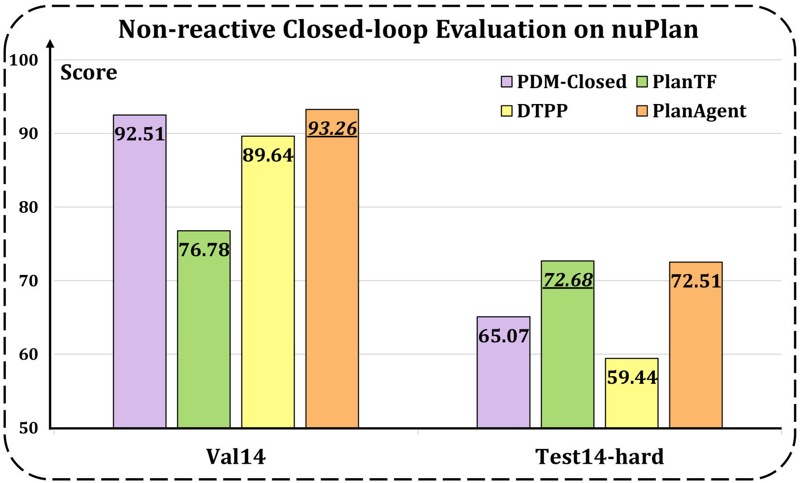
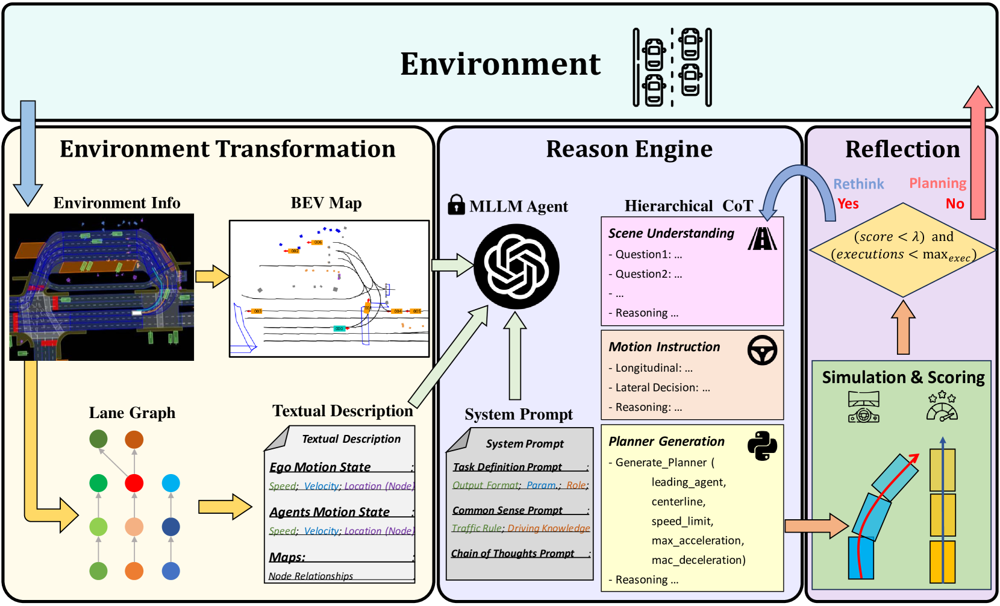
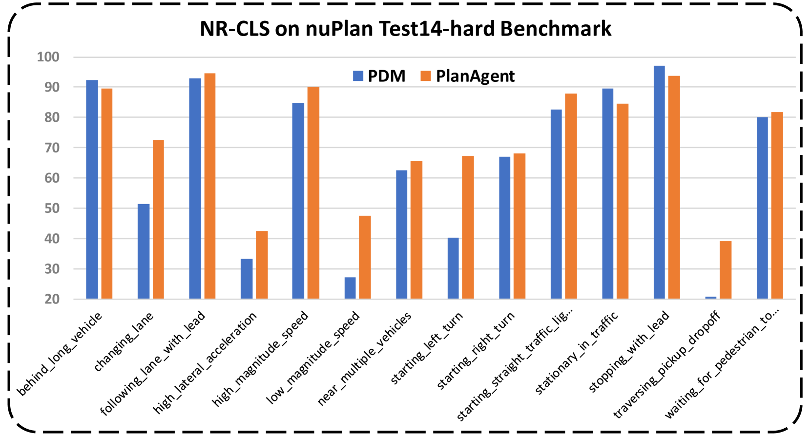

# PlanAgent：专为闭环车辆运动规划设计的多模态大型语言智能代理

发布时间：2024年06月03日

`Agent

理由：这篇论文介绍了一个名为PlanAgent的系统，该系统利用多模态大型语言模型（MLLM）来增强自动驾驶车辆的运动规划。PlanAgent作为一个智能代理，通过其内部的多个模块（环境转换模块、推理引擎模块和反射模块）来处理和优化车辆的运动规划。这个系统的设计和功能表明它是一个典型的Agent应用，因为它能够自主地进行决策和执行任务，特别是在处理复杂和长尾情况时。此外，PlanAgent的性能在实际测试中超越了现有技术，这进一步证明了其在Agent领域的创新和应用价值。` `自动驾驶` `人工智能`

> PlanAgent: A Multi-modal Large Language Agent for Closed-loop Vehicle Motion Planning

# 摘要

> 车辆运动规划是自动驾驶的核心，但现有基于规则的方法在处理复杂长尾情况时显得捉襟见肘，而学习型方法在大规模闭环测试中也未能超越传统。为此，我们创新性地推出了PlanAgent，这是首个利用多模态大型语言模型（MLLM）的中到中规划系统。PlanAgent通过MLLM引入人类智慧，增强规划的可解释性和常识推理，具体通过三个关键模块实现：环境转换模块生成BEV地图和车道文本描述；推理引擎模块从场景理解到运动指令层层推进，最终生成规划代码；反射模块则用于评估和优化规划器，降低不确定性。PlanAgent凭借MLLM的强大能力，不仅应对日常场景游刃有余，更在复杂长尾情况中大放异彩。在nuPlan这一严峻挑战下的测试中，PlanAgent的表现超越了所有现有技术，其代码即将公开。

> Vehicle motion planning is an essential component of autonomous driving technology. Current rule-based vehicle motion planning methods perform satisfactorily in common scenarios but struggle to generalize to long-tailed situations. Meanwhile, learning-based methods have yet to achieve superior performance over rule-based approaches in large-scale closed-loop scenarios. To address these issues, we propose PlanAgent, the first mid-to-mid planning system based on a Multi-modal Large Language Model (MLLM). MLLM is used as a cognitive agent to introduce human-like knowledge, interpretability, and common-sense reasoning into the closed-loop planning. Specifically, PlanAgent leverages the power of MLLM through three core modules. First, an Environment Transformation module constructs a Bird's Eye View (BEV) map and a lane-graph-based textual description from the environment as inputs. Second, a Reasoning Engine module introduces a hierarchical chain-of-thought from scene understanding to lateral and longitudinal motion instructions, culminating in planner code generation. Last, a Reflection module is integrated to simulate and evaluate the generated planner for reducing MLLM's uncertainty. PlanAgent is endowed with the common-sense reasoning and generalization capability of MLLM, which empowers it to effectively tackle both common and complex long-tailed scenarios. Our proposed PlanAgent is evaluated on the large-scale and challenging nuPlan benchmarks. A comprehensive set of experiments convincingly demonstrates that PlanAgent outperforms the existing state-of-the-art in the closed-loop motion planning task. Codes will be soon released.

[Arxiv](https://arxiv.org/abs/2406.01587)