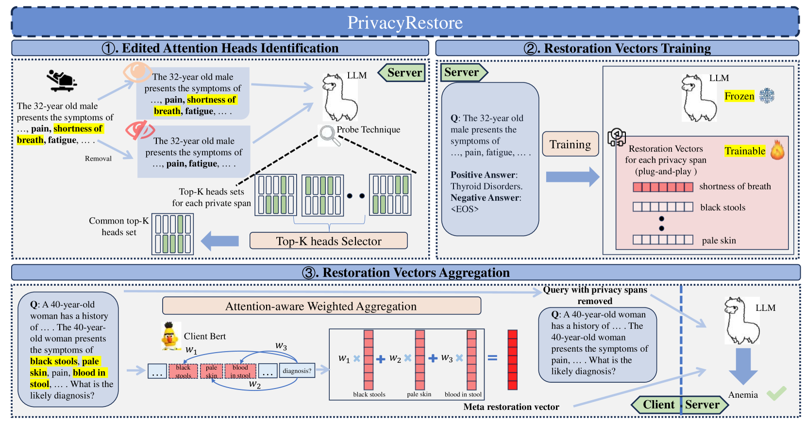
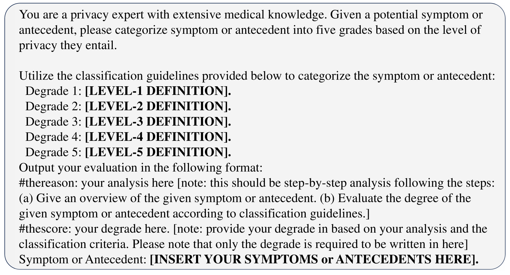
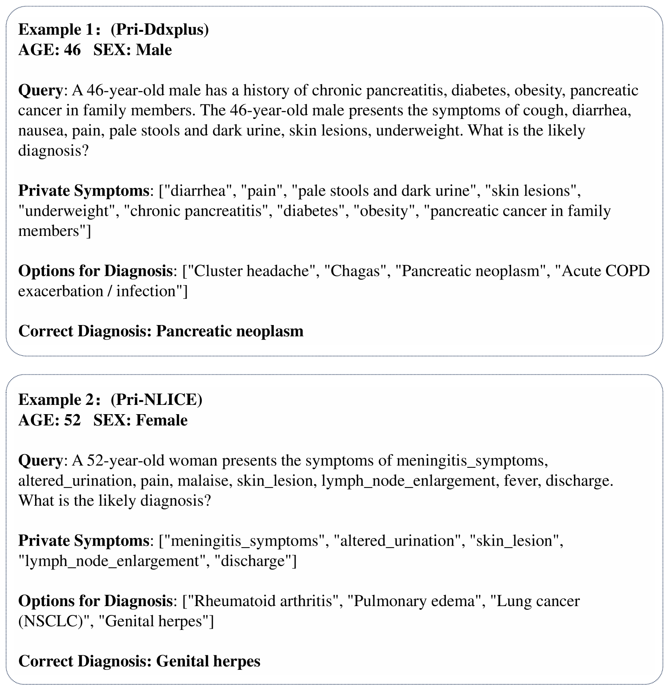

# 隐私恢复技术：在大型语言模型中实现隐私保护推理，通过移除和恢复隐私信息。

发布时间：2024年06月03日

`LLM应用

理由：这篇论文介绍了一种名为PrivacyRestore的新方法，旨在保护在线大型语言模型推理过程中的用户隐私。该方法通过移除输入中的隐私内容并利用激活引导技术恢复信息，以及使用注意力感知加权聚合（AWA）技术来整合隐私片段的恢复向量。这种方法直接应用于LLM的推理过程中，以解决隐私保护的问题，因此属于LLM应用类别。` `隐私保护` `在线服务`

> PrivacyRestore: Privacy-Preserving Inference in Large Language Models via Privacy Removal and Restoration

# 摘要

> 随着在线大型语言模型推理服务的普及，用户输入中的私人信息面临被窃听者或不可信服务提供商泄露的风险。现有的隐私保护措施要么保护不足，要么导致性能下降或推理时间过长。为此，我们提出了PrivacyRestore，一种在LLM推理过程中保护用户隐私的新方法。它通过移除输入中的隐私内容并利用激活引导技术恢复信息，将隐私内容编码为恢复向量。我们创新的注意力感知加权聚合（AWA）技术，能有效整合所有隐私片段的恢复向量，形成一个元恢复向量，既确保了隐私内容的完整性，又防止了从单一元恢复向量中推断出隐私内容的可能。实验证明，PrivacyRestore在保护隐私的同时，保持了良好的性能和推理效率。

> The widespread usage of online Large Language Models (LLMs) inference services has raised significant privacy concerns about the potential exposure of private information in user inputs to eavesdroppers or untrustworthy service providers. Existing privacy protection methods for LLMs suffer from insufficient privacy protection, performance degradation, or severe inference time overhead. In this paper, we propose PrivacyRestore to protect the privacy of user inputs during LLM inference. PrivacyRestore directly removes privacy spans in user inputs and restores privacy information via activation steering during inference. The privacy spans are encoded as restoration vectors. We propose Attention-aware Weighted Aggregation (AWA) which aggregates restoration vectors of all privacy spans in the input into a meta restoration vector. AWA not only ensures proper representation of all privacy spans but also prevents attackers from inferring the privacy spans from the meta restoration vector alone. This meta restoration vector, along with the query with privacy spans removed, is then sent to the server. The experimental results show that PrivacyRestore can protect private information while maintaining acceptable levels of performance and inference efficiency.

[Arxiv](https://arxiv.org/abs/2406.01394)