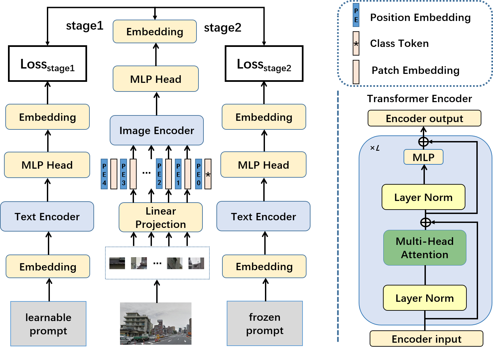
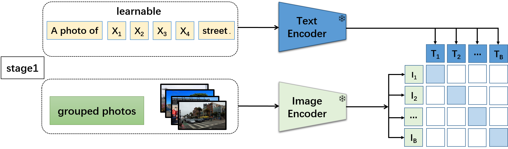
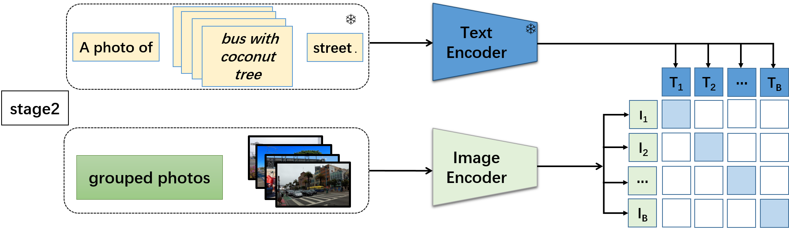
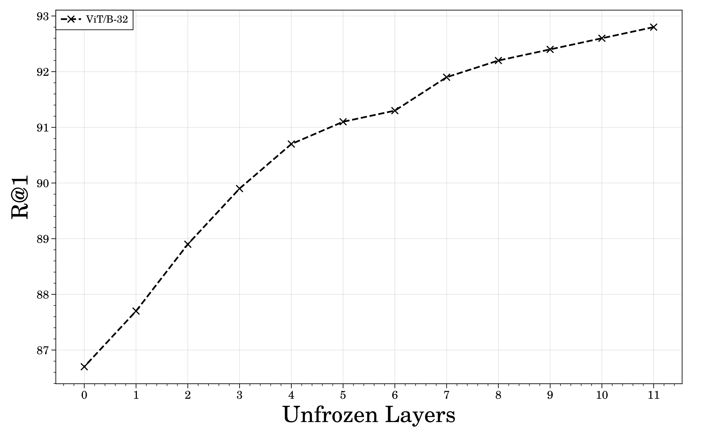

# ProGEO：利用图像与文本的对比学习，巧妙生成提示，助力视觉地理定位任务。

发布时间：2024年06月03日

`Agent

理由：这篇论文主要介绍了一种新颖的两阶段训练法，用于提升视觉地理定位（VG）技术中的图像识别能力。这种方法结合了对比学习和CLIP模型的多模态能力，以生成和利用文本提示来辅助图像编码器的训练，从而更有效地捕捉和泛化视觉特征。这种方法可以被视为一种智能代理（Agent），因为它通过学习和适应来解决特定问题（即地理图像的识别和定位）。虽然这种方法可能涉及到大型语言模型（LLM）的应用，但其核心在于开发和应用一种智能算法来处理视觉数据，因此更适合归类为Agent。` `自动驾驶` `元宇宙`

> ProGEO: Generating Prompts through Image-Text Contrastive Learning for Visual Geo-localization

# 摘要

> 视觉地理定位（VG）技术，广泛应用于自动驾驶、元宇宙等领域，旨在通过图像识别地理位置。然而，细粒度图像因缺乏明确文本描述，常使模型过度关注细节，忽视图像的深层语义。为此，我们提出了一种新颖的两阶段训练法，结合对比学习，以提升视觉识别能力并挖掘图像中的难点。首先，我们利用CLIP模型的多模态能力，为每张地理图像生成模糊但可学习的文本提示。接着，通过动态文本提示辅助图像编码器的训练，使其能更有效地捕捉并泛化视觉特征。这一策略巧妙地解决了地理图像因描述不精确而难以利用的问题。我们在多个大型数据集上验证了此方法的有效性，并取得了优异的成绩。相关代码和模型已公开于https://github.com/Chain-Mao/ProGEO。

> Visual Geo-localization (VG) refers to the process to identify the location described in query images, which is widely applied in robotics field and computer vision tasks, such as autonomous driving, metaverse, augmented reality, and SLAM. In fine-grained images lacking specific text descriptions, directly applying pure visual methods to represent neighborhood features often leads to the model focusing on overly fine-grained features, unable to fully mine the semantic information in the images. Therefore, we propose a two-stage training method to enhance visual performance and use contrastive learning to mine challenging samples. We first leverage the multi-modal description capability of CLIP (Contrastive Language-Image Pretraining) to create a set of learnable text prompts for each geographic image feature to form vague descriptions. Then, by utilizing dynamic text prompts to assist the training of the image encoder, we enable the image encoder to learn better and more generalizable visual features. This strategy of applying text to purely visual tasks addresses the challenge of using multi-modal models for geographic images, which often suffer from a lack of precise descriptions, making them difficult to utilize widely. We validate the effectiveness of the proposed strategy on several large-scale visual geo-localization datasets, and our method achieves competitive results on multiple visual geo-localization datasets. Our code and model are available at https://github.com/Chain-Mao/ProGEO.

[Arxiv](https://arxiv.org/abs/2406.01906)