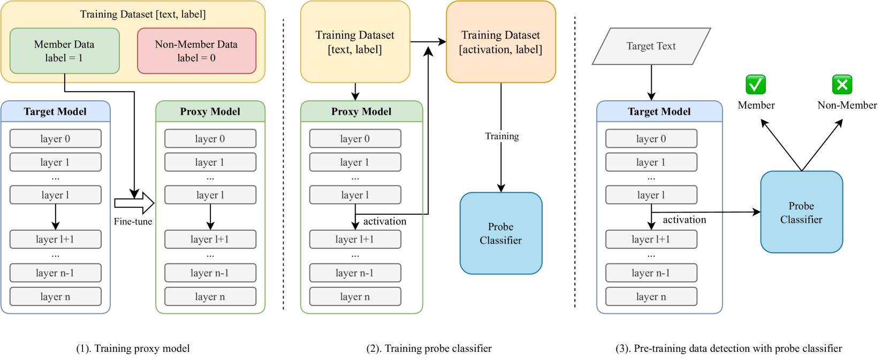
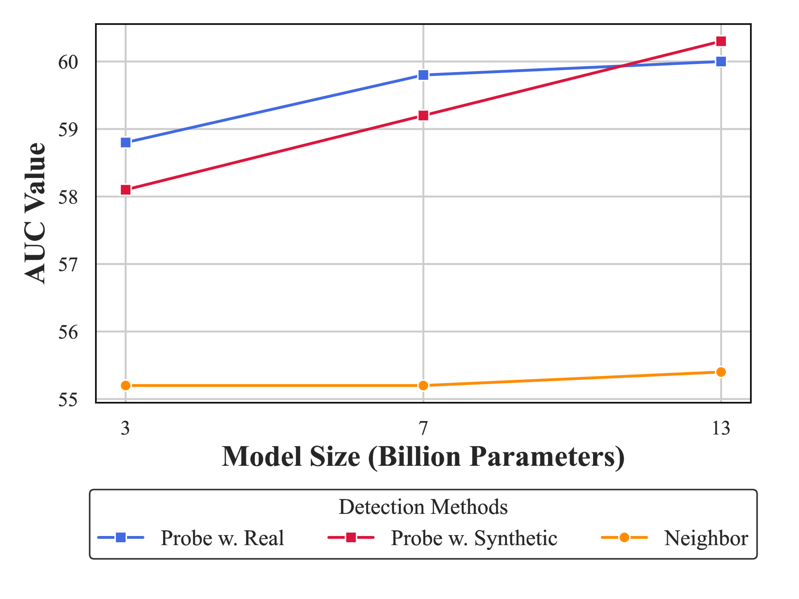
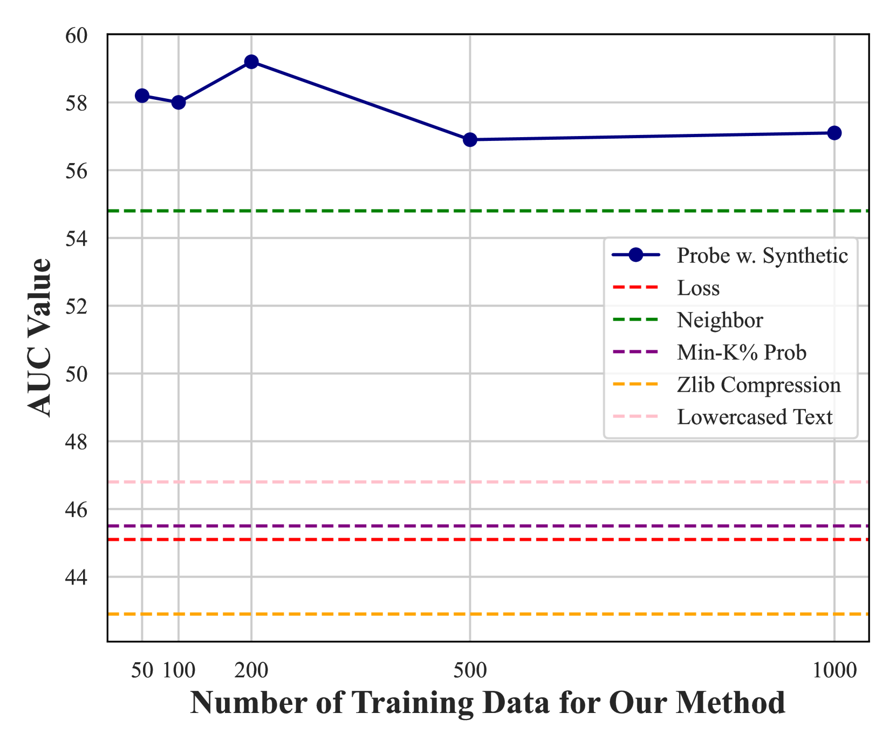

# 探究语言模型，揭示预训练数据的踪迹

发布时间：2024年06月03日

`LLM理论

理由：这篇论文主要探讨了大型语言模型（LLMs）的隐私问题和预训练阶段的数据泄露问题，并提出了一种新的方法来检测模型是否接触过特定文本。这种方法涉及分析模型的内部激活，以提高数据检测的准确性和可信度。此外，论文还介绍了一个新的基准ArxivMIA，用于评估这种方法的有效性。这些内容更偏向于对LLM理论层面的研究和探讨，因此归类为LLM理论。` `数据安全` `计算机科学`

> Probing Language Models for Pre-training Data Detection

# 摘要

> 大型语言模型（LLMs）虽能力惊人，却也因隐私问题和预训练阶段数据泄露而引发数据污染担忧。为此，我们需通过检查LLM是否接触过目标文本来检测污染。现有研究多依赖于计算生成文本的困惑度，这些表面特征并不可靠。本研究中，我们采用探针技术，通过分析模型内部激活来检测预训练数据，方法简便高效，增强了数据检测的可信度。此外，我们推出了ArxivMIA，一个包含计算机科学和数学领域arxiv摘要的新基准，挑战性十足。实验证明，我们的方法不仅超越了所有基线，还在WikiMIA和ArxivMIA上达到了顶尖水平，进一步的实验也验证了其有效性（代码和数据集已公开于https://github.com/zhliu0106/probing-lm-data）。

> Large Language Models (LLMs) have shown their impressive capabilities, while also raising concerns about the data contamination problems due to privacy issues and leakage of benchmark datasets in the pre-training phase. Therefore, it is vital to detect the contamination by checking whether an LLM has been pre-trained on the target texts. Recent studies focus on the generated texts and compute perplexities, which are superficial features and not reliable. In this study, we propose to utilize the probing technique for pre-training data detection by examining the model's internal activations. Our method is simple and effective and leads to more trustworthy pre-training data detection. Additionally, we propose ArxivMIA, a new challenging benchmark comprising arxiv abstracts from Computer Science and Mathematics categories. Our experiments demonstrate that our method outperforms all baselines, and achieves state-of-the-art performance on both WikiMIA and ArxivMIA, with additional experiments confirming its efficacy (Our code and dataset are available at https://github.com/zhliu0106/probing-lm-data).

[Arxiv](https://arxiv.org/abs/2406.01333)