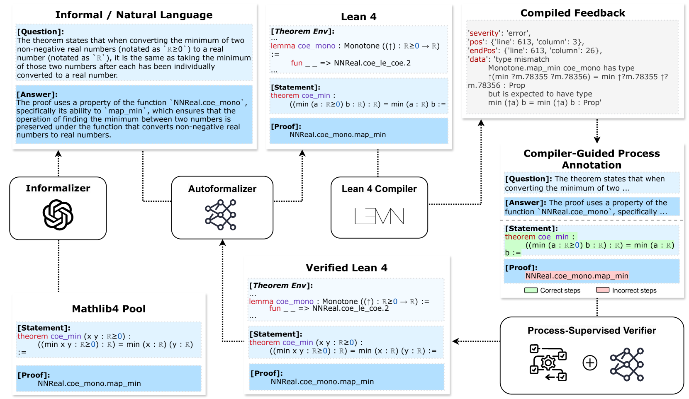

# Lean 4中的过程驱动自动形式化

发布时间：2024年06月03日

`LLM应用

这篇论文主要关注的是大型语言模型（LLM）在自动形式化技术中的应用，特别是在将自然语言数学转换为形式语言（如Lean 4）的能力。论文中提到的“Lean 4 Formalization”基准和过程监督验证器（PSV）都是为了评估和提升LLM在这一特定任务上的性能。因此，这篇论文属于LLM应用类别，因为它探讨了LLM在特定领域（数学形式化）的实际应用和改进方法。` `数学推理` `自动化工具`

> Process-Driven Autoformalization in Lean 4

# 摘要

> 自动形式化技术，将自然语言数学转换为形式语言，极大地推动了数学推理的发展。但目前的工作仅限于那些拥有丰富在线资源的形式语言，难以适应如Lean 4这类快速演进的语言。为此，我们推出了一个名为“Lean 4 Formalization”的新基准，专门用于测试大型语言模型在自动形式化方面的能力，涵盖了问题、答案、形式陈述及证明的全面评估。同时，我们还开发了一个过程监督验证器（PSV），它通过Lean 4编译器的精准反馈来提升自动形式化效率。实验结果显示，PSV不仅提高了准确性，还减少了训练数据的筛选需求。当PSV利用包含详细过程信息的数据进行微调时，其在Lean 4自动形式化上的表现更是有了显著提升。相关数据集和代码已公开于https://github.com/rookie-joe/PDA。

> Autoformalization, the conversion of natural language mathematics into formal languages, offers significant potential for advancing mathematical reasoning. However, existing efforts are limited to formal languages with substantial online corpora and struggle to keep pace with rapidly evolving languages like Lean 4. To bridge this gap, we propose a new benchmark \textbf{Form}alization for \textbf{L}ean~\textbf{4} (\textbf{\name}) designed to evaluate the autoformalization capabilities of large language models (LLMs). This benchmark encompasses a comprehensive assessment of questions, answers, formal statements, and proofs. Additionally, we introduce a \textbf{P}rocess-\textbf{S}upervised \textbf{V}erifier (\textbf{PSV}) model that leverages the precise feedback from Lean 4 compilers to enhance autoformalization. Our experiments demonstrate that the PSV method improves autoformalization, enabling higher accuracy using less filtered training data. Furthermore, when fine-tuned with data containing detailed process information, PSV can leverage the data more effectively, leading to more significant improvements in autoformalization for Lean 4. Our dataset and code are available at \url{https://github.com/rookie-joe/PDA}.

[Arxiv](https://arxiv.org/abs/2406.01940)