# R2C2-Coder：提升并评估大型语言模型在真实仓库级代码补全中的性能

发布时间：2024年06月03日

`LLM应用

这篇论文主要讨论了如何提升大型语言模型在真实仓库环境下的代码补全能力，并推出了R2C2-Coder，包括创新的代码提示构建方法和精心设计的基准。这些内容直接关联到LLM的具体应用，特别是在软件开发领域的代码补全技术，因此将其归类为LLM应用。` `软件开发` `人工智能`

> R2C2-Coder: Enhancing and Benchmarking Real-world Repository-level Code Completion Abilities of Code Large Language Models

# 摘要

> 近年来，代码补全技术取得了长足进步，尤其是仓库级别的代码补全，已成为现代软件开发的热点。尽管已有一些基线方法和基准出现，但现有方法往往未能充分利用项目仓库的丰富上下文，如文件间的复杂关联和类层次结构。同时，现有基准多聚焦于特定场景，难以全面评估仓库级别代码补全的实际能力。为此，我们推出了R2C2-Coder，旨在提升并评估大型语言模型在真实仓库环境下的代码补全能力。R2C2-Coder包含创新的代码提示构建方法R2C2-Enhance和精心设计的基准R2C2-Bench。在R2C2-Enhance中，我们首先建立候选检索池，然后为每个补全点动态组装提示。基于此，R2C2-Bench通过引入上下文扰动策略，模拟真实仓库环境，提供了一个更具挑战性和多样性的测试平台。多基准测试结果充分展示了R2C2-Coder的卓越性能。

> Code completion models have made significant progress in recent years. Recently, repository-level code completion has drawn more attention in modern software development, and several baseline methods and benchmarks have been proposed. However, existing repository-level code completion methods often fall short of fully using the extensive context of a project repository, such as the intricacies of relevant files and class hierarchies. Besides, the existing benchmarks usually focus on limited code completion scenarios, which cannot reflect the repository-level code completion abilities well of existing methods. To address these limitations, we propose the R2C2-Coder to enhance and benchmark the real-world repository-level code completion abilities of code Large Language Models, where the R2C2-Coder includes a code prompt construction method R2C2-Enhance and a well-designed benchmark R2C2-Bench. Specifically, first, in R2C2-Enhance, we first construct the candidate retrieval pool and then assemble the completion prompt by retrieving from the retrieval pool for each completion cursor position. Second, based on R2C2 -Enhance, we can construct a more challenging and diverse R2C2-Bench with training, validation and test splits, where a context perturbation strategy is proposed to simulate the real-world repository-level code completion well. Extensive results on multiple benchmarks demonstrate the effectiveness of our R2C2-Coder.

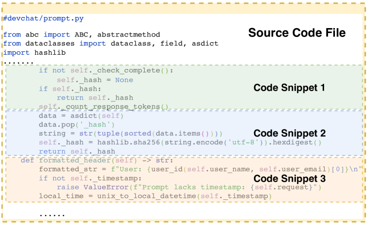

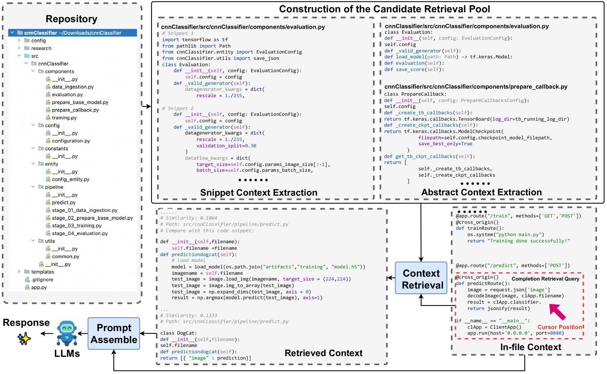

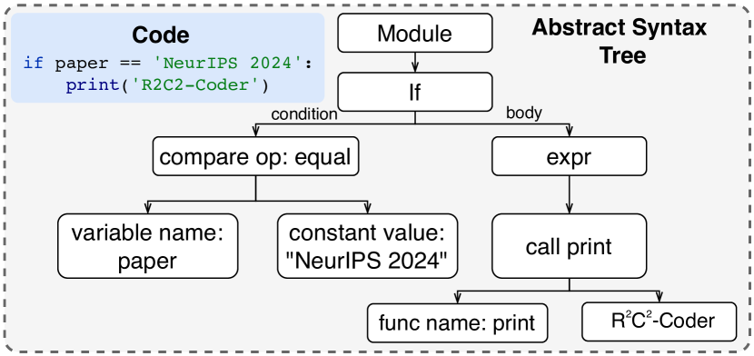

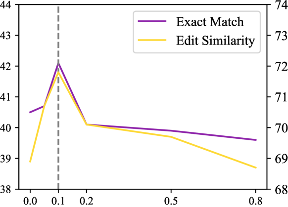

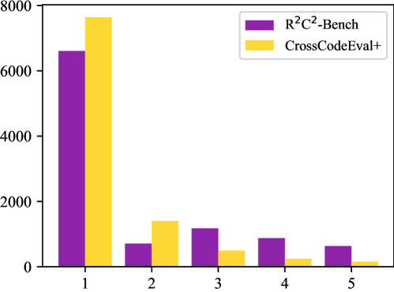

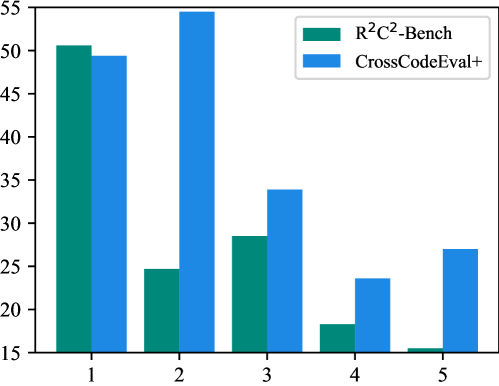

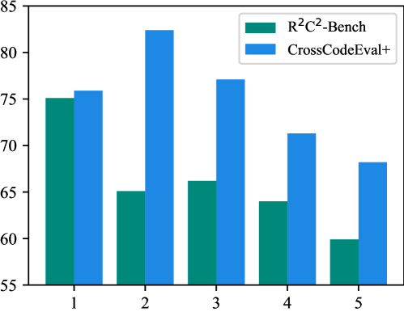

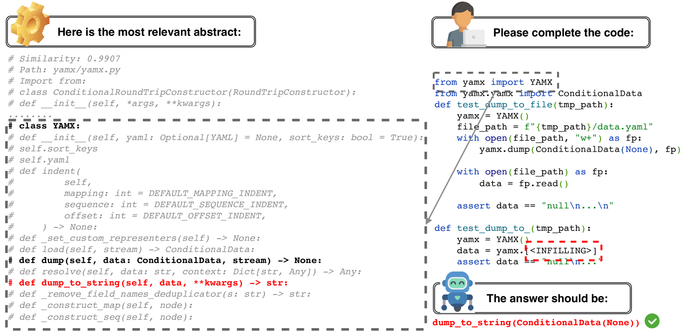

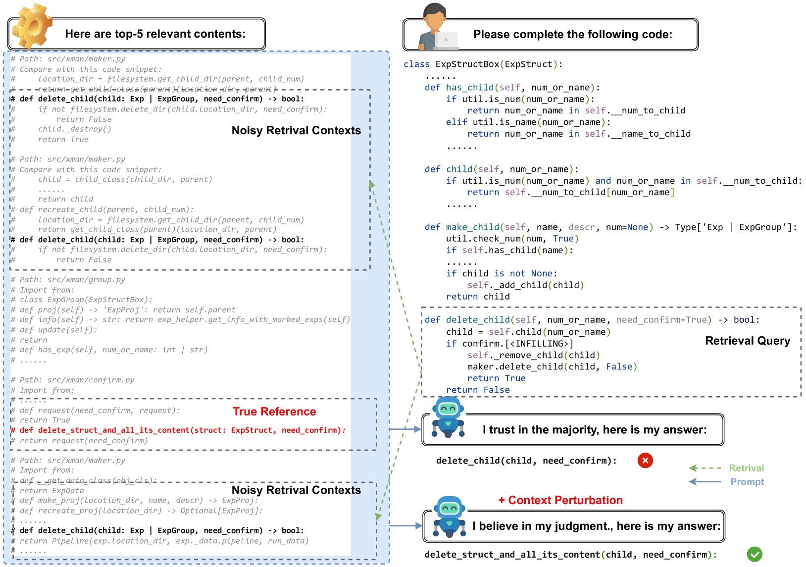

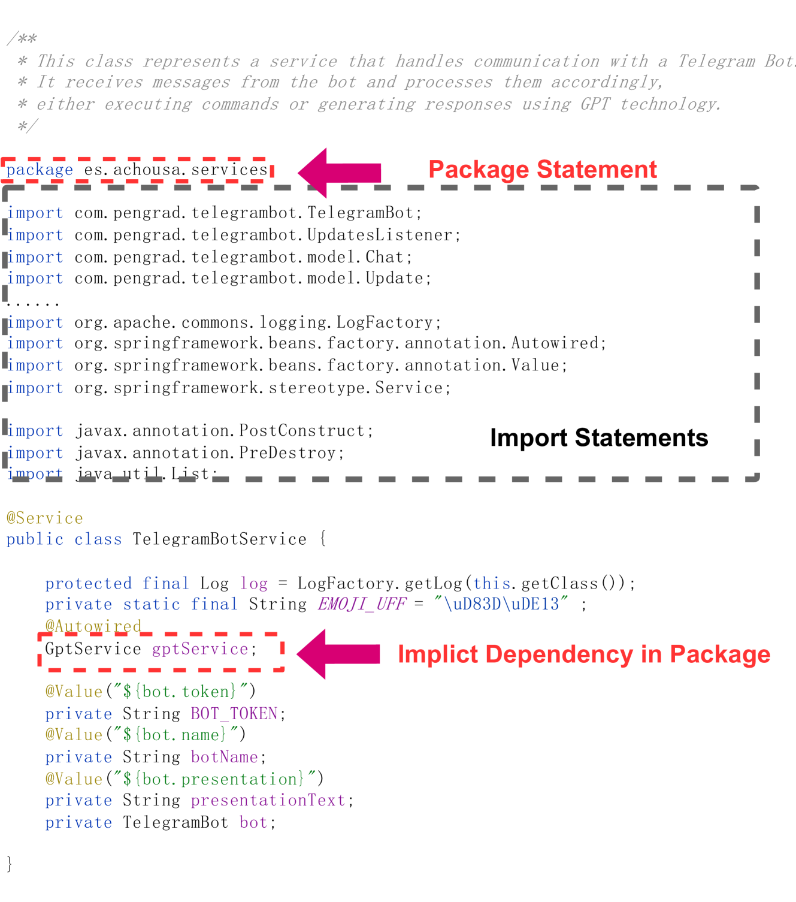

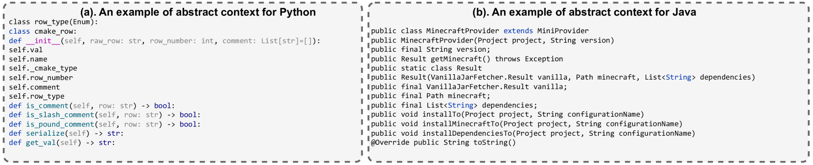

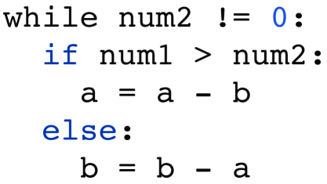

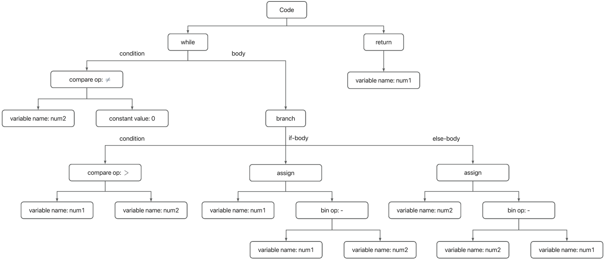

[Arxiv](https://arxiv.org/abs/2406.01359)