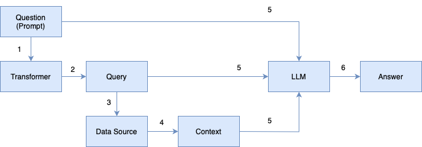
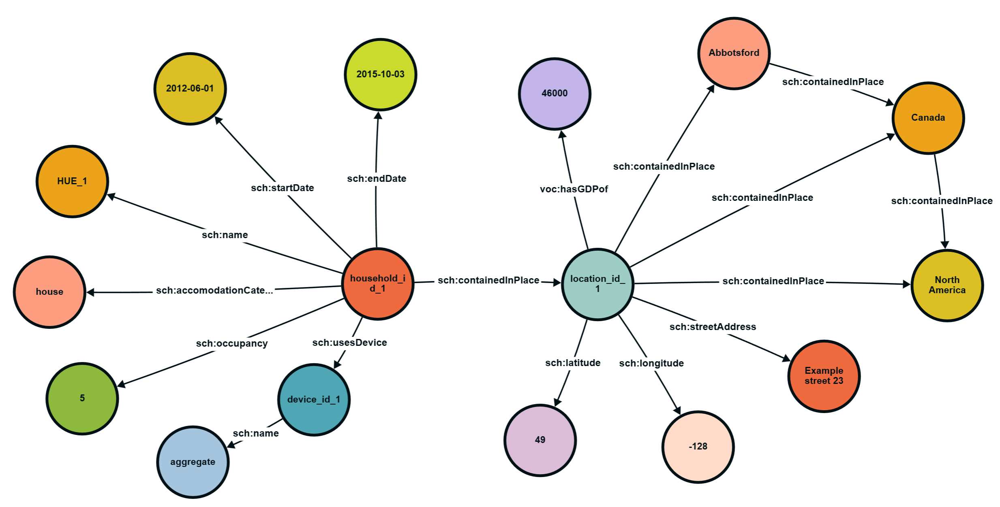

# 利用 RAG 技术进行家庭电力监控的智能对话

发布时间：2024年06月03日

`RAG

理由：这篇论文主要探讨了检索增强生成（RAG）技术与大型语言模型（如ChatGPT、Gemini和Llama）的结合应用，以提高对电力数据集复杂问题回答的精准度和相关性。论文的核心在于利用RAG技术改进LLMs的性能，特别是在检索和生成准确信息方面，这与RAG分类直接相关。虽然涉及LLMs的应用，但主要焦点是RAG技术的应用和效果，因此更适合归类为RAG。` `能源数据分析`

> RAG Enabled Conversations about Household Electricity Monitoring

# 摘要

> 本文探讨了如何将检索增强生成（RAG）技术与ChatGPT、Gemini和Llama等大型语言模型结合，以提升对电力数据集复杂问题回答的精准度和相关性。鉴于LLMs依赖训练数据模式而非事实理解，导致答案精确度和上下文相关性不足，我们提出了一种利用专门电力知识图谱的解决方案。该方法能检索准确、实时的数据，并与LLMs的生成能力融合。研究显示，RAG不仅降低了LLMs生成错误信息的频率，还通过基于可验证数据定位响应，显著提升了输出质量。本文详述了研究方法，对比了有无RAG的响应效果，并探讨了这些发现对未来AI在能源数据分析等专业领域应用的启示。

> In this paper, we investigate the integration of Retrieval Augmented Generation (RAG) with large language models (LLMs) such as ChatGPT, Gemini, and Llama to enhance the accuracy and specificity of responses to complex questions about electricity datasets. Recognizing the limitations of LLMs in generating precise and contextually relevant answers due to their dependency on the patterns in training data rather than factual understanding, we propose a solution that leverages a specialized electricity knowledge graph. This approach facilitates the retrieval of accurate, real-time data which is then synthesized with the generative capabilities of LLMs. Our findings illustrate that the RAG approach not only reduces the incidence of incorrect information typically generated by LLMs but also significantly improves the quality of the output by grounding responses in verifiable data. This paper details our methodology, presents a comparative analysis of responses with and without RAG, and discusses the implications of our findings for future applications of AI in specialized sectors like energy data analysis.

[Arxiv](https://arxiv.org/abs/2406.06566)