# REvolve：大型语言模型驱动下的自动驾驶奖励进化策略

发布时间：2024年06月03日

`Agent

理由：这篇论文主要讨论了如何利用大型语言模型（LLMs）和人类反馈来设计奖励函数，以训练强化学习算法中的代理（Agent）。特别是在自动驾驶领域的应用，通过REvolve框架将人类知识转化为训练指标，以提高代理的性能。因此，这篇论文更侧重于Agent的设计和应用，而不是LLM的理论研究或特定应用。` `自动驾驶`

> REvolve: Reward Evolution with Large Language Models for Autonomous Driving

# 摘要

> 设计奖励函数是训练强化学习算法的关键，但即便对于专家而言，这一过程也充满挑战，因为某些任务的主观性难以量化。近期研究利用大型语言模型（LLMs）从自然语言描述中生成奖励，借助其对人类行为的深刻理解。我们提出，在人类反馈的引导下，LLMs能制定出符合人类期望的奖励函数。特别地，我们在自动驾驶领域进行了探索，其中“良好”驾驶的标准模糊且难以界定。为此，我们开发了REvolve框架，它利用LLMs和人类反馈来设计奖励函数，将隐性的人类知识转化为明确的训练指标。实验表明，REvolve训练的代理在驾驶行为上与人类标准高度契合，超越了现有技术水平。

> Designing effective reward functions is crucial to training reinforcement learning (RL) algorithms. However, this design is non-trivial, even for domain experts, due to the subjective nature of certain tasks that are hard to quantify explicitly. In recent works, large language models (LLMs) have been used for reward generation from natural language task descriptions, leveraging their extensive instruction tuning and commonsense understanding of human behavior. In this work, we hypothesize that LLMs, guided by human feedback, can be used to formulate human-aligned reward functions. Specifically, we study this in the challenging setting of autonomous driving (AD), wherein notions of "good" driving are tacit and hard to quantify. To this end, we introduce REvolve, an evolutionary framework that uses LLMs for reward design in AD. REvolve creates and refines reward functions by utilizing human feedback to guide the evolution process, effectively translating implicit human knowledge into explicit reward functions for training (deep) RL agents. We demonstrate that agents trained on REvolve-designed rewards align closely with human driving standards, thereby outperforming other state-of-the-art baselines.

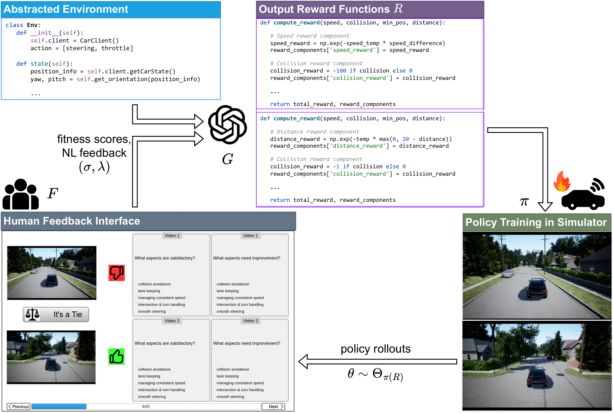

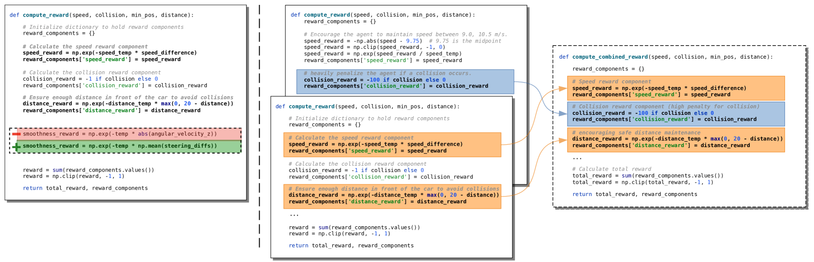

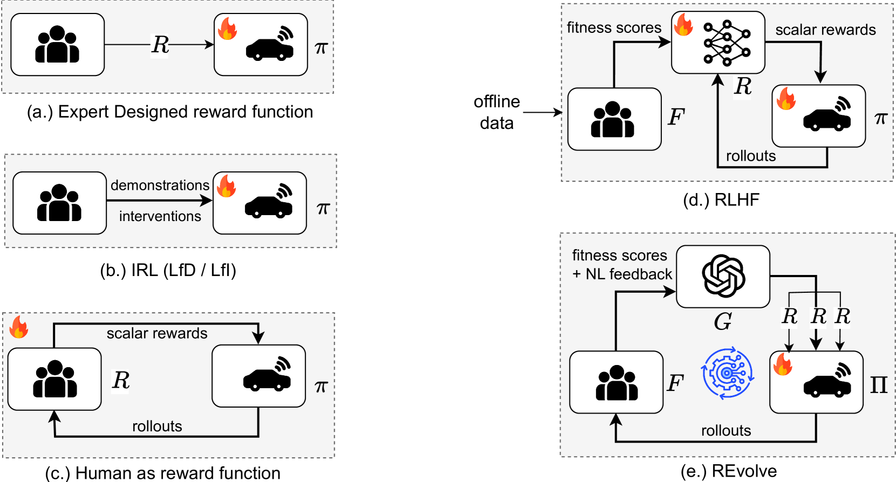

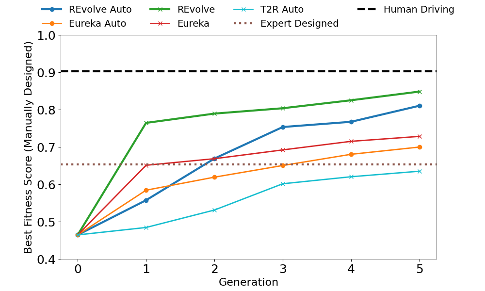

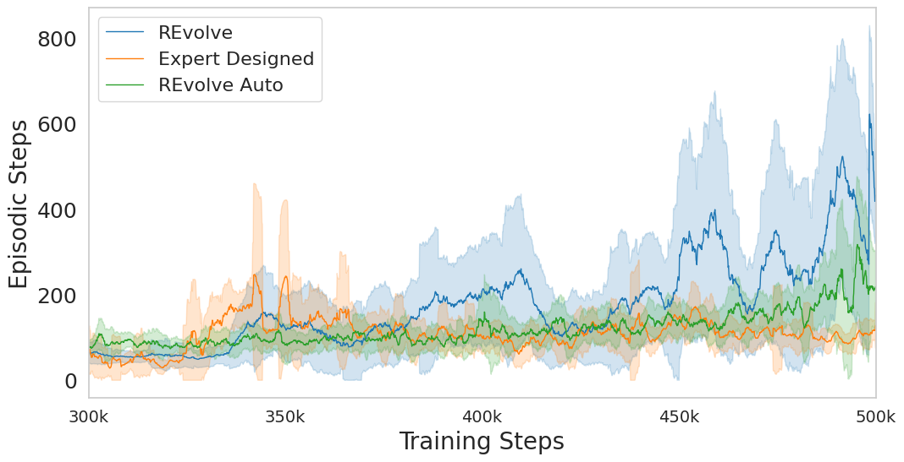

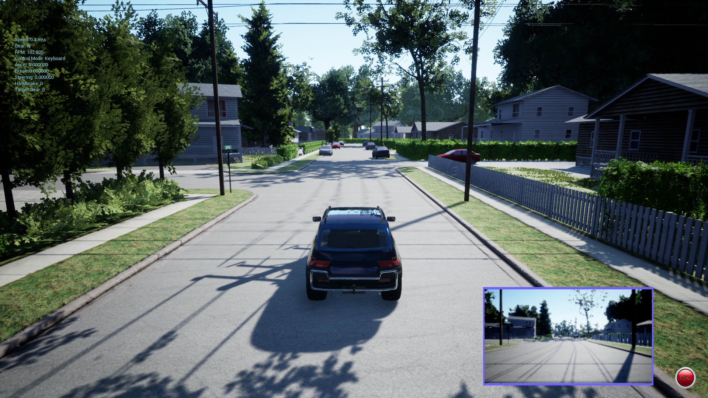

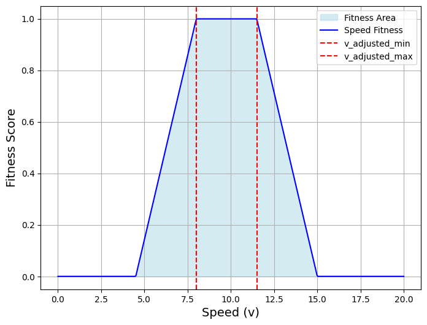

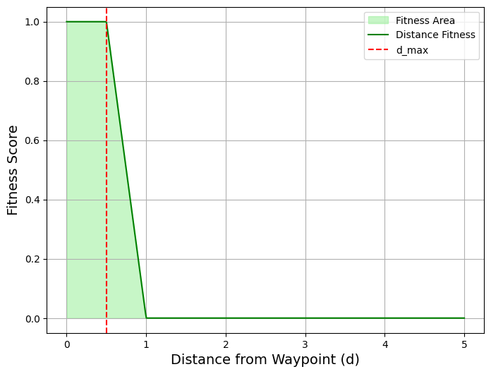

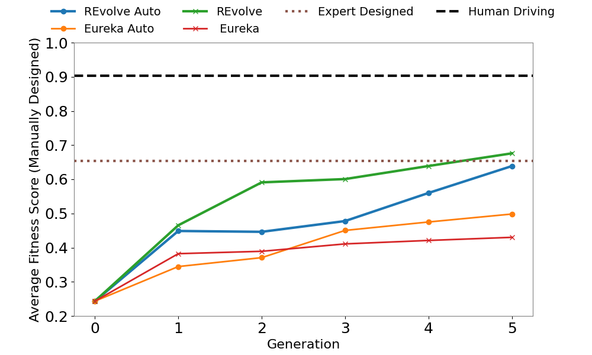

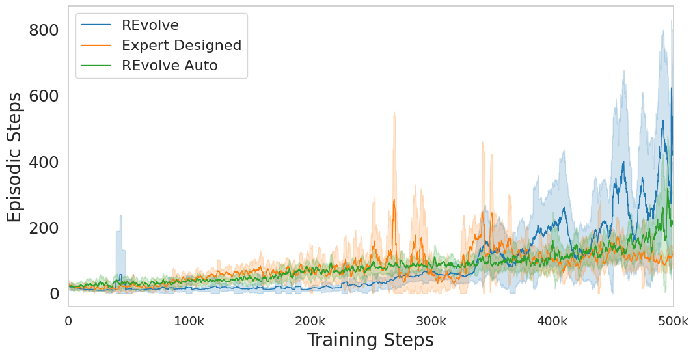

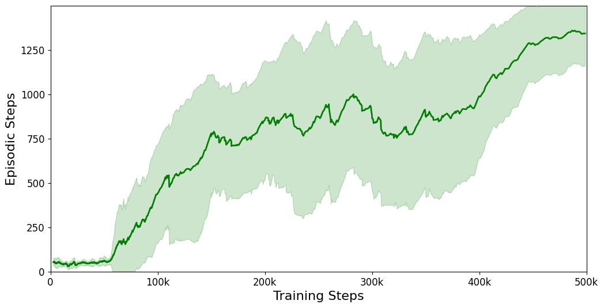

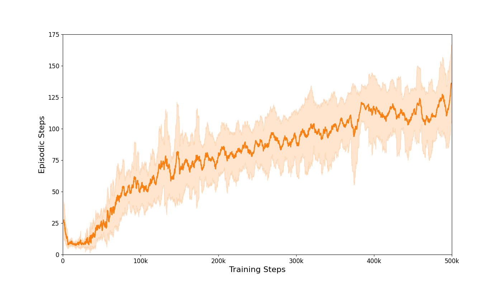

[Arxiv](https://arxiv.org/abs/2406.01309)