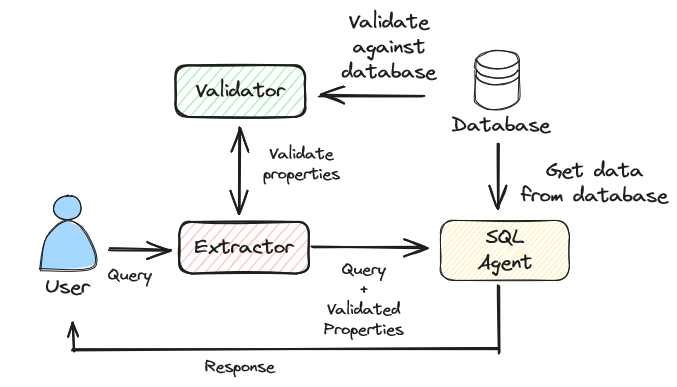
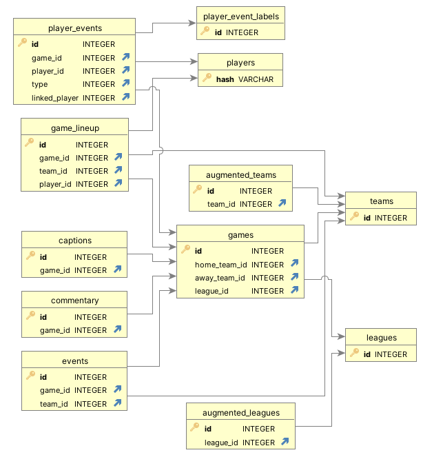

# SoccerRAG：自然查询驱动的多模态足球信息检索系统

发布时间：2024年06月03日

`RAG

理由：这篇论文介绍了一个名为SoccerRAG的框架，该框架结合了检索增强生成（RAG）和大型语言模型（LLMs）来处理多模态数据集，并专注于体育领域的信息检索。虽然它涉及LLMs的应用，但主要焦点是RAG技术的应用和其在体育分析中的效果，因此更适合归类为RAG。` `信息检索`

> SoccerRAG: Multimodal Soccer Information Retrieval via Natural Queries

# 摘要

> 随着数字体育媒体的迅猛发展，我们需要一个能够高效处理多模态数据集的复杂信息检索系统。本文推出的SoccerRAG框架，巧妙结合了检索增强生成（RAG）与大型语言模型（LLMs），通过自然语言查询精准提取足球信息。SoccerRAG不仅支持动态查询和自动数据验证，还极大提升了用户与体育档案的互动体验。评估结果显示，SoccerRAG在处理复杂查询时表现出色，其准确性和用户参与度远超传统系统。这不仅展示了RAG和LLMs在体育分析中的巨大潜力，也为体育数据的可访问性和实时处理技术的未来发展奠定了基础。

> The rapid evolution of digital sports media necessitates sophisticated information retrieval systems that can efficiently parse extensive multimodal datasets. This paper introduces SoccerRAG, an innovative framework designed to harness the power of Retrieval Augmented Generation (RAG) and Large Language Models (LLMs) to extract soccer-related information through natural language queries. By leveraging a multimodal dataset, SoccerRAG supports dynamic querying and automatic data validation, enhancing user interaction and accessibility to sports archives. Our evaluations indicate that SoccerRAG effectively handles complex queries, offering significant improvements over traditional retrieval systems in terms of accuracy and user engagement. The results underscore the potential of using RAG and LLMs in sports analytics, paving the way for future advancements in the accessibility and real-time processing of sports data.

[Arxiv](https://arxiv.org/abs/2406.01273)