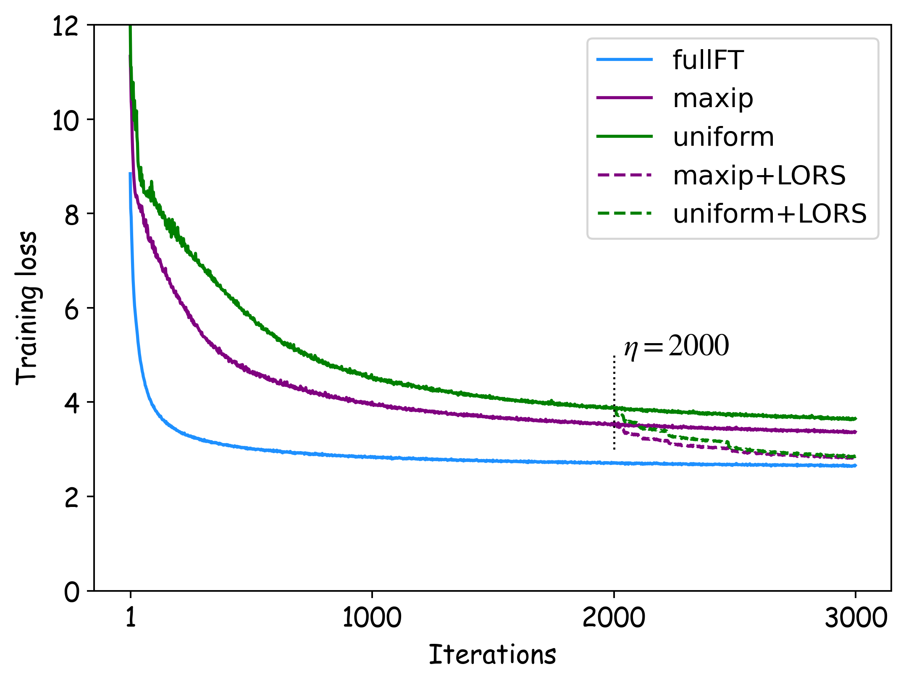

# 利用稀疏性加速大型语言模型的训练

发布时间：2024年06月03日

`LLM理论

理由：这篇论文主要探讨了大型语言模型（LLMs）的训练优化问题，特别是通过利用模型中的稀疏性来加速训练过程。这涉及到对LLMs内部机制的深入理解和理论上的创新，如神经元重要性评估和遗漏率调度器的引入。因此，这项工作更偏向于LLM的理论研究，而不是具体的应用、Agent设计或RAG（Retrieval-Augmented Generation）框架。` `机器学习`

> Sparsity-Accelerated Training for Large Language Models

# 摘要

> 大型语言模型（LLMs）在众多NLP任务中表现出色，但往往需要额外的训练，如持续预训练和监督微调，这些训练因模型参数庞大而成本高昂。本文提出利用预训练LLMs中的稀疏性来加速训练过程。通过识别前向迭代中非激活神经元的稀疏性，我们实现了计算加速。为应对挑战，我们扩展了神经元重要性评估，并引入了阶梯式遗漏率调度器。实验证明，稀疏加速训练（SAT）不仅性能与标准训练相当或更优，还显著提升了训练速度，例如在持续预训练中吞吐量提高了45%，监督微调中节省了38%的训练时间。SAT提供了一个简单、与硬件无关且易于部署的框架，用于LLMs的额外训练。相关代码已公开于https://github.com/OpenDFM/SAT。

> Large language models (LLMs) have demonstrated proficiency across various natural language processing (NLP) tasks but often require additional training, such as continual pre-training and supervised fine-tuning. However, the costs associated with this, primarily due to their large parameter count, remain high. This paper proposes leveraging \emph{sparsity} in pre-trained LLMs to expedite this training process. By observing sparsity in activated neurons during forward iterations, we identify the potential for computational speed-ups by excluding inactive neurons. We address associated challenges by extending existing neuron importance evaluation metrics and introducing a ladder omission rate scheduler. Our experiments on Llama-2 demonstrate that Sparsity-Accelerated Training (SAT) achieves comparable or superior performance to standard training while significantly accelerating the process. Specifically, SAT achieves a $45\%$ throughput improvement in continual pre-training and saves $38\%$ training time in supervised fine-tuning in practice. It offers a simple, hardware-agnostic, and easily deployable framework for additional LLM training. Our code is available at https://github.com/OpenDFM/SAT.

[Arxiv](https://arxiv.org/abs/2406.01392)