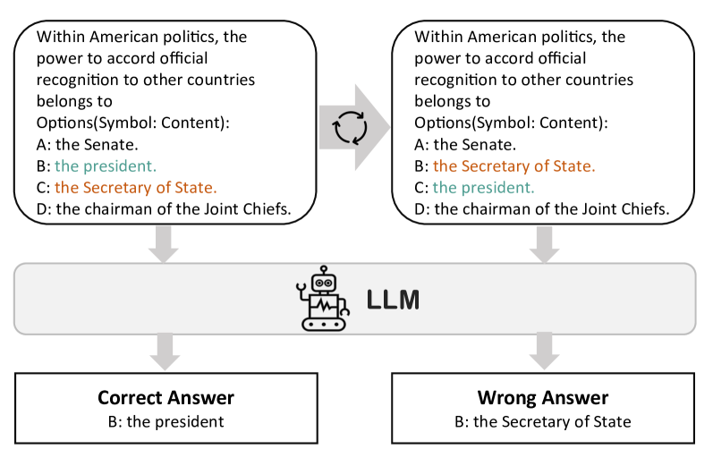
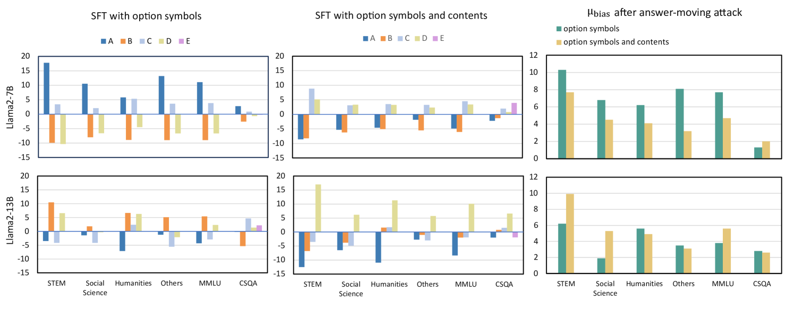
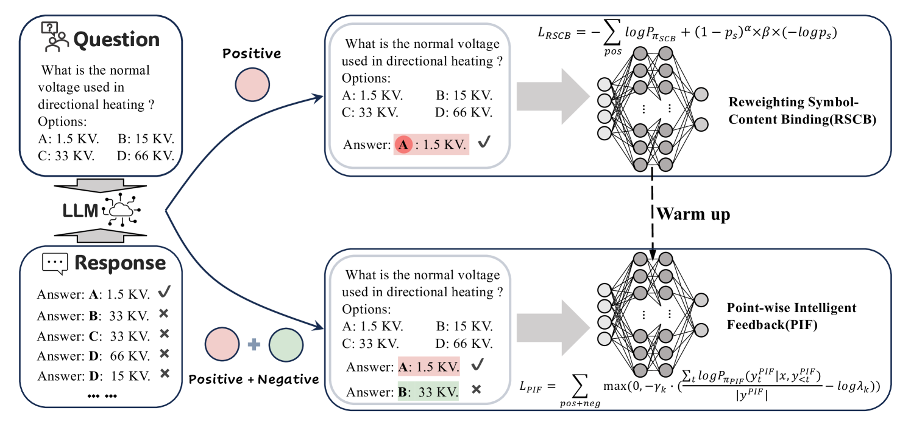
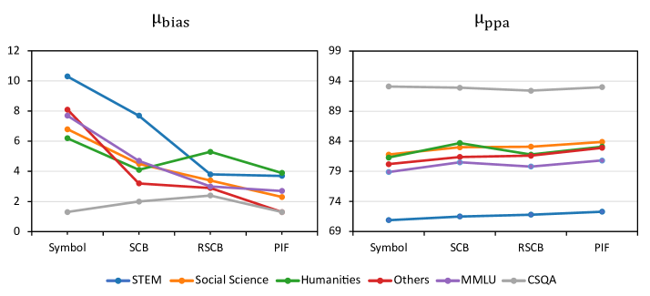
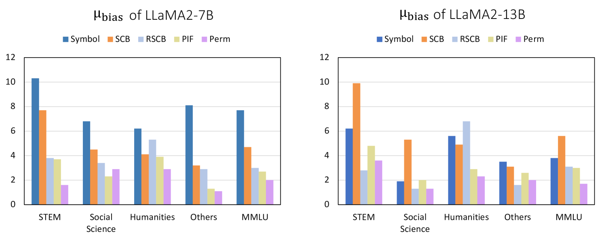

# 通过增强符号绑定，大型语言模型得以转变为精准的多项选择筛选工具。

发布时间：2024年06月03日

`LLM应用

这篇论文主要探讨了大型语言模型（LLMs）在处理多项选择题（MCQs）时的性能问题，特别是监督微调（SFT）阶段的选择偏差问题。论文提出了一种新的SFT算法——逐点智能反馈（PIF），旨在通过改进模型对答案选项与其符号之间关联的理解来减少选择偏差，并提高MCQs的准确性。这一研究直接应用于LLMs的实际问题解决，属于LLM应用的范畴。` `人工智能`

> Strengthened Symbol Binding Makes Large Language Models Reliable Multiple-Choice Selectors

# 摘要

> 多项选择题（MCQs）在大型语言模型（LLMs）研究中占据重要地位。以往研究已揭示，在少量样本情况下，LLM的性能受答案选项呈现方式影响，但监督微调（SFT）中的选择偏差问题尚未被深入探讨。本文发现，SFT阶段的选择偏差源于LLM在多项选择符号绑定（MCSB）上的不足，即模型难以有效关联答案选项与其符号（如A/B/C/D）。为此，我们通过将选项内容融入损失函数，并调整其与符号的权重，引导模型更准确地理解选项内容。基于此，我们开发了一种名为逐点智能反馈（PIF）的高效SFT算法，它通过随机组合错误选项与符号创建负例，并利用逐点损失向LLMs提供反馈。实验证明，PIF显著减少了选择偏差，大幅提升了MCQs的准确性。

> Multiple-Choice Questions (MCQs) constitute a critical area of research in the study of Large Language Models (LLMs). Previous works have investigated the selection bias problem in MCQs within few-shot scenarios, in which the LLM's performance may be influenced by the presentation of answer choices, leaving the selection bias during Supervised Fine-Tuning (SFT) unexplored. In this paper, we reveal that selection bias persists in the SFT phase , primarily due to the LLM's inadequate Multiple Choice Symbol Binding (MCSB) ability. This limitation implies that the model struggles to associate the answer options with their corresponding symbols (e.g., A/B/C/D) effectively. To enhance the model's MCSB capability, we first incorporate option contents into the loss function and subsequently adjust the weights of the option symbols and contents, guiding the model to understand the option content of the current symbol. Based on this, we introduce an efficient SFT algorithm for MCQs, termed Point-wise Intelligent Feedback (PIF). PIF constructs negative instances by randomly combining the incorrect option contents with all candidate symbols, and proposes a point-wise loss to provide feedback on these negative samples into LLMs. Our experimental results demonstrate that PIF significantly reduces the model's selection bias by improving its MCSB capability. Remarkably, PIF exhibits a substantial enhancement in the accuracy for MCQs.

[Arxiv](https://arxiv.org/abs/2406.01026)