# TCMBench：传统中医领域大型语言模型的全面评估基准

发布时间：2024年06月03日

`LLM应用

理由：这篇论文主要关注于开发和评估大型语言模型（LLMs）在中医（TCM）领域的应用，特别是通过创建一个名为TCM-Bench的评估基准来测试和改进LLMs在中医相关任务上的表现。论文讨论了专门为中医设计的评估指标TCMScore，并分析了LLMs在中医领域的性能和挑战。这些内容主要涉及LLMs的实际应用和评估，而不是理论研究或Agent的设计，因此最适合归类为LLM应用。` `医学评估`

> TCMBench: A Comprehensive Benchmark for Evaluating Large Language Models in Traditional Chinese Medicine

# 摘要

> 大型语言模型（LLMs）在西方医学领域的自然语言处理任务中表现卓越，但在中医（TCM）领域，这一古老而广泛影响的医学体系中，对LLMs的专业评估基准尚属空白。为此，我们开发了TCM-Bench，一个专为中医设计的全面评估基准，包含5,473个来自中医执业考试（TCMLE）的问题，其中1,300个问题附有权威解析，覆盖了中医基础与临床实践的核心内容。我们不仅关注问题回答的准确性，还特别设计了TCMScore这一指标，用以全面评估LLMs在中医相关问题上的答案质量，考虑了中医语义和知识的一致性。实验分析揭示了以下关键点：（1）LLMs在TCM-Bench上的表现不尽人意，表明其在中医领域有巨大的提升空间；（2）领域知识的引入能增强LLMs的性能，但如ZhongJing-TCM等模型在分析文本生成上的质量有所下降，我们推测这可能与其微调过程有关；（3）传统文本质量评估指标如Rouge和BertScore易受文本长度和语义模糊性的影响，而TCMScore等领域特定指标能更深入地补充和解释评估结果。这些发现不仅揭示了LLMs在中医领域的潜力与挑战，也旨在为医学研究提供更为精准的支持。

> Large language models (LLMs) have performed remarkably well in various natural language processing tasks by benchmarking, including in the Western medical domain. However, the professional evaluation benchmarks for LLMs have yet to be covered in the traditional Chinese medicine(TCM) domain, which has a profound history and vast influence. To address this research gap, we introduce TCM-Bench, an comprehensive benchmark for evaluating LLM performance in TCM. It comprises the TCM-ED dataset, consisting of 5,473 questions sourced from the TCM Licensing Exam (TCMLE), including 1,300 questions with authoritative analysis. It covers the core components of TCMLE, including TCM basis and clinical practice. To evaluate LLMs beyond accuracy of question answering, we propose TCMScore, a metric tailored for evaluating the quality of answers generated by LLMs for TCM related questions. It comprehensively considers the consistency of TCM semantics and knowledge. After conducting comprehensive experimental analyses from diverse perspectives, we can obtain the following findings: (1) The unsatisfactory performance of LLMs on this benchmark underscores their significant room for improvement in TCM. (2) Introducing domain knowledge can enhance LLMs' performance. However, for in-domain models like ZhongJing-TCM, the quality of generated analysis text has decreased, and we hypothesize that their fine-tuning process affects the basic LLM capabilities. (3) Traditional metrics for text generation quality like Rouge and BertScore are susceptible to text length and surface semantic ambiguity, while domain-specific metrics such as TCMScore can further supplement and explain their evaluation results. These findings highlight the capabilities and limitations of LLMs in the TCM and aim to provide a more profound assistance to medical research.

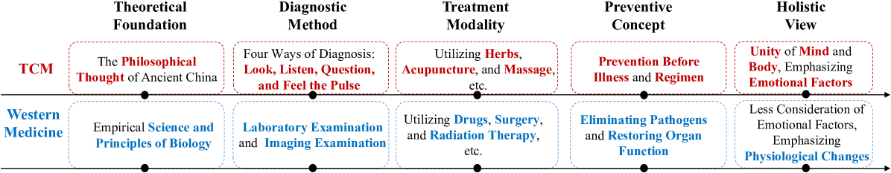

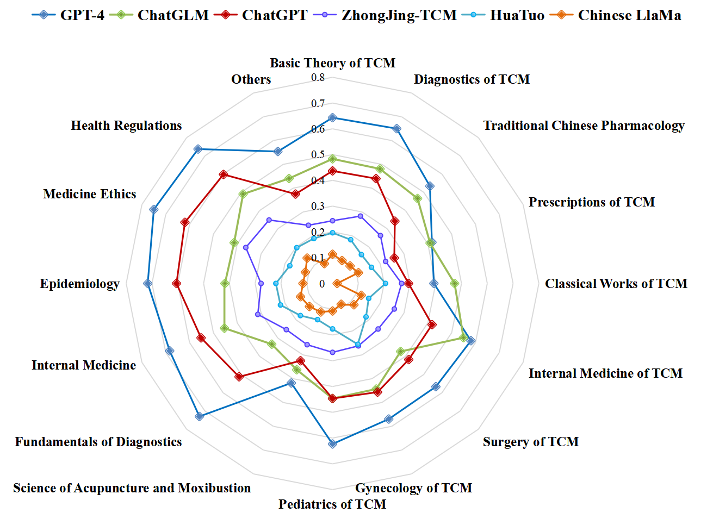

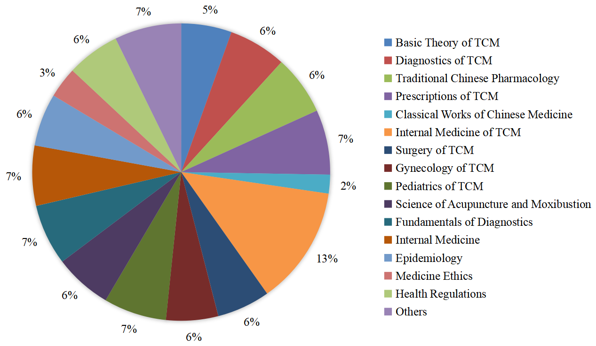

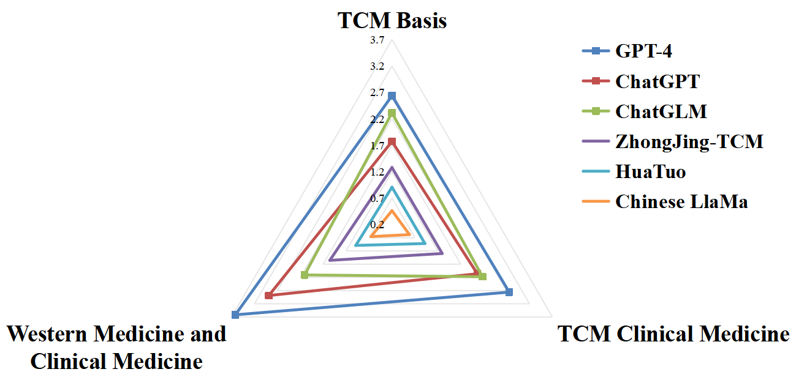

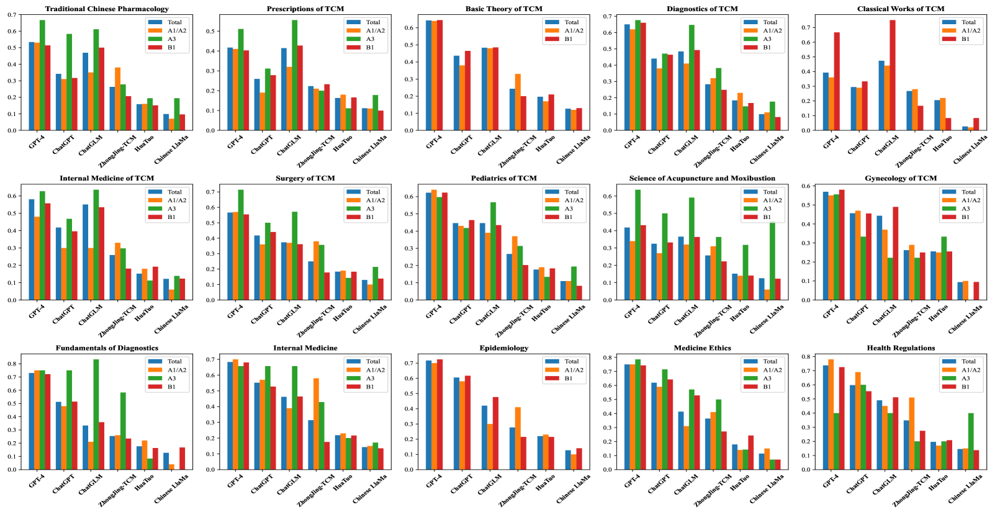

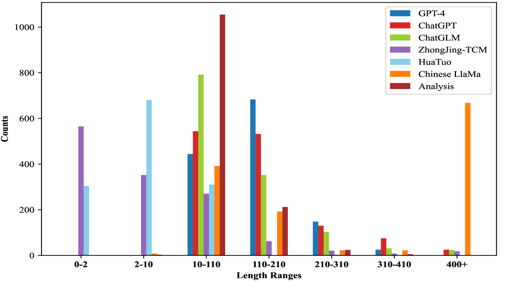

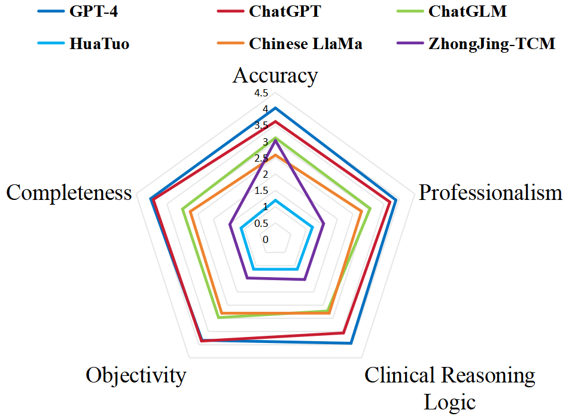

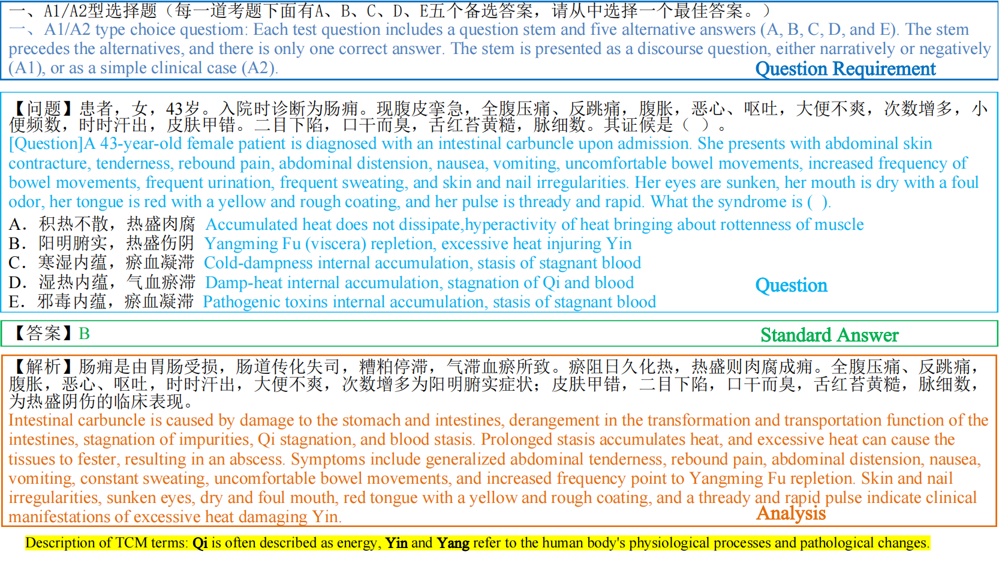

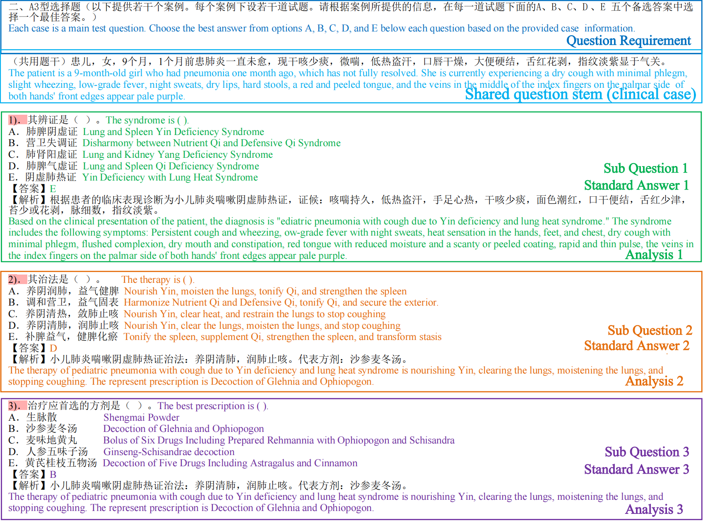

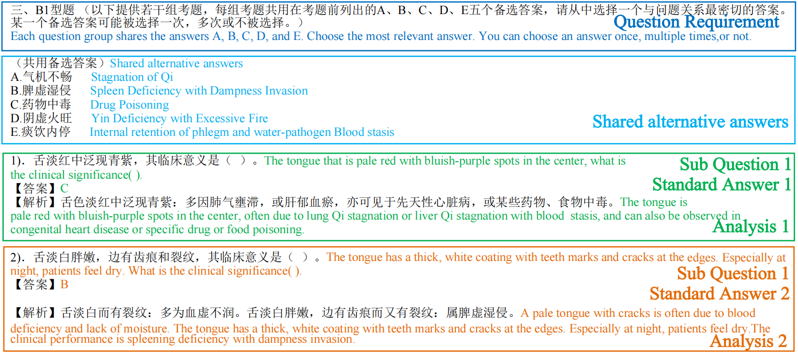

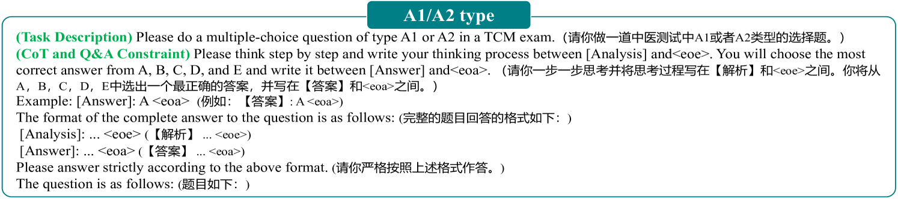

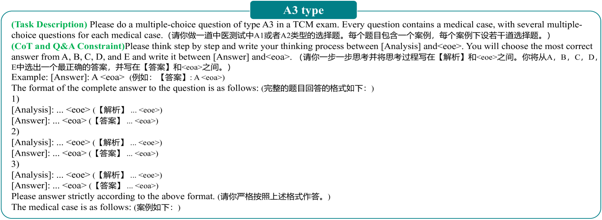

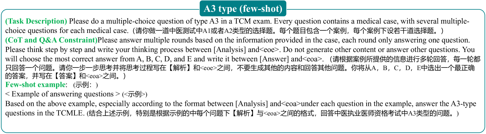

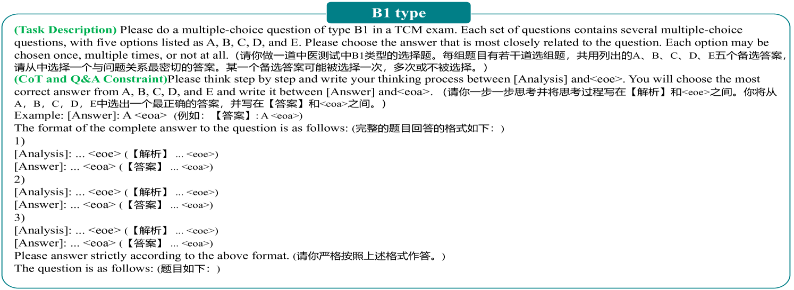

[Arxiv](https://arxiv.org/abs/2406.01126)