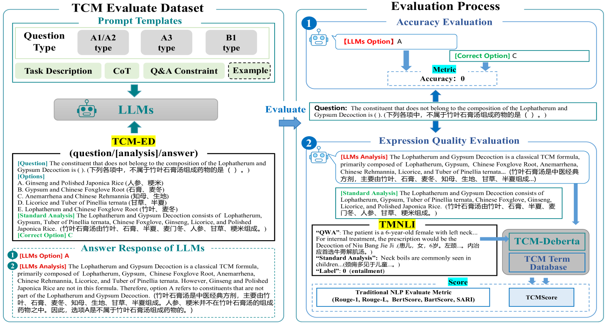

# TCMBench：传统中医学领域大型语言模型的综合评估基准

发布时间：2024年06月03日

`LLM应用

这篇论文主要关注的是大型语言模型（LLMs）在传统中医（TCM）领域的应用和性能评估。通过开发TCM-Bench这一专为TCM设计的评估基准，并引入新的评估指标TCMScore，论文探讨了LLMs在特定医学领域的应用潜力和面临的挑战。这与LLM的理论研究不同，因为它侧重于实际应用和性能评估，而不是模型或算法的理论基础。此外，它也不属于Agent或RAG分类，因为它不涉及代理行为或检索增强生成技术。因此，最合适的分类是LLM应用。` `医学评估`

> TCMBench: A Comprehensive Benchmark for Evaluating Large Language Models in Traditional Chinese Medicine

# 摘要

> 大型语言模型（LLMs）在西方医学领域的自然语言处理任务中表现卓越，但在传统中医（TCM）领域，这一评估尚未涉及。为此，我们开发了TCM-Bench，一个专为TCM设计的LLMs性能评估基准，包含5,473个来自TCM执业考试的问题，其中1,300个附有权威解析。TCM-Bench不仅评估答案的准确性，还引入了TCMScore这一新指标，全面考量TCM语义与知识的连贯性。实验分析显示，LLMs在TCM领域的应用尚有巨大提升空间，领域知识的引入能增强其性能，但过度微调可能损害模型的基本能力。此外，传统评估指标易受文本长度和语义模糊影响，而TCMScore等特定领域指标能更准确地评估模型表现。这些发现不仅揭示了LLMs在TCM领域的潜力与挑战，也为医学研究提供了更深层次的支持。

> Large language models (LLMs) have performed remarkably well in various natural language processing tasks by benchmarking, including in the Western medical domain. However, the professional evaluation benchmarks for LLMs have yet to be covered in the traditional Chinese medicine(TCM) domain, which has a profound history and vast influence. To address this research gap, we introduce TCM-Bench, an comprehensive benchmark for evaluating LLM performance in TCM. It comprises the TCM-ED dataset, consisting of 5,473 questions sourced from the TCM Licensing Exam (TCMLE), including 1,300 questions with authoritative analysis. It covers the core components of TCMLE, including TCM basis and clinical practice. To evaluate LLMs beyond accuracy of question answering, we propose TCMScore, a metric tailored for evaluating the quality of answers generated by LLMs for TCM related questions. It comprehensively considers the consistency of TCM semantics and knowledge. After conducting comprehensive experimental analyses from diverse perspectives, we can obtain the following findings: (1) The unsatisfactory performance of LLMs on this benchmark underscores their significant room for improvement in TCM. (2) Introducing domain knowledge can enhance LLMs' performance. However, for in-domain models like ZhongJing-TCM, the quality of generated analysis text has decreased, and we hypothesize that their fine-tuning process affects the basic LLM capabilities. (3) Traditional metrics for text generation quality like Rouge and BertScore are susceptible to text length and surface semantic ambiguity, while domain-specific metrics such as TCMScore can further supplement and explain their evaluation results. These findings highlight the capabilities and limitations of LLMs in the TCM and aim to provide a more profound assistance to medical research.

[Arxiv](https://arxiv.org/abs/2406.01126)