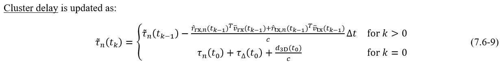

# TSpec-LLM：一款专为大型语言模型解读3GPP规范而设的开源数据集

发布时间：2024年06月03日

`RAG

这篇论文主要介绍了名为\textit{TSpec-LLM}的数据集，该数据集包含了1999至2023年间所有3GPP文档，并探讨了如何利用这个数据集通过检索增强生成（RAG）框架来提升大型语言模型（LLMs）的上下文检索能力。论文中提到的RAG框架的应用，以及其对GPT-3.5、Gemini 1.0 Pro和GPT-4等模型性能的提升，表明了该研究的重点在于通过特定的数据集和框架优化LLM的应用性能，而不是探讨LLM的理论基础或Agent的设计与应用。因此，这篇论文最符合RAG分类。` `数据集`

> TSpec-LLM: An Open-source Dataset for LLM Understanding of 3GPP Specifications

# 摘要

> 理解电信标准涉及繁琐的技术文档梳理，尤其是那些由3GPP发布的。尽管大型语言模型（LLMs）能辅助处理这些庞大的知识库，但一个全面的数据集对其预训练和微调至关重要。本文推出了\textit{TSpec-LLM}，一个覆盖1999至2023年间所有3GPP文档的开源数据集。我们通过选取代表性文档样本并设计技术问题，评估了LLMs的基准性能，并引入了检索增强生成（RAG）框架，利用\textit{TSpec-LLM}数据集提升LLMs的上下文检索能力。结果表明，采用RAG框架后，GPT-3.5、Gemini 1.0 Pro和GPT-4的准确率分别提升至71%、75%和72%。

> Understanding telecom standards involves sorting through numerous technical documents, such as those produced by the 3rd Generation Partnership Project (3GPP), which is time-consuming and labor-intensive. While large language models (LLMs) can assist with the extensive 3GPP knowledge base, an inclusive dataset is crucial for their effective pre-training and fine-tuning. In this paper, we introduce \textit{TSpec-LLM}, an open-source comprehensive dataset covering all 3GPP documents from Release 8 to Release 19 (1999--2023). To evaluate its efficacy, we first select a representative sample of 3GPP documents, create corresponding technical questions, and assess the baseline performance of various LLMs. We then incorporate a retrieval-augmented generation (RAG) framework to enhance LLM capabilities by retrieving relevant context from the \textit{TSpec-LLM} dataset. Our evaluation shows that using a naive-RAG framework on \textit{TSpec-LLM} improves the accuracy of GPT-3.5, Gemini 1.0 Pro, and GPT-4 from 44\%, 46\%, and 51\% to 71\%, 75\%, and 72\%, respectively.

[Arxiv](https://arxiv.org/abs/2406.01768)