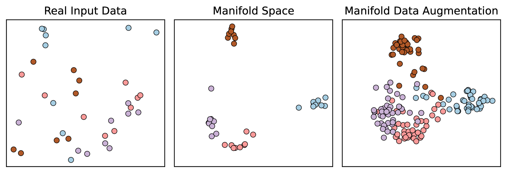
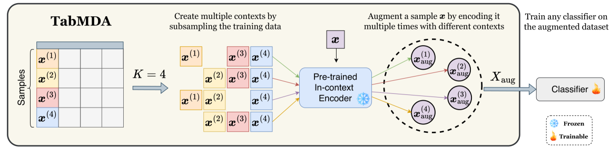
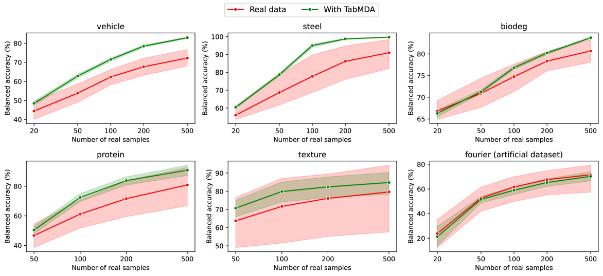
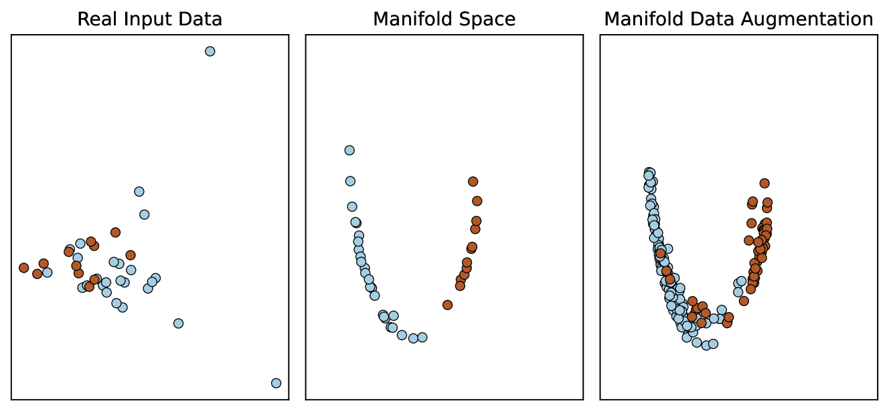
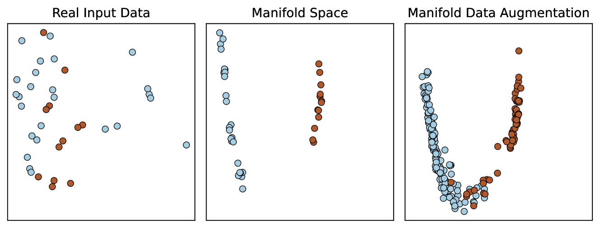
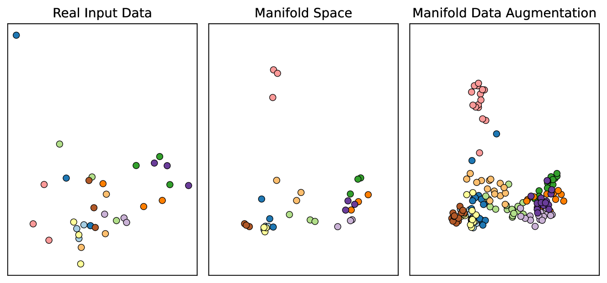
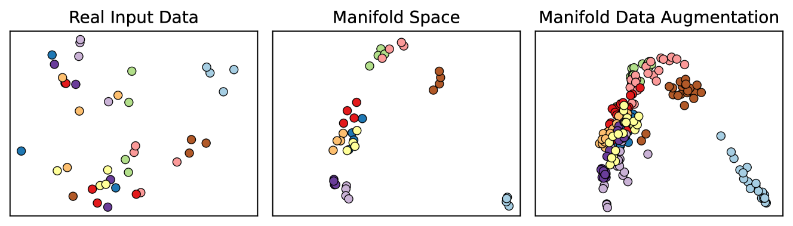

# TabMDA：利用Transformer的上下文子集技术，为任意分类器提供表格流形数据增强方案

发布时间：2024年06月03日

`LLM应用

理由：这篇论文介绍了一种名为TabMDA的新型表格数据多维数据增强技术，该技术利用预训练的上下文模型（如TabPFN）来增强表格数据的性能。这种方法直接应用于现有的机器学习模型，以提升其在表格数据上的表现，属于对大型语言模型（LLM）的应用范畴。虽然它涉及到预训练模型的使用，但重点在于如何利用这些模型来改善数据增强技术，而不是探讨LLM的理论基础或Agent的行为，也不是关于检索增强生成（RAG）的具体应用。因此，最合适的分类是LLM应用。` `数据增强` `机器学习`

> TabMDA: Tabular Manifold Data Augmentation for Any Classifier using Transformers with In-context Subsetting

# 摘要

> 表格数据在多个关键领域中广泛存在，但其获取量往往有限，导致机器学习模型在此类数据上的表现不佳。尽管数据增强在视觉和语言任务中常能提升性能，但面对表格数据时，由于输入空间缺乏明显对称性，其效果通常不尽人意。为此，我们开发了TabMDA，一种新颖的表格数据多维数据增强技术。TabMDA利用预训练的上下文模型（如TabPFN）将数据映射至多维空间，并通过在不同上下文中多次编码数据来实现标签不变的转换，从而探索并扩展了底层模型的多维结构，有效增大了训练数据集。作为一种无需额外训练的方法，TabMDA可应用于任何分类器。我们在五个标准分类器上测试了TabMDA，并在多个表格数据集上观察到了显著的性能提升。实验结果证实，TabMDA能有效利用预训练上下文模型的信息，显著提升下游分类器的性能。

> Tabular data is prevalent in many critical domains, yet it is often challenging to acquire in large quantities. This scarcity usually results in poor performance of machine learning models on such data. Data augmentation, a common strategy for performance improvement in vision and language tasks, typically underperforms for tabular data due to the lack of explicit symmetries in the input space. To overcome this challenge, we introduce TabMDA, a novel method for manifold data augmentation on tabular data. This method utilises a pre-trained in-context model, such as TabPFN, to map the data into a manifold space. TabMDA performs label-invariant transformations by encoding the data multiple times with varied contexts. This process explores the manifold of the underlying in-context models, thereby enlarging the training dataset. TabMDA is a training-free method, making it applicable to any classifier. We evaluate TabMDA on five standard classifiers and observe significant performance improvements across various tabular datasets. Our results demonstrate that TabMDA provides an effective way to leverage information from pre-trained in-context models to enhance the performance of downstream classifiers.

[Arxiv](https://arxiv.org/abs/2406.01805)