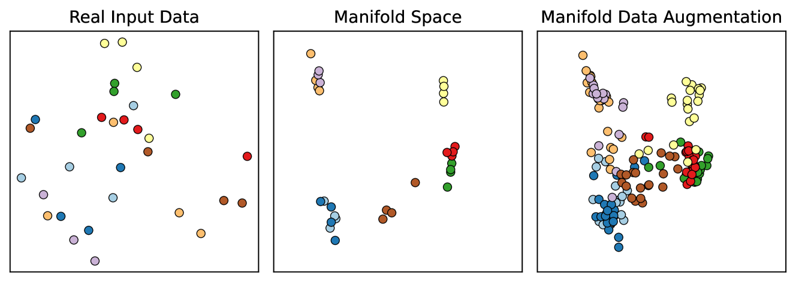

# TabMDA：利用Transformer的上下文子集技术，为任意分类器提供表格流形数据增强方案

发布时间：2024年06月03日

`LLM应用

理由：这篇论文介绍了一种名为TabMDA的新技术，它利用预训练的上下文模型（如TabPFN）来增强表格数据，从而提升机器学习模型在有限表格数据上的表现。这种方法直接应用了预训练模型来解决实际问题，即表格数据的数据增强，属于LLM（大型语言模型）的应用范畴。论文中并未深入探讨模型的理论基础或Agent的设计，也没有涉及检索增强生成（RAG）的相关内容，因此最合适的分类是LLM应用。` `数据增强` `机器学习`

> TabMDA: Tabular Manifold Data Augmentation for Any Classifier using Transformers with In-context Subsetting

# 摘要

> 表格数据在众多关键领域中广泛存在，但其获取量往往有限，导致机器学习模型在此类数据上的表现不佳。尽管数据增强在视觉和语言任务中常能提升性能，但面对表格数据时，由于输入空间缺乏明确对称性，其效果往往不尽人意。为此，我们创新性地提出了TabMDA，一种针对表格数据的流形数据增强技术。TabMDA借助预训练的上下文模型（如TabPFN），将数据映射至流形空间，并通过多次以不同上下文编码数据，实现标签不变的变换，从而探索并扩展了底层模型的流形，有效扩充了训练数据集。作为一种无需额外训练的方法，TabMDA可广泛应用于各类分类器。我们在五个标准分类器上验证了TabMDA的效果，并在多个表格数据集上观察到了显著的性能提升。实验结果证实，TabMDA能有效利用预训练上下文模型的信息，显著提升下游分类器的性能。

> Tabular data is prevalent in many critical domains, yet it is often challenging to acquire in large quantities. This scarcity usually results in poor performance of machine learning models on such data. Data augmentation, a common strategy for performance improvement in vision and language tasks, typically underperforms for tabular data due to the lack of explicit symmetries in the input space. To overcome this challenge, we introduce TabMDA, a novel method for manifold data augmentation on tabular data. This method utilises a pre-trained in-context model, such as TabPFN, to map the data into a manifold space. TabMDA performs label-invariant transformations by encoding the data multiple times with varied contexts. This process explores the manifold of the underlying in-context models, thereby enlarging the training dataset. TabMDA is a training-free method, making it applicable to any classifier. We evaluate TabMDA on five standard classifiers and observe significant performance improvements across various tabular datasets. Our results demonstrate that TabMDA provides an effective way to leverage information from pre-trained in-context models to enhance the performance of downstream classifiers.

[Arxiv](https://arxiv.org/abs/2406.01805)