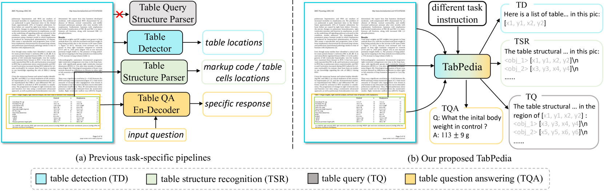
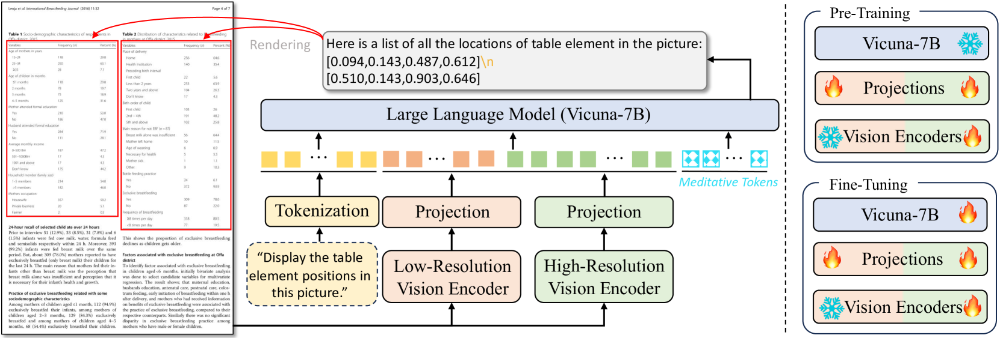
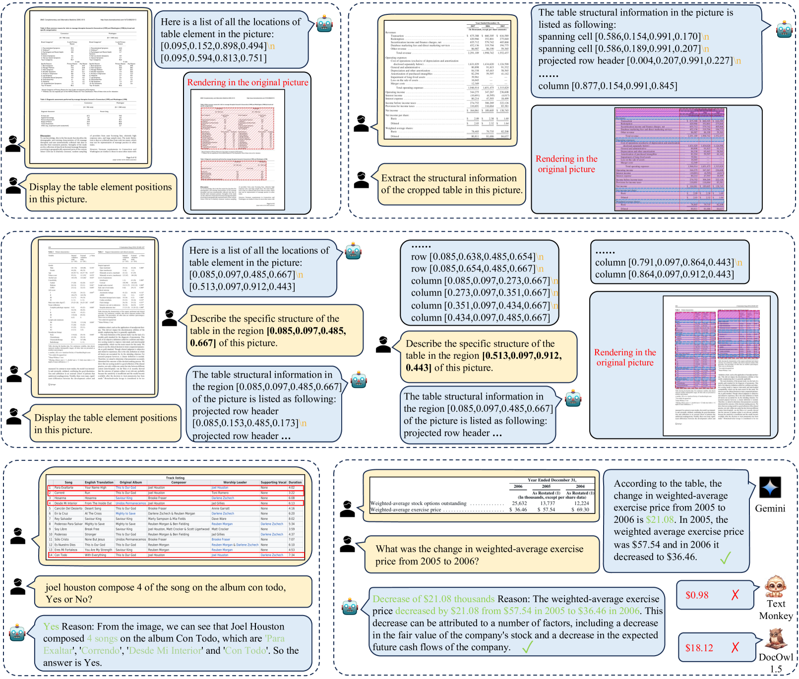
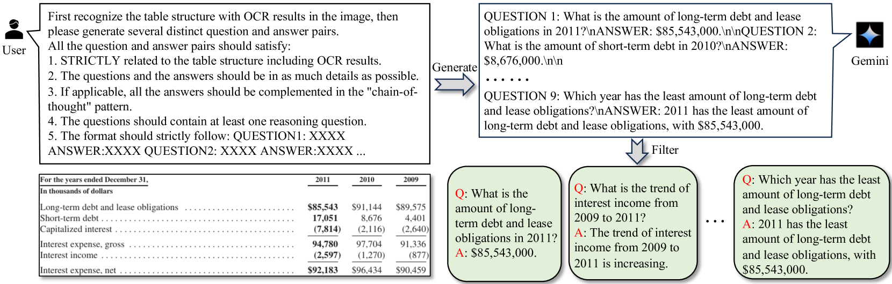
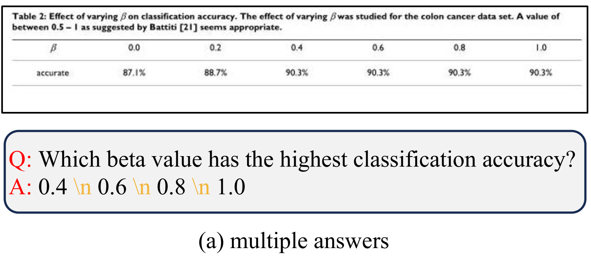
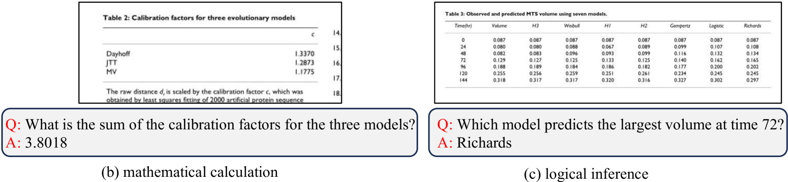

# TabPedia：借助概念协同，探索视觉表格理解的全面性

发布时间：2024年06月03日

`LLM应用

理由：这篇论文介绍了一种名为TabPedia的大型视觉-语言模型，它通过概念协同机制处理各种视觉表格理解任务，如表格检测、结构识别、查询和问答。这种模型利用了大型语言模型（LLMs）的能力，并且通过创建一个新的基准ComTQA来评估其在VTU任务上的表现。这表明论文主要关注于LLM在特定应用场景（即视觉表格理解）中的实际应用和性能评估，因此属于LLM应用类别。` `数据处理` `问答系统`

> TabPedia: Towards Comprehensive Visual Table Understanding with Concept Synergy

# 摘要

> 表格中的事实与量化数据，以及其多样化的结构和内容，对机器的理解提出了挑战。传统方法往往为特定任务定制架构和目标，导致模式孤立和流程复杂。本文介绍了一种创新的大型视觉-语言模型TabPedia，它通过概念协同机制，将各种视觉表格理解（VTU）任务和多源视觉嵌入抽象为统一的概念。这一机制使得TabPedia能够流畅地融合VTU任务，如表格检测、结构识别、查询和问答，充分利用大型语言模型（LLMs）的潜能。概念协同机制还促进了表格感知与理解任务的和谐协作，它们能从相应的感知嵌入中提取关键线索。为了更真实地评估VTU任务，我们创建了一个包含约9,000个QA对的全面表格VQA基准ComTQA。在多个公共基准上进行的广泛实验证实了TabPedia在表格感知与理解上的高效性。其优异表现进一步证明了当所有概念协同作用时，LLMs在视觉表格理解上的潜力。ComTQA基准已在https://huggingface.co/datasets/ByteDance/ComTQA公开，源代码和模型即将发布。

> Tables contain factual and quantitative data accompanied by various structures and contents that pose challenges for machine comprehension. Previous methods generally design task-specific architectures and objectives for individual tasks, resulting in modal isolation and intricate workflows. In this paper, we present a novel large vision-language model, TabPedia, equipped with a concept synergy mechanism. In this mechanism, all the involved diverse visual table understanding (VTU) tasks and multi-source visual embeddings are abstracted as concepts. This unified framework allows TabPedia to seamlessly integrate VTU tasks, such as table detection, table structure recognition, table querying, and table question answering, by leveraging the capabilities of large language models (LLMs). Moreover, the concept synergy mechanism enables table perception-related and comprehension-related tasks to work in harmony, as they can effectively leverage the needed clues from the corresponding source perception embeddings. Furthermore, to better evaluate the VTU task in real-world scenarios, we establish a new and comprehensive table VQA benchmark, ComTQA, featuring approximately 9,000 QA pairs. Extensive quantitative and qualitative experiments on both table perception and comprehension tasks, conducted across various public benchmarks, validate the effectiveness of our TabPedia. The superior performance further confirms the feasibility of using LLMs for understanding visual tables when all concepts work in synergy. The benchmark ComTQA has been open-sourced at https://huggingface.co/datasets/ByteDance/ComTQA. The source code and model will be released later.

[Arxiv](https://arxiv.org/abs/2406.01326)