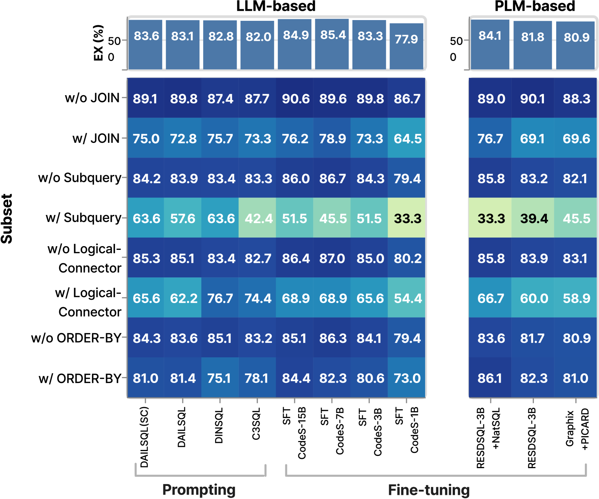
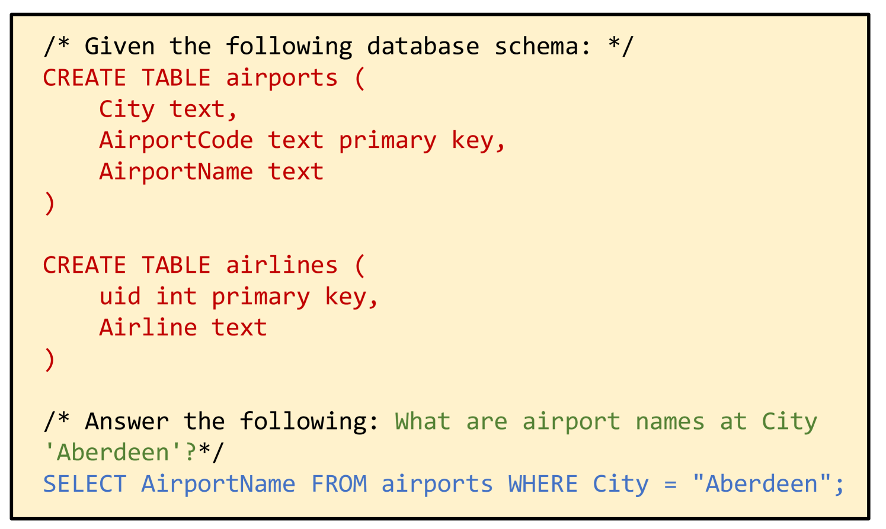

# 自然语言转SQL的时代已至，我们是否已做好万全准备？

发布时间：2024年06月03日

`LLM应用

这篇论文主要讨论了如何将自然语言问题转化为SQL查询（NL2SQL），并介绍了为此开发的一个全面的评估框架——NL2SQL360。这个框架用于评估和比较不同的NL2SQL技术，并探索最佳的设计方案。由于这项工作主要关注于大型语言模型（LLM）在实际应用中的表现和优化，特别是在NL2SQL任务中的应用，因此它属于LLM应用分类。` `数据库管理`

> The Dawn of Natural Language to SQL: Are We Fully Ready?

# 摘要

> 将自然语言问题转化为SQL查询（NL2SQL）极大地简化了访问关系数据库的过程。随着大型语言模型的兴起，NL2SQL任务的能力得到了显著提升。但这也带来了一个重要问题：我们是否已准备好将这些模型投入实际应用？为此，我们开发了一个全面的NL2SQL评估框架——NL2SQL360，旨在帮助研究者设计和测试新的NL2SQL技术。通过NL2SQL360，我们深入比较了多种NL2SQL方法在不同场景下的表现，包括数据领域和SQL特性，为选择最合适的NL2SQL技术提供了重要参考。此外，我们还利用NL2SQL360探索了NL2SQL的最佳设计方案，自动识别出针对特定用户需求的最佳解决方案。特别地，NL2SQL360发现了一种高效的NL2SQL方法——SuperSQL，在Spider数据集上以87%的执行准确性脱颖而出。在Spider和BIRD测试集上，SuperSQL分别取得了87%和62.66%的执行准确性，显示出强大的竞争力。

> Translating users' natural language questions into SQL queries (i.e., NL2SQL) significantly lowers the barriers to accessing relational databases. The emergence of Large Language Models has introduced a novel paradigm in NL2SQL tasks, enhancing capabilities dramatically. However, this raises a critical question: Are we fully prepared to deploy NL2SQL models in production?
  To address the posed questions, we present a multi-angle NL2SQL evaluation framework, NL2SQL360, to facilitate the design and test of new NL2SQL methods for researchers. Through NL2SQL360, we conduct a detailed comparison of leading NL2SQL methods across a range of application scenarios, such as different data domains and SQL characteristics, offering valuable insights for selecting the most appropriate NL2SQL methods for specific needs. Moreover, we explore the NL2SQL design space, leveraging NL2SQL360 to automate the identification of an optimal NL2SQL solution tailored to user-specific needs. Specifically, NL2SQL360 identifies an effective NL2SQL method, SuperSQL, distinguished under the Spdier dataset using the execution accuracy metric. Remarkably, SuperSQL achieves competitive performance with execution accuracy of 87% and 62.66% on the Spider and BIRD test sets, respectively.

[Arxiv](https://arxiv.org/abs/2406.01265)