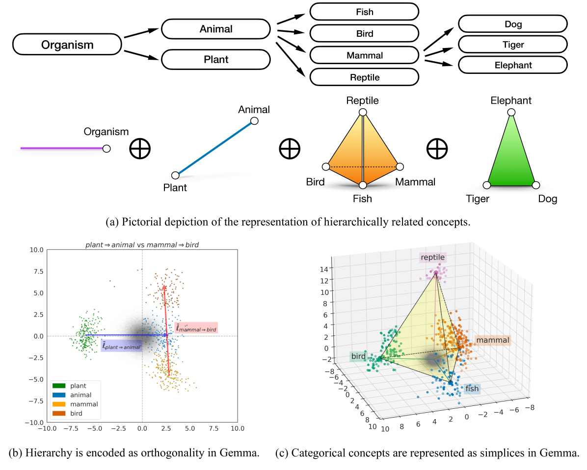
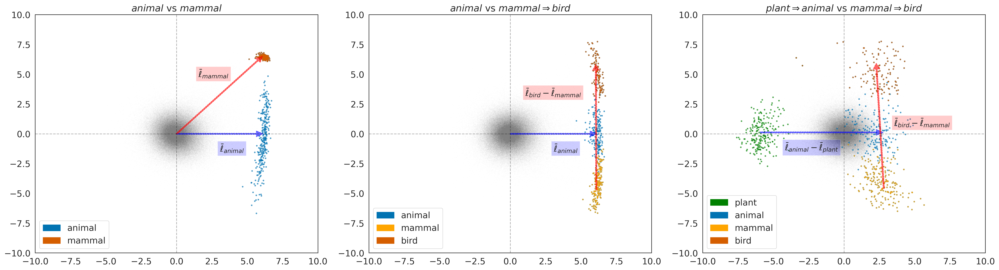
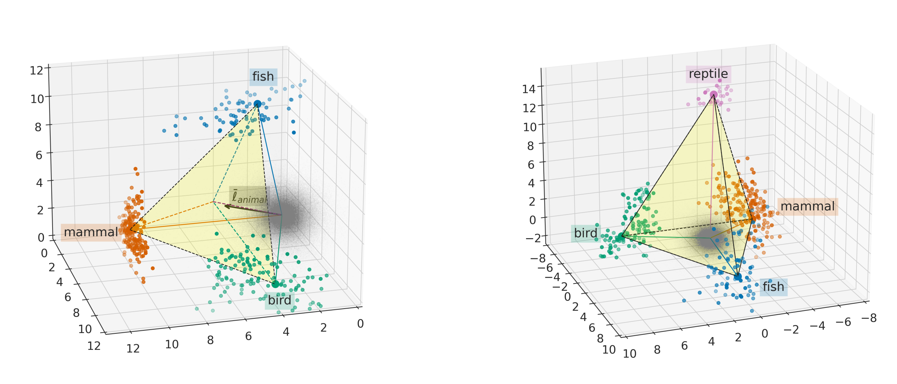
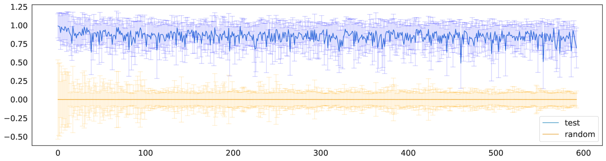
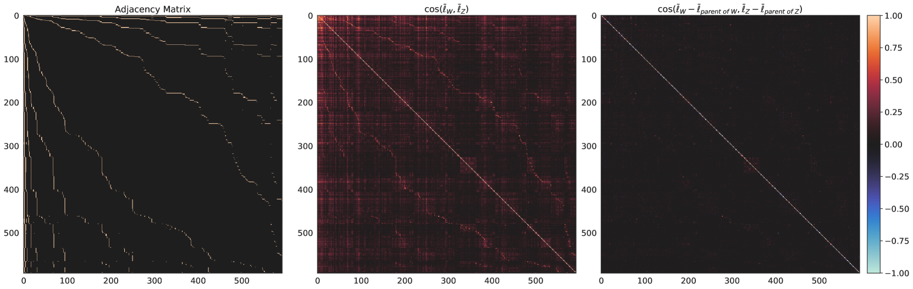
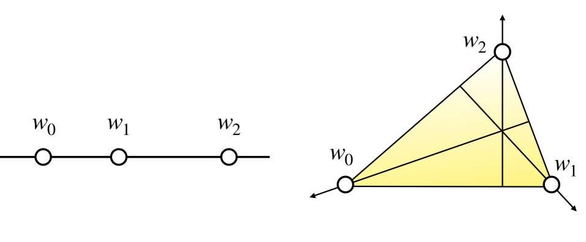
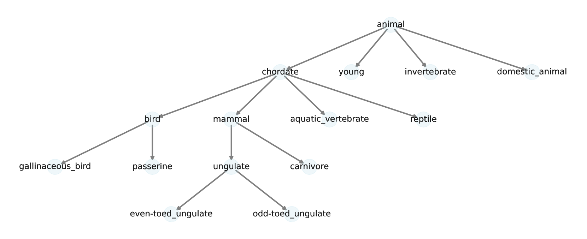
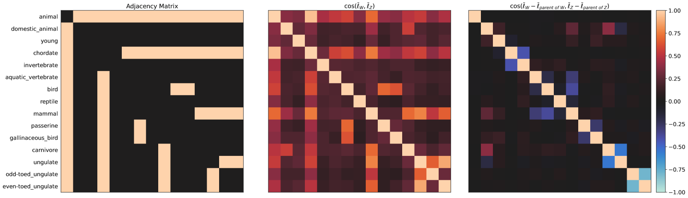
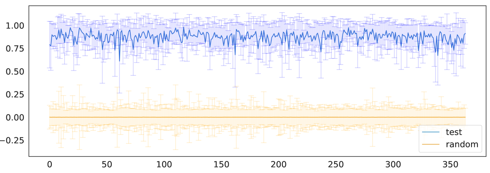
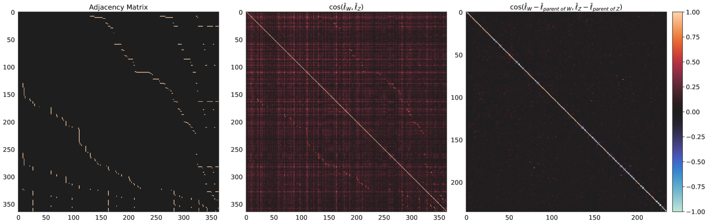

# 大型语言模型中分类与层次概念的几何探索

发布时间：2024年06月03日

`LLM理论

这篇论文主要探讨了大型语言模型（LLM）如何编码语义意义，特别是如何表示和编码类别概念及其间的层次关系。这涉及到对LLM内部工作原理的理论分析和研究，因此属于LLM理论分类。论文通过扩展线性表示假设，提出了一种表示和编码概念的方法，并在实际模型上进行了验证，这进一步强化了其理论性质。` `知识表示`

> The Geometry of Categorical and Hierarchical Concepts in Large Language Models

# 摘要

> 探索大型语言模型如何编码语义意义，是解读其工作原理的关键。本文深入探讨了两大核心问题：一是如何表示如{'哺乳动物', '鸟', '爬行动物', '鱼'}等类别概念；二是如何编码概念间的层次关系，比如'狗'属于'哺乳动物'这一事实。我们通过扩展线性表示假设，揭示了一个简洁的结构：基本类别概念以单纯形表示，层次关系概念在特定意义上保持正交，而复杂概念则通过单纯形的直接和构成的多面体来表达，映射出层次结构。我们利用WordNet数据，在Gemma模型上验证了这一理论，精确估计了957个层次相关概念的表示。

> Understanding how semantic meaning is encoded in the representation spaces of large language models is a fundamental problem in interpretability. In this paper, we study the two foundational questions in this area. First, how are categorical concepts, such as {'mammal', 'bird', 'reptile', 'fish'}, represented? Second, how are hierarchical relations between concepts encoded? For example, how is the fact that 'dog' is a kind of 'mammal' encoded? We show how to extend the linear representation hypothesis to answer these questions. We find a remarkably simple structure: simple categorical concepts are represented as simplices, hierarchically related concepts are orthogonal in a sense we make precise, and (in consequence) complex concepts are represented as polytopes constructed from direct sums of simplices, reflecting the hierarchical structure. We validate these theoretical results on the Gemma large language model, estimating representations for 957 hierarchically related concepts using data from WordNet.

[Arxiv](https://arxiv.org/abs/2406.01506)