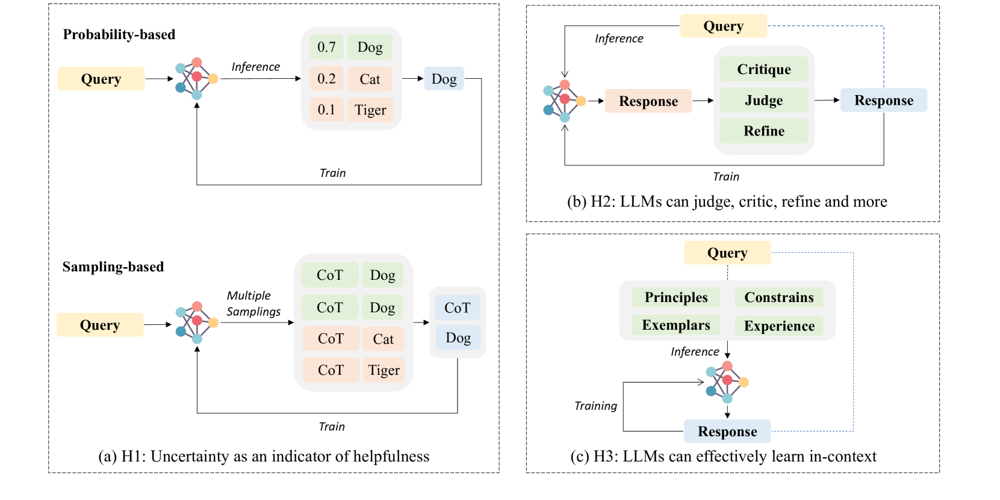

# 探索大型语言模型的可扩展自动对齐：一份综述

发布时间：2024年06月03日

`LLM理论

理由：这篇论文主要探讨了大型语言模型（LLMs）中的对齐问题，特别是自动化对齐方法的发展和内在机制。它分析了对齐信号的来源，并讨论了确保自动化对齐技术有效性的关键要素。这些内容更偏向于理论探讨和方法论的分析，而不是具体的应用实例或Agent的设计，因此归类为LLM理论。` `人工智能`

> Towards Scalable Automated Alignment of LLMs: A Survey

# 摘要

> 在构建满足人类需求的大型语言模型（LLMs）中，对齐是最关键的一环。随着LLMs能力的飞速提升，传统依赖人工标注的对齐方法已难以应对日益增长的需求。因此，寻找新的自动化对齐信号和技术途径变得尤为迫切。本文深入探讨了新兴的自动化对齐方法，旨在揭示当LLMs超越人类能力时，如何实现高效、可扩展的自动化对齐。我们依据对齐信号的来源，将现有方法细分为四大类，并分析了各自的现状与未来潜力。同时，本文还揭示了自动化对齐的内在机制，并从对齐的根本作用出发，探讨了确保自动化对齐技术既可行又有效的关键要素。

> Alignment is the most critical step in building large language models (LLMs) that meet human needs. With the rapid development of LLMs gradually surpassing human capabilities, traditional alignment methods based on human-annotation are increasingly unable to meet the scalability demands. Therefore, there is an urgent need to explore new sources of automated alignment signals and technical approaches. In this paper, we systematically review the recently emerging methods of automated alignment, attempting to explore how to achieve effective, scalable, automated alignment once the capabilities of LLMs exceed those of humans. Specifically, we categorize existing automated alignment methods into 4 major categories based on the sources of alignment signals and discuss the current status and potential development of each category. Additionally, we explore the underlying mechanisms that enable automated alignment and discuss the essential factors that make automated alignment technologies feasible and effective from the fundamental role of alignment.

[Arxiv](https://arxiv.org/abs/2406.01252)