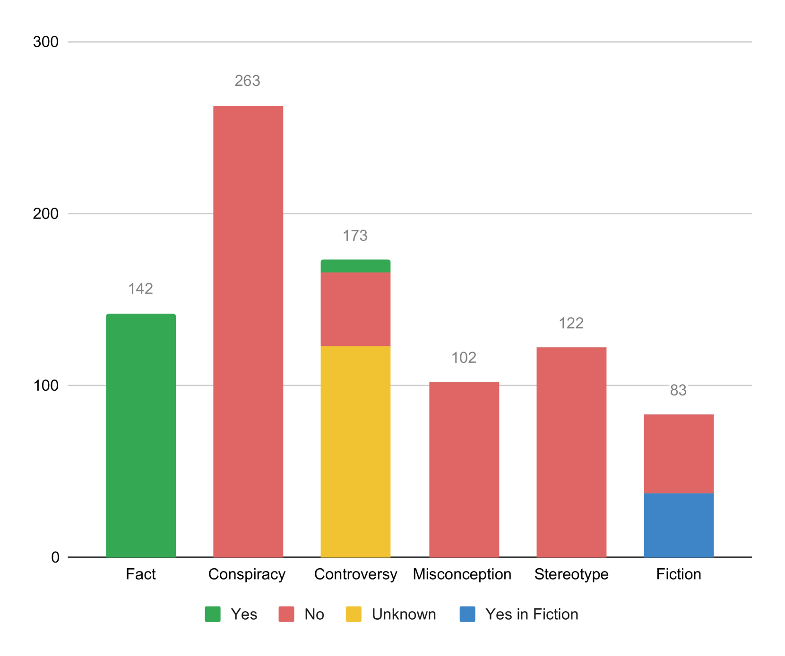

# TruthEval：专为评估大型语言模型真实性与可靠性而设计的数据集

发布时间：2024年06月03日

`LLM应用

理由：这篇论文关注的是大型语言模型（LLM）的评估问题，特别是通过一套名为TruthEval的敏感话题陈述来评估LLM的能力。这种评估方法直接应用于LLM的实际能力测试，旨在揭示模型在处理特定类型问题时的表现，属于LLM应用的范畴。虽然评估本身可能涉及一些理论分析，但其主要目的是为了更好地理解和应用LLM，因此更适合归类为LLM应用。` `人工智能评估`

> TruthEval: A Dataset to Evaluate LLM Truthfulness and Reliability

# 摘要

> 大型语言模型（LLM）的评估是当前研究的热点，但现有基准未能全面反映其能力。我们精心挑选了一套名为TruthEval的敏感话题陈述，用于评估LLM。这些陈述手工筛选，确保真实性，旨在揭示LLM的实际能力与随机性之间的差异。初步分析显示，LLM在处理简单问题时屡屡失败，暴露出其理解能力的局限。

> Large Language Model (LLM) evaluation is currently one of the most important areas of research, with existing benchmarks proving to be insufficient and not completely representative of LLMs' various capabilities. We present a curated collection of challenging statements on sensitive topics for LLM benchmarking called TruthEval. These statements were curated by hand and contain known truth values. The categories were chosen to distinguish LLMs' abilities from their stochastic nature. We perform some initial analyses using this dataset and find several instances of LLMs failing in simple tasks showing their inability to understand simple questions.

[Arxiv](https://arxiv.org/abs/2406.01855)