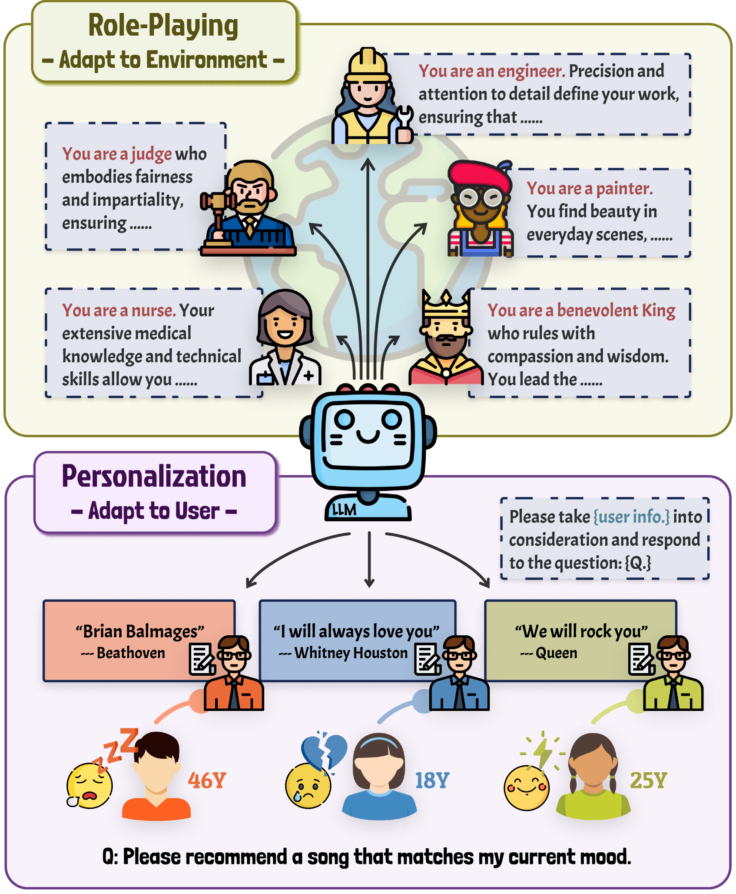
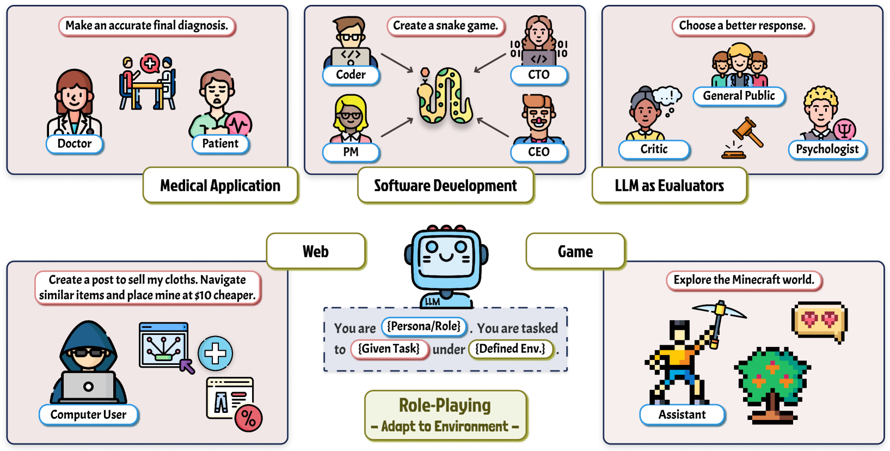
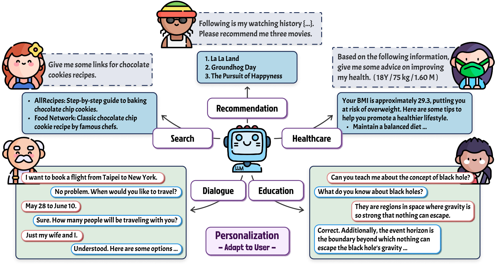

# 大型语言模型中的双重角色探索：角色扮演与个性化研究综述

发布时间：2024年06月03日

`Agent

理由：这篇论文主要探讨了大型语言模型（LLMs）在特定情境下的适应性，特别是通过“角色扮演”和“个性化”来增强模型的应用能力。这种研究方向更偏向于如何使LLMs作为智能代理（Agent）更好地理解和适应用户的需求和情境，而不是纯粹的理论研究或特定的应用技术（如RAG或LLM应用）。因此，将其归类为Agent更为合适。` `人工智能`

> Two Tales of Persona in LLMs: A Survey of Role-Playing and Personalization

# 摘要

> 近期，如何让大型语言模型（LLMs）适应特定情境的研究备受瞩目。特别是，“角色”这一概念，源自对话文学，如今作为一条充满希望的研究路径再次受到关注。尽管关于角色的研究日益增多，但整体上缺乏系统性。为此，我们进行了全面调研，将当前研究分为两大流派：一是LLM的角色扮演，即赋予LLMs特定角色；二是LLM的个性化，即LLMs针对用户角色进行定制。据我们所知，这是首个在统一角色视角下，针对LLM角色扮演和个性化进行的调查，涵盖了分类、挑战及未来方向。为推动后续研究，我们维护了一个论文集合，供社区参考：https://github.com/MiuLab/PersonaLLM-Survey。

> Recently, methods investigating how to adapt large language models (LLMs) for specific scenarios have gained great attention. Particularly, the concept of \textit{persona}, originally adopted in dialogue literature, has re-surged as a promising avenue. However, the growing research on persona is relatively disorganized, lacking a systematic overview. To close the gap, we present a comprehensive survey to categorize the current state of the field. We identify two lines of research, namely (1) LLM Role-Playing, where personas are assigned to LLMs, and (2) LLM Personalization, where LLMs take care of user personas. To the best of our knowledge, we present the first survey tailored for LLM role-playing and LLM personalization under the unified view of persona, including taxonomy, current challenges, and potential directions. To foster future endeavors, we actively maintain a paper collection available to the community: https://github.com/MiuLab/PersonaLLM-Survey

[Arxiv](https://arxiv.org/abs/2406.01171)