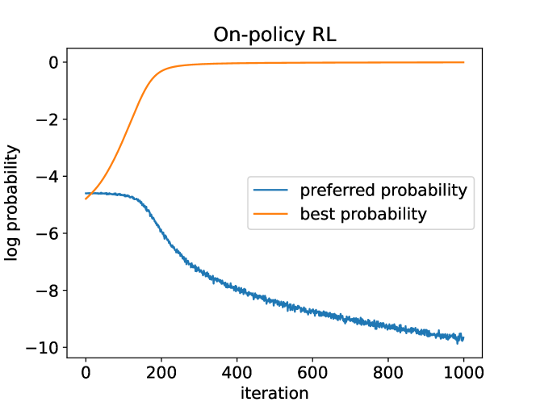
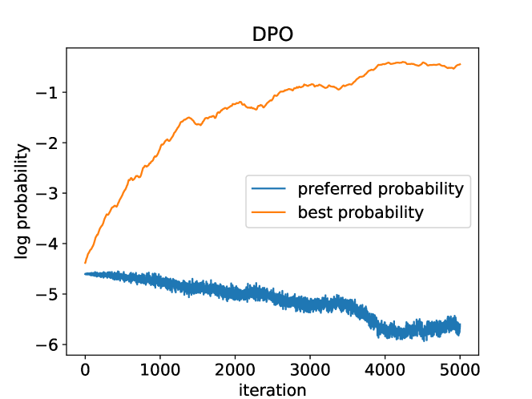
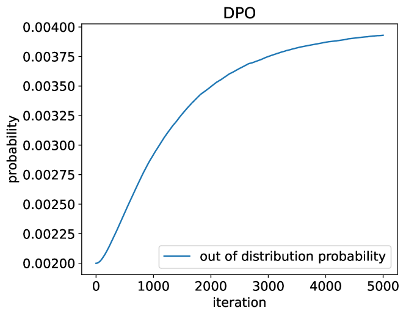

# 从覆盖率的角度洞察偏好微调的奥秘

发布时间：2024年06月03日

`LLM理论

理由：这篇论文主要探讨了大型语言模型（LLMs）的学习方法，特别是在人类偏好数据的学习上，分析了在线和离线方法的差异，并提出了新的混合偏好优化（HyPO）算法。这些内容更多地涉及LLM的理论和算法优化，而不是具体的应用、Agent行为或RAG（检索增强生成）技术。因此，将其归类为LLM理论是合适的。` `人工智能` `机器学习`

> Understanding Preference Fine-Tuning Through the Lens of Coverage

# 摘要

> 人类偏好数据的学习已成为微调大型语言模型（LLMs）的主流方法。在线强化学习（如PPO）和离线对比方法（如DPO），尽管起始点相同，但我们的分析揭示了它们在数据集覆盖度上的差异：离线方法需全局覆盖，而在线方法仅需局部覆盖。这一发现解释了为何在线方法在数据多样性不足时更胜一筹。基于此，我们提出了混合偏好优化（HyPO）算法，结合离线对比优化与在线KL正则化，实证显示HyPO不仅超越了DPO，还保持了高效性。

> Learning from human preference data has emerged as the dominant paradigm for fine-tuning large language models (LLMs). The two most common families of techniques -- online reinforcement learning (RL) such as Proximal Policy Optimization (PPO) and offline contrastive methods such as Direct Preference Optimization (DPO) -- were positioned as equivalent in prior work due to the fact that both have to start from the same offline preference dataset. To further expand our theoretical understanding of the similarities and differences between online and offline techniques for preference fine-tuning, we conduct a rigorous analysis through the lens of dataset coverage, a concept that captures how the training data covers the test distribution and is widely used in RL. We prove that a global coverage condition is both necessary and sufficient for offline contrastive methods to converge to the optimal policy, but a weaker partial coverage condition suffices for online RL methods. This separation provides one explanation of why online RL methods can perform better than offline methods, especially when the offline preference data is not diverse enough. Finally, motivated by our preceding theoretical observations, we derive a hybrid preference optimization (HyPO) algorithm that uses offline data for contrastive-based preference optimization and online data for KL regularization. Theoretically and empirically, we demonstrate that HyPO is more performant than its pure offline counterpart DPO, while still preserving its computation and memory efficiency.

[Arxiv](https://arxiv.org/abs/2406.01462)