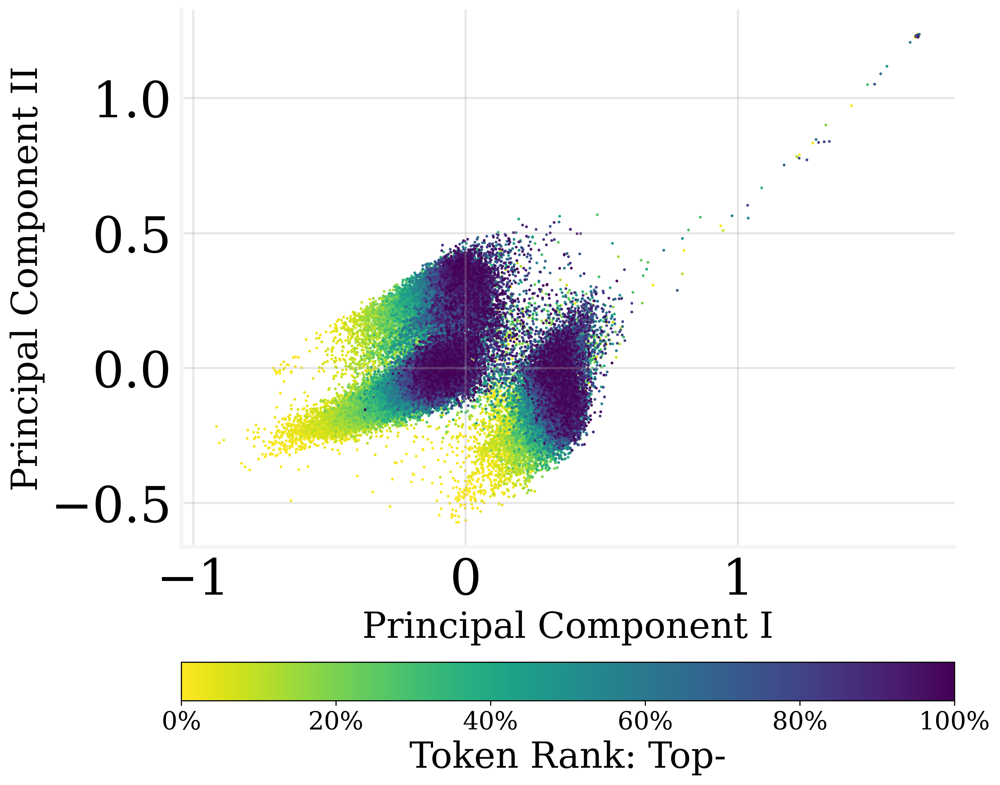
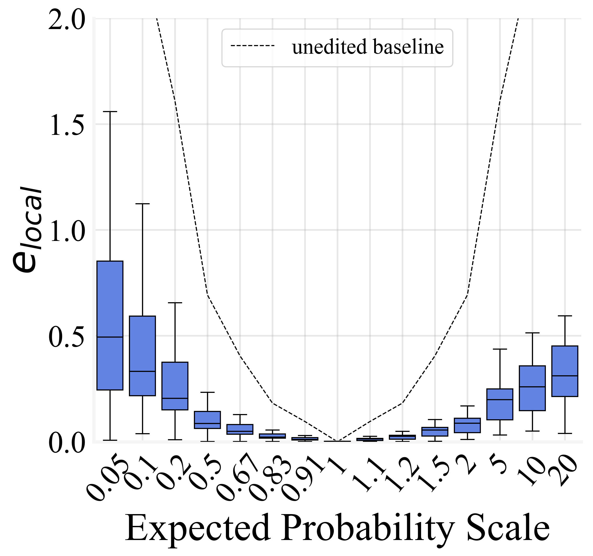
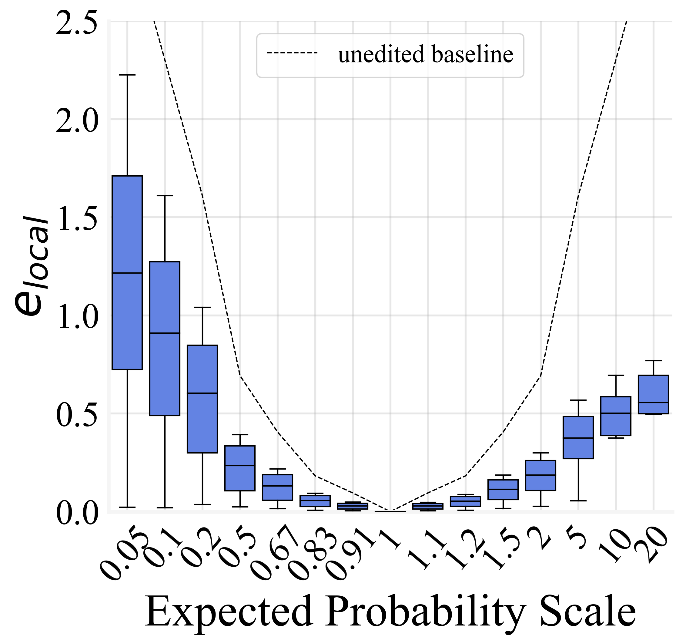

# 解析输出嵌入中的令牌概率编码机制

发布时间：2024年06月03日

`LLM理论

这篇论文探讨了语言模型输出嵌入中的输出令牌概率信息，并提出了一种近似对数线性编码方法。这种方法涉及到输出嵌入的编码调整和输出概率分布的改变，以及对输出嵌入中无关维度的剔除。这些研究内容主要关注语言模型内部的工作机制和优化方法，属于对大型语言模型（LLM）的理论研究。因此，将其分类为LLM理论。` `机器学习`

> Understanding Token Probability Encoding in Output Embeddings

# 摘要

> 本文探讨了语言模型输出嵌入中的输出令牌概率信息，提出了一种近似对数线性编码方法，该方法在输出空间广阔且输出对数集中时表现准确且稀疏。基于此，我们调整了输出嵌入的编码，精准地改变了输出概率分布。研究还发现，输出概率编码的稀疏性意味着输出嵌入中的许多维度对因果语言建模贡献甚微。因此，我们尝试剔除这些无关维度，结果显示，超过30%的维度被移除后，输出分布和序列生成性能并未受到显著影响。此外，在训练过程中，我们利用这种编码作为探针，发现输出嵌入在训练初期就能捕捉到令牌频率信息，甚至在明显收敛之前。

> In this paper, we investigate the output token probability information in the output embedding of language models. We provide an approximate common log-linear encoding of output token probabilities within the output embedding vectors and demonstrate that it is accurate and sparse when the output space is large and output logits are concentrated. Based on such findings, we edit the encoding in output embedding to modify the output probability distribution accurately. Moreover, the sparsity we find in output probability encoding suggests that a large number of dimensions in the output embedding do not contribute to causal language modeling. Therefore, we attempt to delete the output-unrelated dimensions and find more than 30% of the dimensions can be deleted without significant movement in output distribution and degeneration on sequence generation. Additionally, in training dynamics, we use such encoding as a probe and find that the output embeddings capture token frequency information in early steps, even before an obvious convergence starts.

[Arxiv](https://arxiv.org/abs/2406.01468)