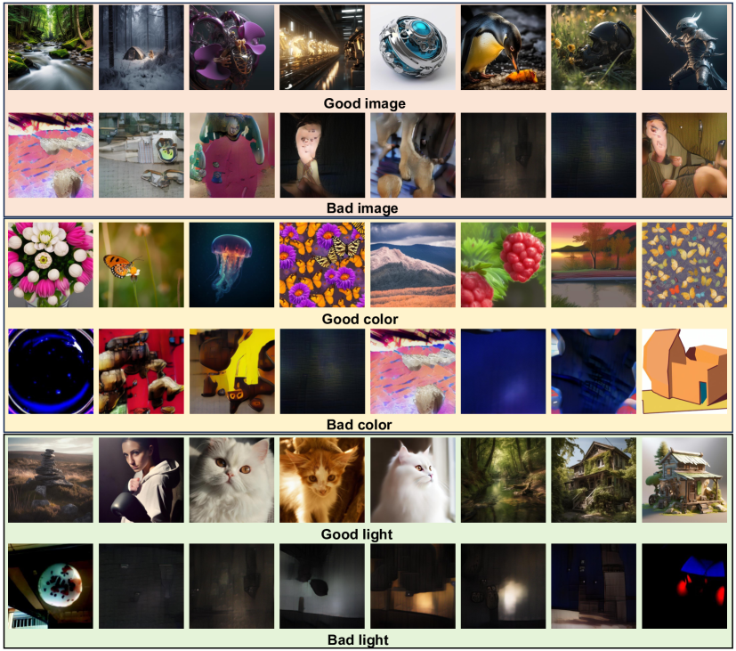

# UniQA：图像质量与美学评估的统一视觉-语言预训练模型

发布时间：2024年06月03日

`LLM应用

这篇论文主要探讨了如何利用大型语言模型（LLM）来提升图像质量与美学评估（IQA与IAA）任务的性能。论文中提出的UniQA模型通过使用LLM生成高质量的文本描述，并结合轻量级适配器来优化预训练模型的应用，从而在IQA和IAA任务上取得了显著的改进。这种方法展示了LLM在多模态任务中的应用潜力，特别是在处理视觉和语言数据结合的场景中。因此，这篇论文应归类为LLM应用。` `图像质量评估` `美学评估`

> UniQA: Unified Vision-Language Pre-training for Image Quality and Aesthetic Assessment

# 摘要

> 图像质量与美学评估（IQA 与 IAA）旨在模拟人类对图像视觉质量及美学吸引力的主观感受。现有方法因学习目标不同而独立处理这两项任务，却忽视了它们之间的内在联系，限制了共享表示的学习。为此，我们提出了统一视觉-语言预训练模型 UniQA，旨在同时提升两项任务的通用感知能力。针对 IQA 数据集缺乏文本描述及 IAA 数据集文本噪声问题，我们采用多模态大型语言模型生成高质量文本描述，并将其作为元数据净化 IAA 数据。此外，我们设计了一种轻量级适配器，以充分利用预训练模型的广泛知识，有效适应下游任务。实验结果显示，UniQA 在 IQA 和 IAA 任务上均达到新高度，同时展现出卓越的零-shot 和少量标签图像评估能力。源代码即将在 GitHub 上发布。

> Image Quality Assessment (IQA) and Image Aesthetic Assessment (IAA) aim to simulate human subjective perception of image visual quality and aesthetic appeal. Existing methods typically address these tasks independently due to distinct learning objectives. However, they neglect the underlying interconnectedness of both tasks, which hinders the learning of task-agnostic shared representations for human subjective perception. To confront this challenge, we propose Unified vision-language pre-training of Quality and Aesthetics (UniQA), to learn general perceptions of two tasks, thereby benefiting them simultaneously. Addressing the absence of text in the IQA datasets and the presence of textual noise in the IAA datasets, (1) we utilize multimodal large language models (MLLMs) to generate high-quality text descriptions; (2) the generated text for IAA serves as metadata to purify noisy IAA data. To effectively adapt the pre-trained UniQA to downstream tasks, we further propose a lightweight adapter that utilizes versatile cues to fully exploit the extensive knowledge of the pre-trained model. Extensive experiments demonstrate that our approach attains a new state-of-the-art performance on both IQA and IAA tasks, while concurrently showcasing exceptional zero-shot and few-label image assessment capabilities. The source code will be available at https://github.com/zht8506/UniQA.

[Arxiv](https://arxiv.org/abs/2406.01069)