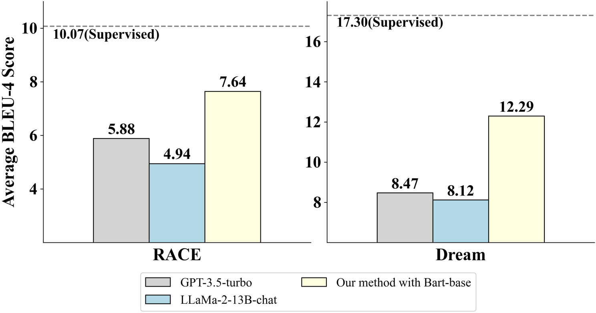
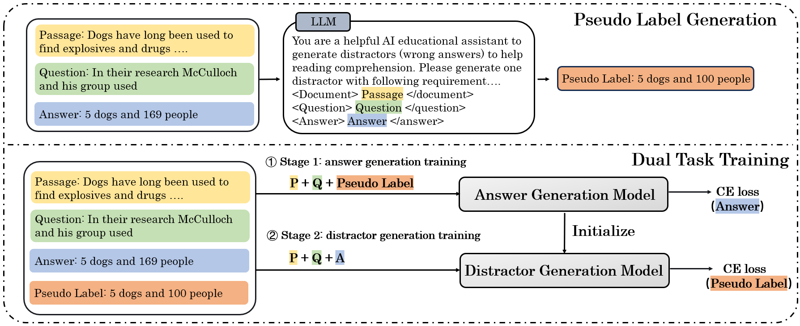
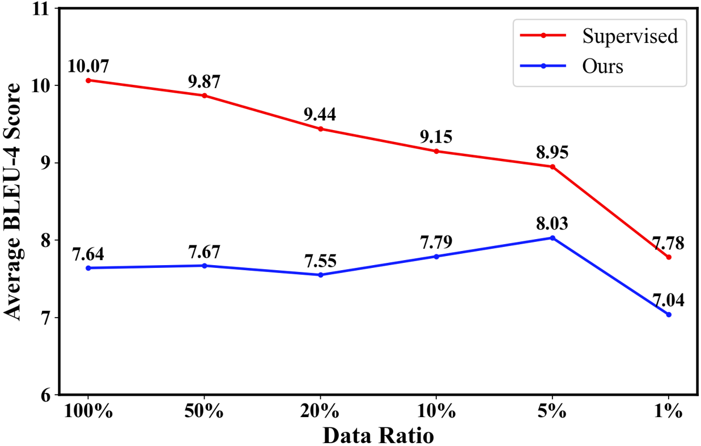
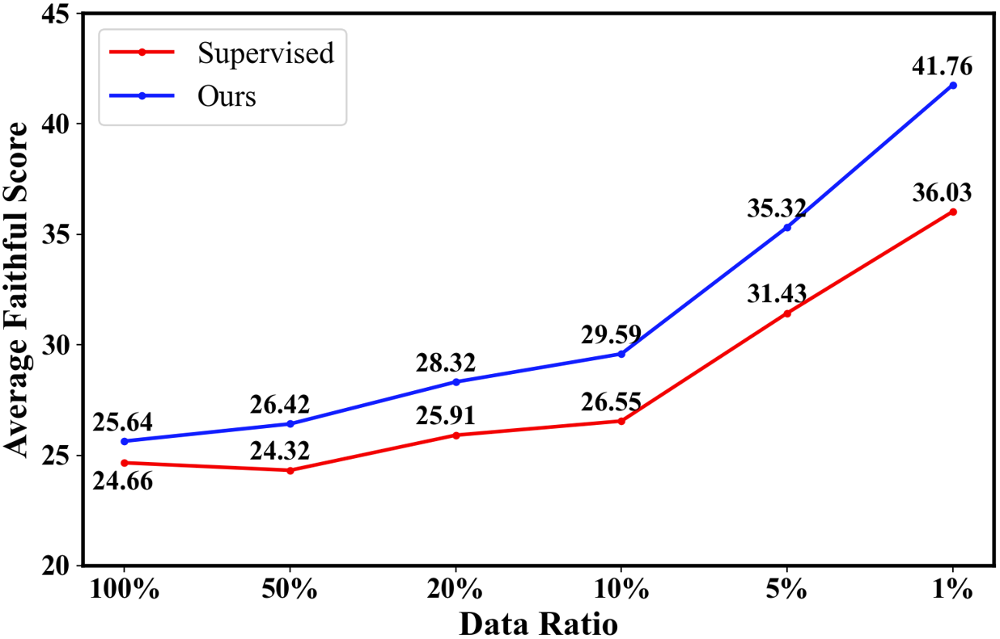

# 利用大型语言模型蒸馏与反事实对比解码技术，实现无监督干扰生成

发布时间：2024年06月03日

`LLM应用

这篇论文的摘要主要描述了一种利用大型语言模型（LLMs）来提升小型模型在阅读理解领域中干扰项生成（DG）能力的方法。通过提出一个无监督框架，并采用双任务训练策略和反事实对比解码机制，该方法能够在不依赖人工标注的情况下，有效地生成误导性选项。这种方法特别强调了经济性和效率，通过使用较小的模型参数实现了与大型模型相当的性能。因此，这篇论文的内容更偏向于LLM的具体应用，而不是理论研究或Agent、RAG相关的研究。` `阅读理解`

> Unsupervised Distractor Generation via Large Language Model Distilling and Counterfactual Contrastive Decoding

# 摘要

> 在阅读理解领域，干扰项生成（DG）旨在创造误导性选项。传统方法依赖人工标注，成本高昂。本文创新提出无监督框架，利用大型语言模型（LLMs）作为经济标注工具，提升小型模型的DG能力。我们采用双任务训练策略，结合LLMs的伪干扰项与原始答案，通过两阶段训练优化目标。同时，引入反事实对比解码机制，增强迷惑性。实验证明，我们的Bart-base无监督方法远超GPT-3.5-turbo，参数仅为其200分之一。此方法为阅读理解应用提供了一个高效、经济的解决方案，无需繁重的人工标注和昂贵的大型模型。

> Within the context of reading comprehension, the task of Distractor Generation (DG) aims to generate several incorrect options to confuse readers. Traditional supervised methods for DG rely heavily on expensive human-annotated distractor labels. In this paper, we propose an unsupervised DG framework, leveraging Large Language Models (LLMs) as cost-effective annotators to enhance the DG capability of smaller student models. Specially, to perform knowledge distilling, we propose a dual task training strategy that integrates pseudo distractors from LLMs and the original answer in-formation as the objective targets with a two-stage training process. Moreover, we devise a counterfactual contrastive decoding mechanism for increasing the distracting capability of the DG model. Experiments show that our unsupervised generation method with Bart-base greatly surpasses GPT-3.5-turbo performance with only 200 times fewer model parameters. Our proposed unsupervised DG method offers a cost-effective framework for practical reading comprehension applications, without the need of laborious distractor annotation and costly large-size models

[Arxiv](https://arxiv.org/abs/2406.01306)