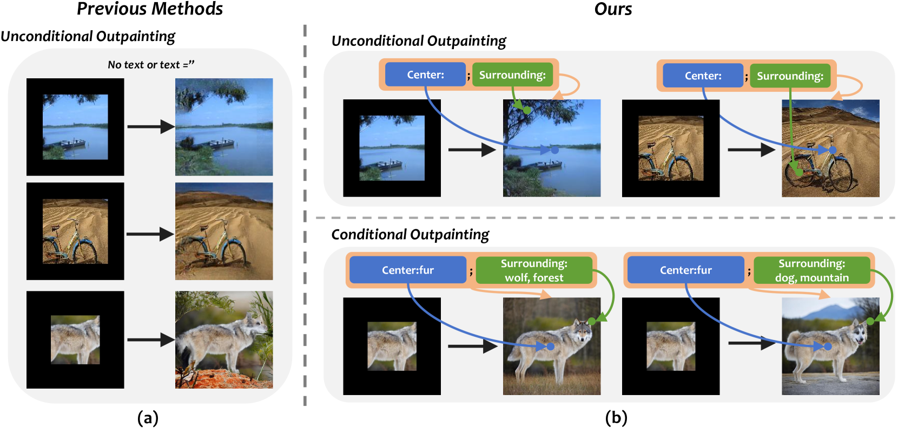
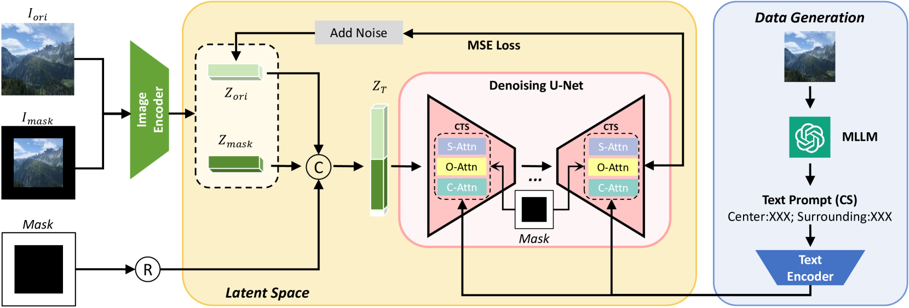
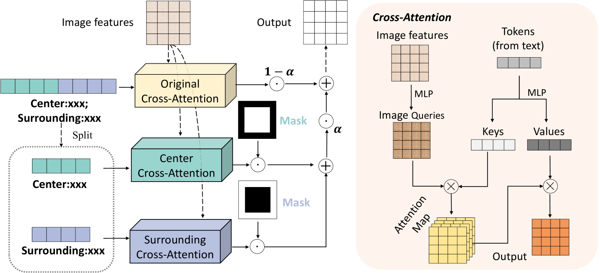
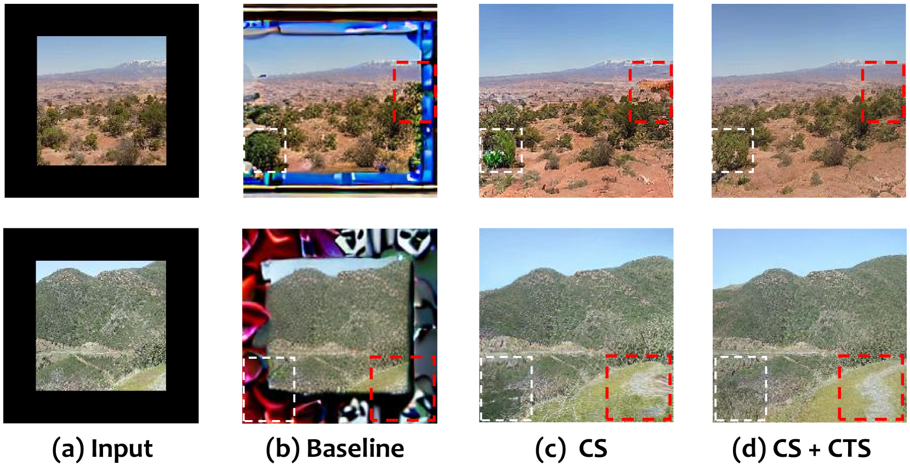
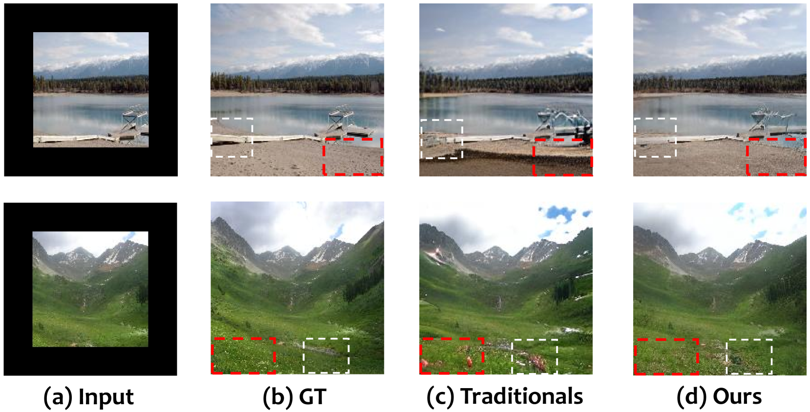
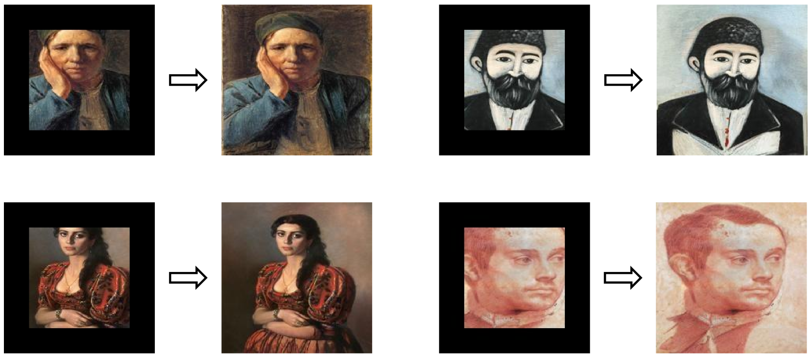
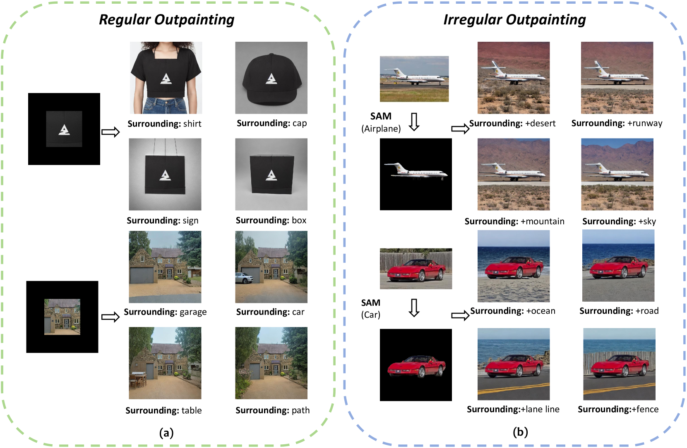
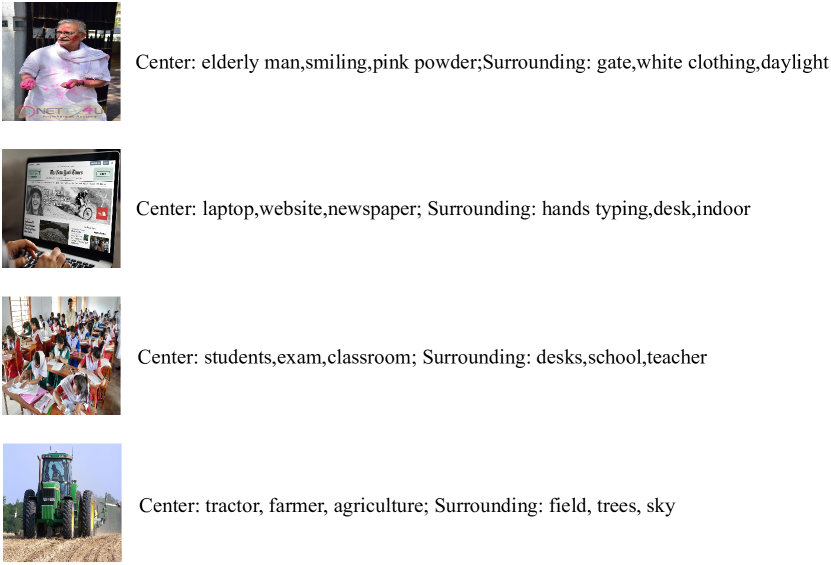
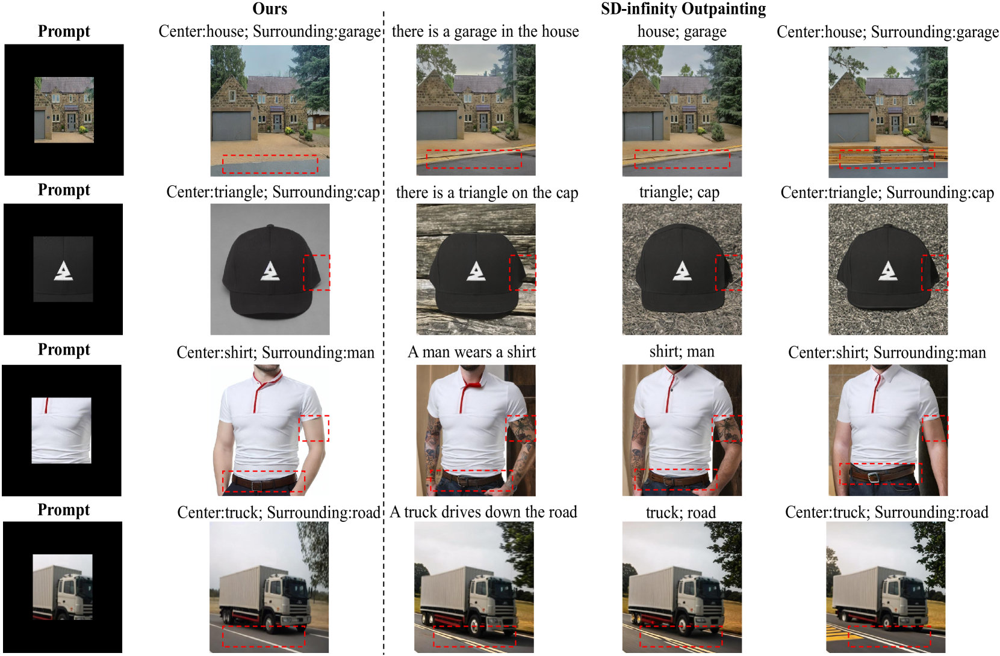
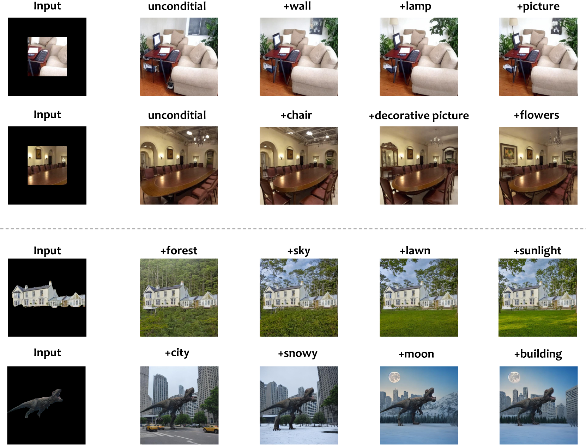

# VIP：多模态大型语言模型驱动下的全能图像外延技术

发布时间：2024年06月03日

`LLM应用

这篇论文探讨了图像外推技术，并提出了一种创新的框架，该框架利用多模态大型语言模型（MLLM）来自动提取图像的文本描述，并通过这些描述来定制图像的外推输出。这种方法特别强调了模型的定制化能力和资源效率，通过微调现有的稳定扩散模型而非从头训练来实现。因此，这项工作属于大型语言模型（LLM）的应用范畴，具体是在图像处理领域的应用。` `图像处理` `计算机视觉`

> VIP: Versatile Image Outpainting Empowered by Multimodal Large Language Model

# 摘要

> 本文探讨了图像外推技术，旨在根据图像中心内容扩展其周围部分。尽管已有研究取得进展，但缺乏灵活性和定制化限制了其实际应用范围。为此，我们提出了一种创新的图像外推框架，能根据用户需求定制输出。我们首先利用多模态大型语言模型（MLLM）自动提取图像遮罩与未遮罩部分的文本描述，进而通过这些文本提示赋予模型定制能力。特别地，我们设计了中心-总体-周围（CTS）交叉注意力模块，加强图像特定区域与文本提示间的交互。与多数方法不同，我们的方法高效利用资源，仅对现有稳定扩散（SD）模型进行微调，而非从头训练。实验结果显示，我们的模型在风景、建筑和WikiArt等数据集上超越了现有技术，并展示了其强大的定制化能力。

> In this paper, we focus on resolving the problem of image outpainting, which aims to extrapolate the surrounding parts given the center contents of an image. Although recent works have achieved promising performance, the lack of versatility and customization hinders their practical applications in broader scenarios. Therefore, this work presents a novel image outpainting framework that is capable of customizing the results according to the requirement of users. First of all, we take advantage of a Multimodal Large Language Model (MLLM) that automatically extracts and organizes the corresponding textual descriptions of the masked and unmasked part of a given image. Accordingly, the obtained text prompts are introduced to endow our model with the capacity to customize the outpainting results. In addition, a special Cross-Attention module, namely Center-Total-Surrounding (CTS), is elaborately designed to enhance further the the interaction between specific space regions of the image and corresponding parts of the text prompts. Note that unlike most existing methods, our approach is very resource-efficient since it is just slightly fine-tuned on the off-the-shelf stable diffusion (SD) model rather than being trained from scratch. Finally, the experimental results on three commonly used datasets, i.e. Scenery, Building, and WikiArt, demonstrate our model significantly surpasses the SoTA methods. Moreover, versatile outpainting results are listed to show its customized ability.

[Arxiv](https://arxiv.org/abs/2406.01059)