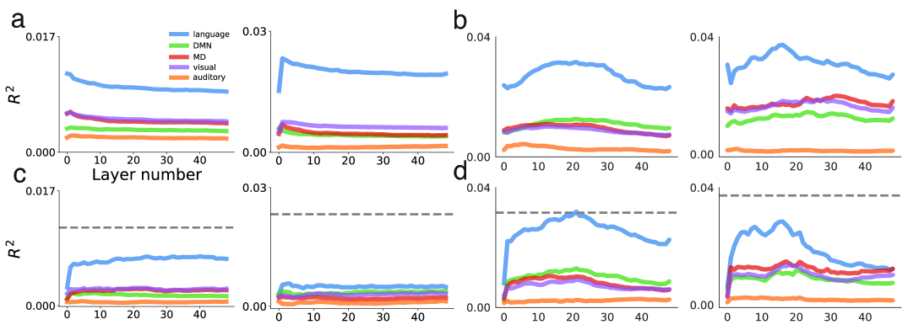

# 大型语言模型在人脑中的映射究竟是什么？本文质疑了过度依赖脑部评分的现象。

发布时间：2024年06月03日

`LLM理论

这篇论文主要探讨了大型语言模型（LLMs）与人类大脑在语言处理方面的相似性，特别是通过“脑分数”这一指标来评估模型预测神经信号的准确性。论文通过分析神经数据集，质疑了LLMs与人类大脑在计算原则上的共享程度，并指出过度依赖“脑分数”可能导致对LLMs与大脑相似性的误解。这一研究属于对LLMs理论层面的深入分析，因此应归类为LLM理论。` `神经科学` `语言模型`

> What Are Large Language Models Mapping to in the Brain? A Case Against Over-Reliance on Brain Scores

# 摘要

> 随着大型语言模型（LLMs）能力的显著提升，人们对其与人类大脑相似性的评估兴趣日益浓厚。一种评估方法是通过“脑分数”来衡量模型预测神经信号的准确性。LLMs的内部表示已达到顶尖水平，引发了对它们与人类语言处理共享计算原则的猜测。然而，这种推断仅在LLMs预测的神经活动反映语言处理核心元素时成立。我们通过分析三个关键的神经数据集，特别是参与者阅读短文的fMRI数据集，对此假设提出质疑。首先，我们发现，与先前研究中的随机分割不同，一个简单的时间自相关特征不仅超越了LLMs，还解释了大部分LLMs所解释的神经变异。因此，我们转向连续分割。其次，我们揭示了未训练的LLMs的高脑分数仅基于句子长度和位置这两个基本特征，这挑战了transformer架构使计算更接近大脑的观点。最后，我们发现，经过训练的LLMs的脑分数主要受句子长度、位置和静态词嵌入的影响，而一小部分由特定感知的嵌入和句子结构的上下文表示解释。这表明，过度依赖脑分数可能导致对LLMs与大脑相似性的误解，强调了深入分析LLMs在神经信号中映射内容的重要性。

> Given the remarkable capabilities of large language models (LLMs), there has been a growing interest in evaluating their similarity to the human brain. One approach towards quantifying this similarity is by measuring how well a model predicts neural signals, also called "brain score". Internal representations from LLMs achieve state-of-the-art brain scores, leading to speculation that they share computational principles with human language processing. This inference is only valid if the subset of neural activity predicted by LLMs reflects core elements of language processing. Here, we question this assumption by analyzing three neural datasets used in an impactful study on LLM-to-brain mappings, with a particular focus on an fMRI dataset where participants read short passages. We first find that when using shuffled train-test splits, as done in previous studies with these datasets, a trivial feature that encodes temporal autocorrelation not only outperforms LLMs but also accounts for the majority of neural variance that LLMs explain. We therefore use contiguous splits moving forward. Second, we explain the surprisingly high brain scores of untrained LLMs by showing they do not account for additional neural variance beyond two simple features: sentence length and sentence position. This undermines evidence used to claim that the transformer architecture biases computations to be more brain-like. Third, we find that brain scores of trained LLMs on this dataset can largely be explained by sentence length, position, and pronoun-dereferenced static word embeddings; a small, additional amount is explained by sense-specific embeddings and contextual representations of sentence structure. We conclude that over-reliance on brain scores can lead to over-interpretations of similarity between LLMs and brains, and emphasize the importance of deconstructing what LLMs are mapping to in neural signals.

[Arxiv](https://arxiv.org/abs/2406.01538)