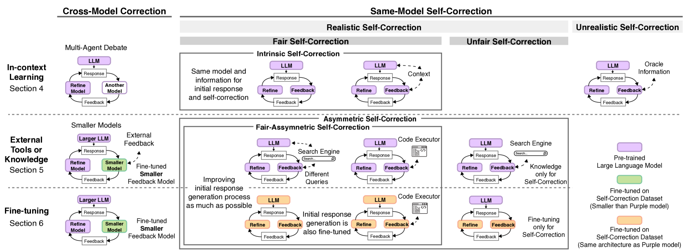

# 大型语言模型何时能自我纠错？一份关于LLMs自我修正能力的深度审视

发布时间：2024年06月03日

`LLM理论

这篇论文主要探讨了大型语言模型（LLMs）的自我修正机制，分析了现有研究的不足，并提出了改进的实验设计方法。它关注的是LLMs的理论和方法论问题，特别是自我修正的实现条件和效果评估。因此，它属于LLM理论分类。` `人工智能`

> When Can LLMs Actually Correct Their Own Mistakes? A Critical Survey of Self-Correction of LLMs

# 摘要

> 自我修正是一种利用大型语言模型（LLMs）在推理过程中优化输出的策略。尽管已有多种自我修正框架被提出，利用了自我评估和外部反馈等不同反馈源，但关于LLMs何时能自我纠错的问题仍未有定论，近期研究甚至出现了负面结果。本研究深入分析了相关文献，探讨了实现有效自我修正的条件。我们发现，以往研究往往未能明确界定研究问题，且常采用不切实际的框架或不公平的评估，过度夸大了自我修正的效果。为此，我们对自我修正的研究问题进行了分类，并提供了一套设计实验的检查清单。我们的批判性分析揭示了以下几点：(1) 目前尚无研究在通用任务中证明通过提示LLMs反馈实现成功的自我修正；(2) 在能获取可靠外部反馈的任务中，自我修正表现出色；(3) 大规模微调是实现自我修正的关键。

> Self-correction is an approach to improving responses from large language models (LLMs) by refining the responses using LLMs during inference. Prior work has proposed various self-correction frameworks using different sources of feedback, including self-evaluation and external feedback. However, there is still no consensus on the question of when LLMs can correct their own mistakes, as recent studies also report negative results. In this work, we critically survey broad papers and discuss the conditions required for successful self-correction. We first find that prior studies often do not define their research questions in detail and involve impractical frameworks or unfair evaluations that over-evaluate self-correction. To tackle these issues, we categorize research questions in self-correction research and provide a checklist for designing appropriate experiments. Our critical survey based on the newly categorized research questions shows that (1) no prior work demonstrates successful self-correction with feedback from prompted LLMs in general tasks, (2) self-correction works well in tasks that can use reliable external feedback, and (3) large-scale fine-tuning enables self-correction.

[Arxiv](https://arxiv.org/abs/2406.01297)