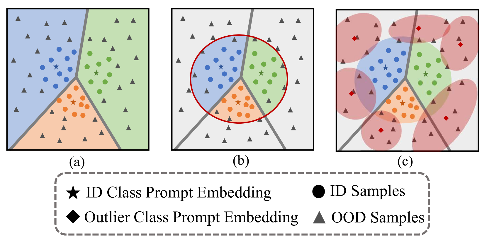
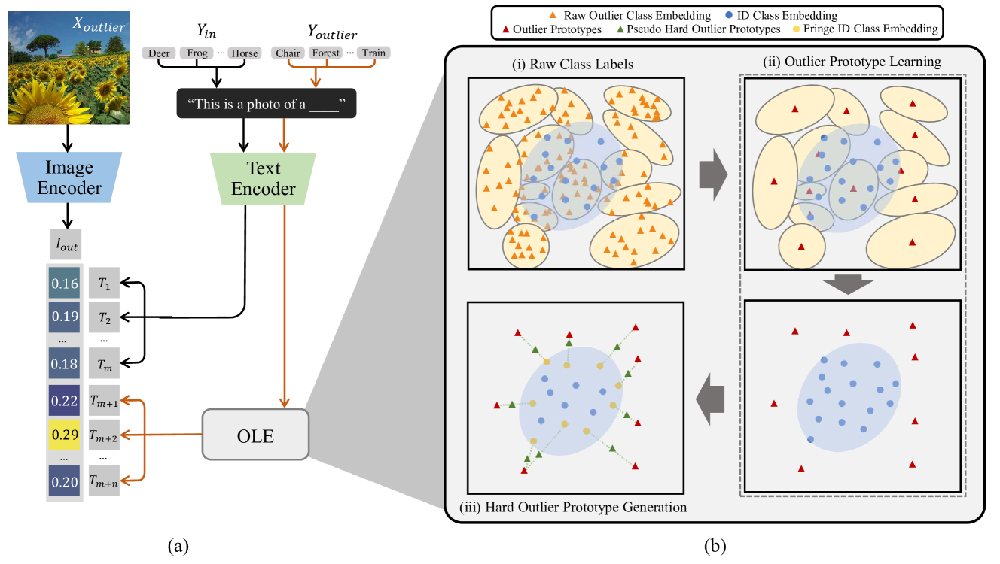
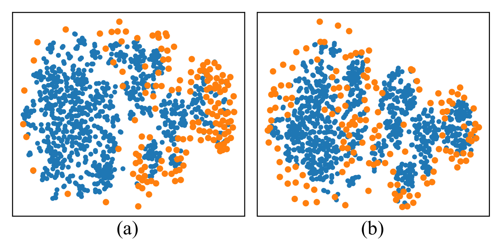
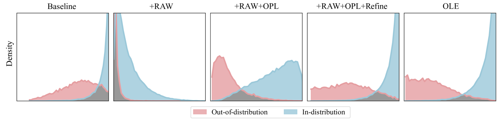
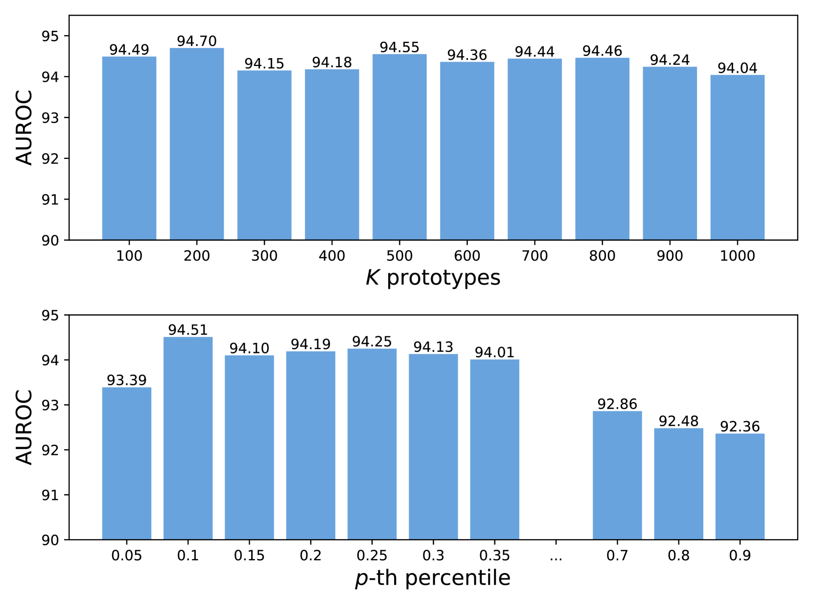

# 借助异常标签暴露实现零-shot分布外检测

发布时间：2024年06月03日

`Agent

这篇论文主要探讨了如何增强视觉-语言模型（如CLIP）在面对分布外（OOD）输入时的安全性，提出了一种新的策略——异常标签暴露（OLE），并通过实验验证了其有效性。虽然涉及到了模型的应用，但其核心在于提出并验证一种新的模型安全策略，更偏向于模型自身的改进和优化，因此归类为Agent。` `计算机视觉` `异常检测`

> Zero-Shot Out-of-Distribution Detection with Outlier Label Exposure

# 摘要

> 视觉-语言模型如CLIP在零样本任务中表现卓越，但如何确保其在面对分布外（OOD）输入时的安全性成为关键问题。现有方法多依赖ID类别标签提示CLIP区分ID与OOD图像。我们提出一种新策略——异常标签暴露（OLE），通过大量辅助异常类别标签作为提示，增强CLIP的OOD检测能力。我们发现，ID图像与异常类别提示的相似度通常低于OOD图像，但原始类别标签中的噪声（如同义词）会影响检测效果。为此，我们设计了异常原型学习模块，利用异常标签的嵌入学习关键原型，以提高OOD评分准确性。同时，通过异常标签生成模块，我们合成了介于ID与OOD之间的原型，进一步优化了OLE的检测精度。实验证明，OLE不仅简便高效，还在大规模和困难OOD检测任务中刷新了性能记录。

> As vision-language models like CLIP are widely applied to zero-shot tasks and gain remarkable performance on in-distribution (ID) data, detecting and rejecting out-of-distribution (OOD) inputs in the zero-shot setting have become crucial for ensuring the safety of using such models on the fly. Most existing zero-shot OOD detectors rely on ID class label-based prompts to guide CLIP in classifying ID images and rejecting OOD images. In this work we instead propose to leverage a large set of diverse auxiliary outlier class labels as pseudo OOD class text prompts to CLIP for enhancing zero-shot OOD detection, an approach we called Outlier Label Exposure (OLE). The key intuition is that ID images are expected to have lower similarity to these outlier class prompts than OOD images. One issue is that raw class labels often include noise labels, e.g., synonyms of ID labels, rendering raw OLE-based detection ineffective. To address this issue, we introduce an outlier prototype learning module that utilizes the prompt embeddings of the outlier labels to learn a small set of pivotal outlier prototypes for an embedding similarity-based OOD scoring. Additionally, the outlier classes and their prototypes can be loosely coupled with the ID classes, leading to an inseparable decision region between them. Thus, we also introduce an outlier label generation module that synthesizes our outlier prototypes and ID class embeddings to generate in-between outlier prototypes to further calibrate the detection in OLE. Despite its simplicity, extensive experiments show that OLE substantially improves detection performance and achieves new state-of-the-art performance in large-scale OOD and hard OOD detection benchmarks.

[Arxiv](https://arxiv.org/abs/2406.01170)