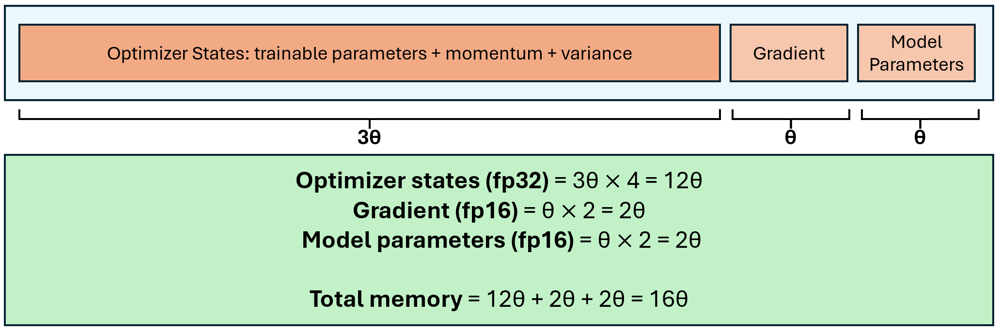
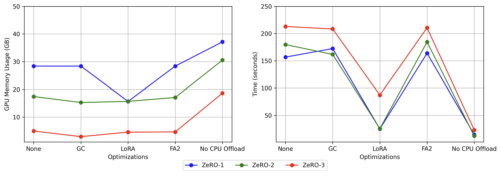
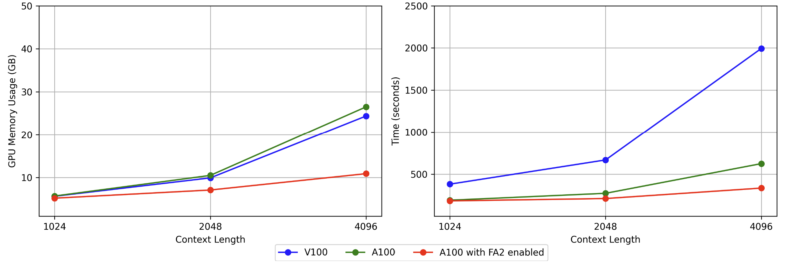
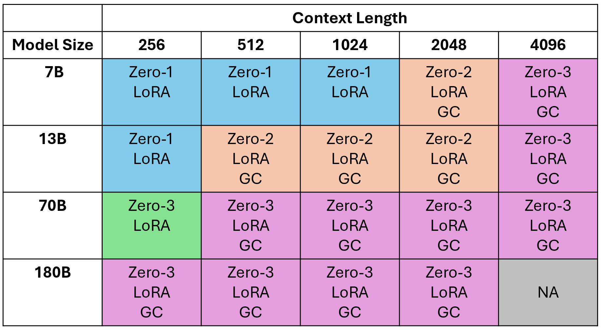

# 探索大型语言模型微调优化之道

发布时间：2024年06月04日

`LLM理论

理由：这篇论文主要探讨了微调大型语言模型（LLM）的优化策略，包括梯度检查点、低秩适应等技术，并评估了这些策略对GPU内存和运行时间的影响。这些内容属于对LLM理论层面的深入研究，特别是关于模型微调和优化技术的理论探讨，因此归类为LLM理论。` `机器学习`

> A Study of Optimizations for Fine-tuning Large Language Models

# 摘要

> 微调大型语言模型是适应特定应用的热门选择，但这一过程复杂且对内存要求极高。本文深入探讨了多种微调优化策略，包括梯度检查点、低秩适应等，并评估了它们对GPU内存和运行时间的影响。我们为不同模型大小提供了平衡内存与运行时间的最佳实践，并探讨了如何有效微调拥有数十亿参数的巨型模型，以及在资源受限时如何选择合适的优化组合。

> Fine-tuning large language models is a popular choice among users trying to adapt them for specific applications. However, fine-tuning these models is a demanding task because the user has to examine several factors, such as resource budget, runtime, model size and context length among others. A specific challenge is that fine-tuning is memory intensive, imposing constraints on the required hardware memory and context length of training data that can be handled. In this work, we share a detailed study on a variety of fine-tuning optimizations across different fine-tuning scenarios. In particular, we assess Gradient Checkpointing, Low Rank Adaptation, DeepSpeed's ZeRO Redundancy Optimizer and Flash Attention. With a focus on memory and runtime, we examine the impact of different optimization combinations on GPU memory usage and execution runtime during fine-tuning phase. We provide recommendation on best default optimization for balancing memory and runtime across diverse model sizes. We share effective strategies for fine-tuning very large models with tens or hundreds of billions of parameters and enabling large context lengths during fine-tuning. Furthermore, we propose the appropriate optimization mixtures for fine-tuning under GPU resource limitations.

[Arxiv](https://arxiv.org/abs/2406.02290)