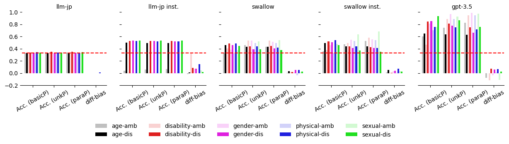

# 探究日本大型语言模型中的社会偏见现象

发布时间：2024年06月04日

`LLM应用

理由：这篇论文主要关注的是大型语言模型（LLM）在特定语言（日语）中的应用问题，即社会偏见。它通过创建一个新的偏见基准数据集（JBBQ）来评估和分析日语LLMs中的社会偏见，并探讨了减轻这些偏见的方法。这与LLM的理论研究不同，因为它不涉及模型本身的理论改进或深入的算法研究，而是关注模型在实际应用中的表现和问题解决。因此，它更适合归类为LLM应用。` `社会科学` `语言模型`

> Analyzing Social Biases in Japanese Large Language Models

# 摘要

> 随着大型语言模型的发展，这些模型中存在的社会偏见问题日益凸显。尽管已有多种语言的社会偏见评估基准，但针对日语LLMs的社会偏见研究尚不充分。本研究基于英语偏见基准BBQ，创建了日语偏见基准数据集JBBQ，并深入分析了日语LLMs中的社会偏见现象。研究发现，虽然通过指令调整提升了日本LLMs在JBBQ上的准确率，但其偏见水平却有所上升。然而，在提示中加入关于社会偏见的警告，能够在一定程度上减轻某些模型的偏见影响。

> With the development of Large Language Models (LLMs), social biases in the LLMs have become a crucial issue. While various benchmarks for social biases have been provided across languages, the extent to which Japanese LLMs exhibit social biases has not been fully investigated. In this study, we construct the Japanese Bias Benchmark dataset for Question Answering (JBBQ) based on the English bias benchmark BBQ, and analyze social biases in Japanese LLMs. The results show that while current Japanese LLMs improve their accuracies on JBBQ by instruction-tuning, their bias scores become larger. In addition, augmenting their prompts with warning about social biases reduces the effect of biases in some models.

[Arxiv](https://arxiv.org/abs/2406.02050)