# 探究大型语言模型如何应对时间复杂事件？这一基准旨在深入理解时间与长上下文的关系。

发布时间：2024年06月04日

`RAG

理由：这篇论文主要关注的是使用检索增强生成（RAG）技术来处理时间复杂事件（TCE），并设立了TCELongBench基准来测试LLMs在处理时间动态和理解长篇文本方面的能力。虽然涉及到了大型语言模型（LLMs），但重点在于RAG技术的应用，而不是LLM的理论研究或作为代理（Agent）的应用。因此，最合适的分类是RAG。` `新闻分析` `时间序列分析`

> Analyzing Temporal Complex Events with Large Language Models? A Benchmark towards Temporal, Long Context Understanding

# 摘要

> 随着在线新闻量的激增，数字环境正迅速演变，迫切需要对复杂事件进行即时的精准分析。我们将这类由多篇新闻文章组成、时间跨度较长的复杂事件定义为时间复杂事件（TCE）。本文创新性地运用大型语言模型（LLMs），系统地提取并分析TCE中的事件链，特别关注其关键节点和时间标记。为此，我们设立了TCELongBench基准，旨在检验LLMs在处理时间动态和理解长篇文本方面的能力。该基准涵盖了阅读理解、时间序列分析和未来事件预测三大任务。实验中，我们采用了检索增强生成（RAG）技术及具备长上下文窗口的LLMs，以应对TCE中的长篇新闻。研究结果显示，配备高效检索器的模型与依赖长上下文窗口的模型在性能上不相上下。

> The digital landscape is rapidly evolving with an ever-increasing volume of online news, emphasizing the need for swift and precise analysis of complex events. We refer to the complex events composed of many news articles over an extended period as Temporal Complex Event (TCE). This paper proposes a novel approach using Large Language Models (LLMs) to systematically extract and analyze the event chain within TCE, characterized by their key points and timestamps. We establish a benchmark, named TCELongBench, to evaluate the proficiency of LLMs in handling temporal dynamics and understanding extensive text. This benchmark encompasses three distinct tasks - reading comprehension, temporal sequencing, and future event forecasting. In the experiment, we leverage retrieval-augmented generation (RAG) method and LLMs with long context window to deal with lengthy news articles of TCE. Our findings indicate that models with suitable retrievers exhibit comparable performance with those utilizing long context window.

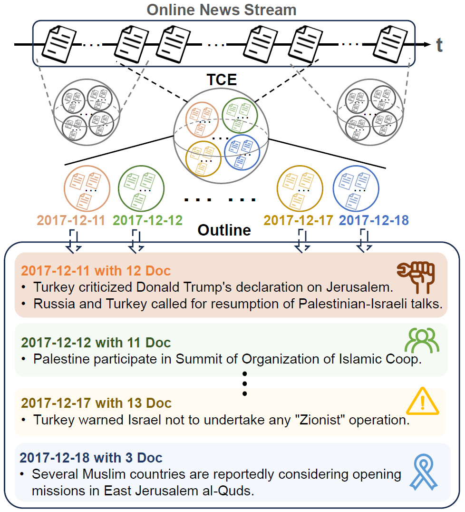

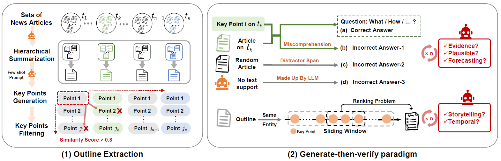

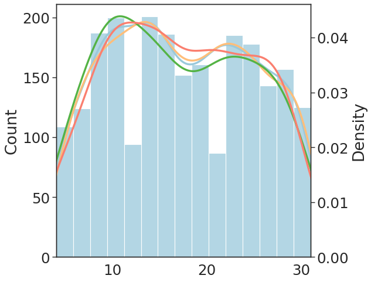

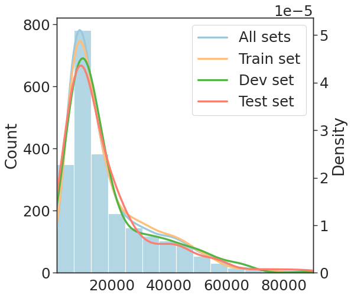

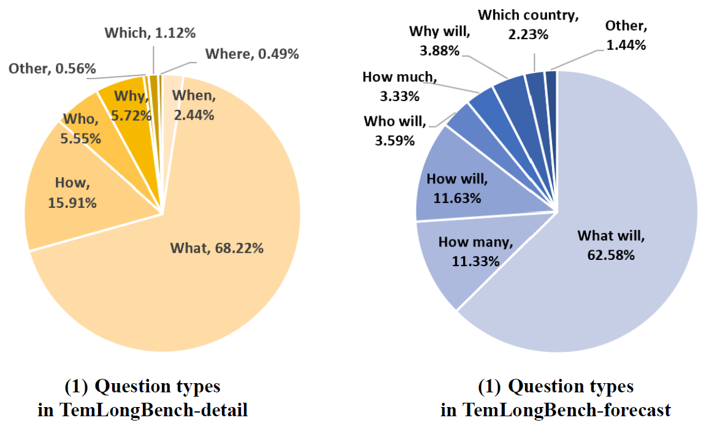

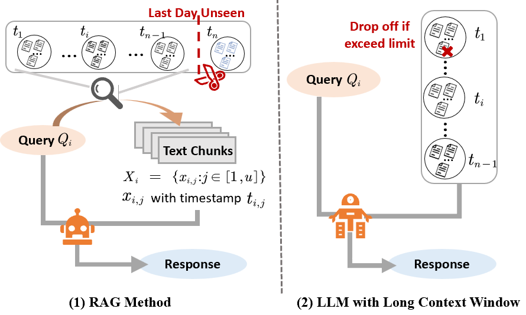

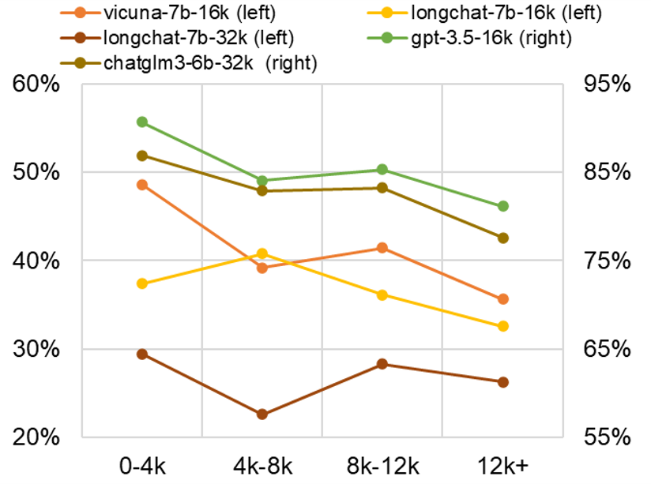

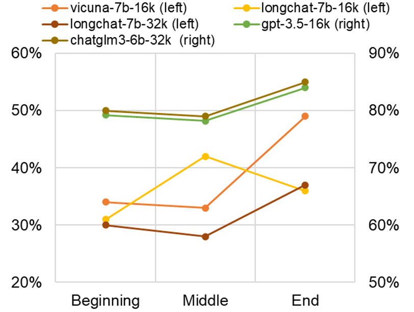

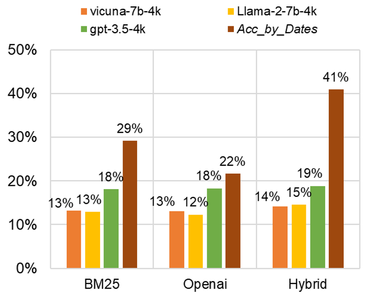

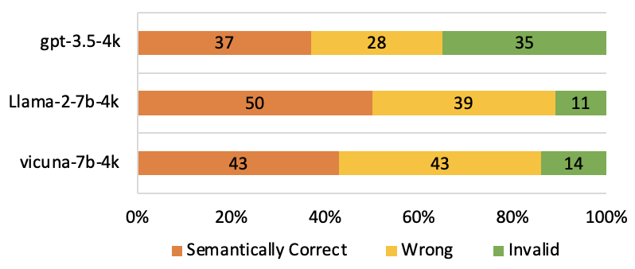

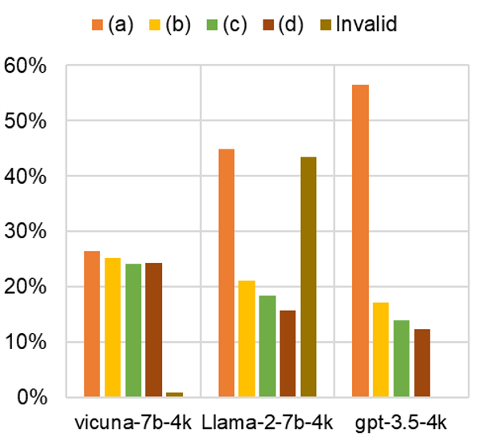

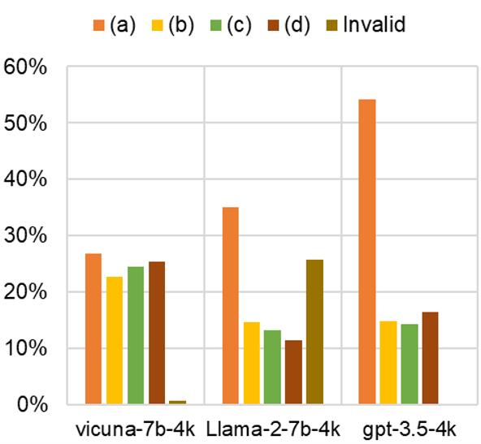

[Arxiv](https://arxiv.org/abs/2406.02472)