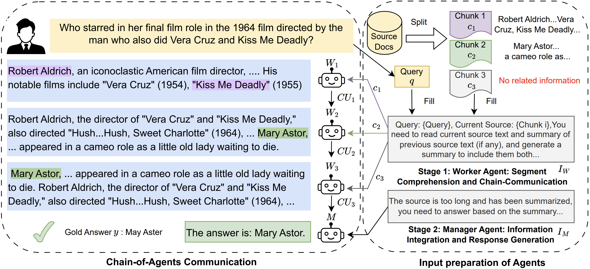
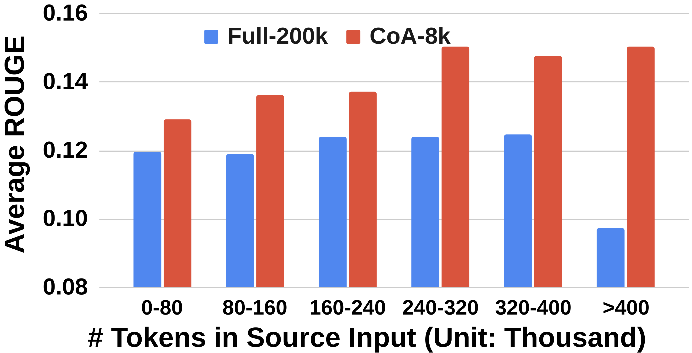
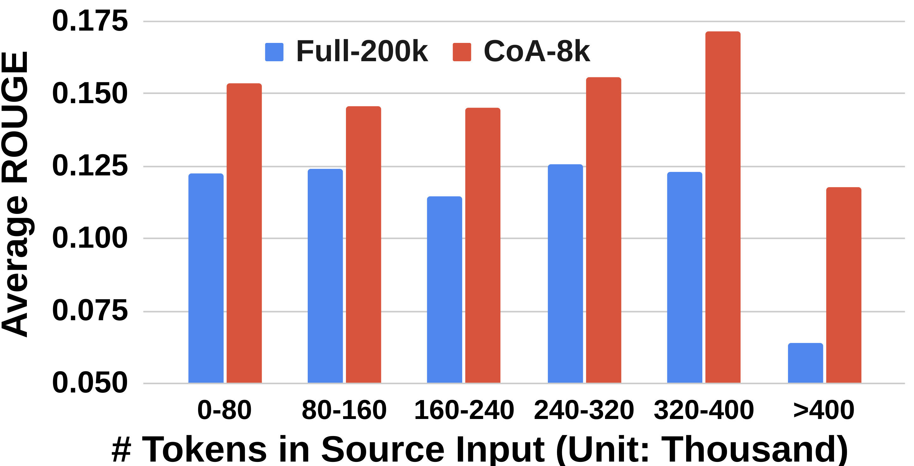
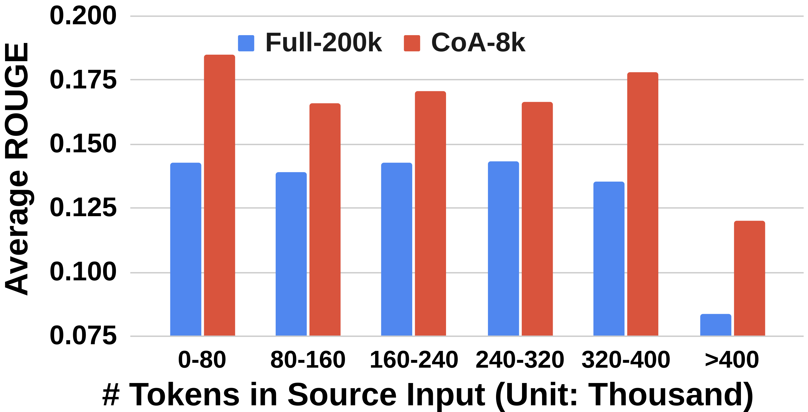
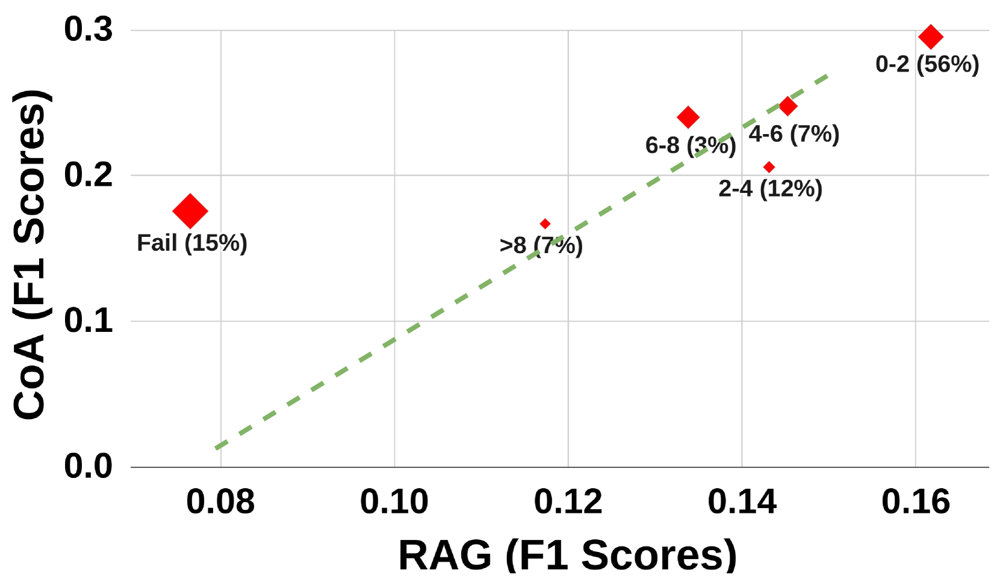
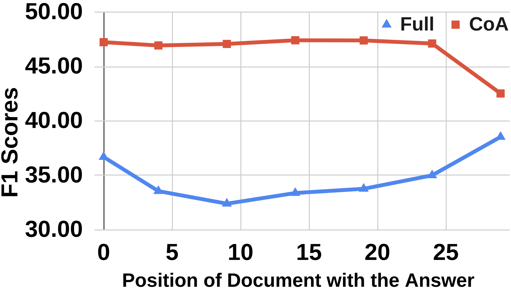
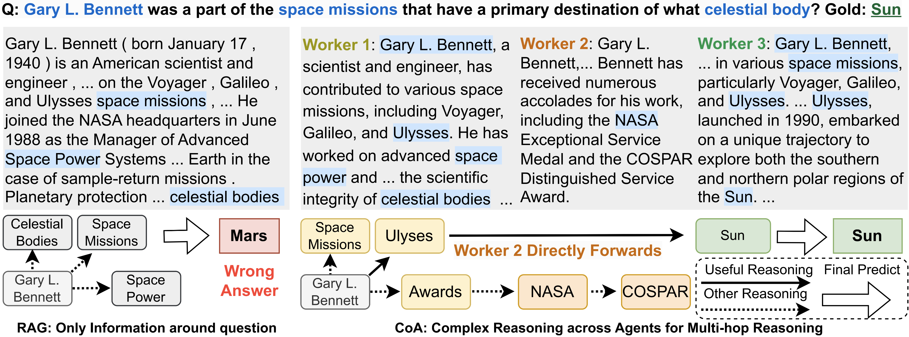
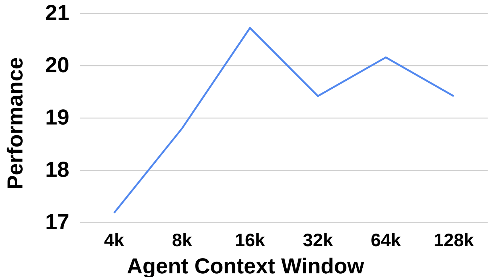

# 代理协作链：大型语言模型联手应对长上下文任务挑战

发布时间：2024年06月04日

`Agent

理由：这篇论文介绍了一个名为“链式代理（CoA）”的框架，该框架通过多个代理的协作来处理长上下文任务。这种多代理系统的设计和应用属于Agent的范畴，因为它们是作为独立的实体在系统中执行任务和进行交互。论文中提到的代理之间的协作和信息聚合，以及它们在处理长上下文任务中的应用，都是Agent研究的核心内容。因此，这篇论文应归类于Agent。` `人工智能`

> Chain of Agents: Large Language Models Collaborating on Long-Context Tasks

# 摘要

> 处理长上下文已成为大型语言模型（LLMs）的一大挑战。现有策略包括减少输入长度和扩展上下文窗口，但各有不足。为此，我们提出了链式代理（CoA）框架，通过多代理协作，利用自然语言在长上下文任务中实现信息聚合和推理。CoA中的多个工作代理依次交流，处理文本片段，再由管理代理整合成连贯输出。通过交替阅读和推理，并为每个代理分配短上下文，CoA有效解决了长上下文关注问题。在问答、摘要和代码完成等任务中，CoA的性能比现有技术提高了高达10%。

> Addressing the challenge of effectively processing long contexts has become a critical issue for Large Language Models (LLMs). Two common strategies have emerged: 1) reducing the input length, such as retrieving relevant chunks by Retrieval-Augmented Generation (RAG), and 2) expanding the context window limit of LLMs. However, both strategies have drawbacks: input reduction has no guarantee of covering the part with needed information, while window extension struggles with focusing on the pertinent information for solving the task. To mitigate these limitations, we propose Chain-of-Agents (CoA), a novel framework that harnesses multi-agent collaboration through natural language to enable information aggregation and context reasoning across various LLMs over long-context tasks. CoA consists of multiple worker agents who sequentially communicate to handle different segmented portions of the text, followed by a manager agent who synthesizes these contributions into a coherent final output. CoA processes the entire input by interleaving reading and reasoning, and it mitigates long context focus issues by assigning each agent a short context. We perform comprehensive evaluation of CoA on a wide range of long-context tasks in question answering, summarization, and code completion, demonstrating significant improvements by up to 10% over strong baselines of RAG, Full-Context, and multi-agent LLMs.

[Arxiv](https://arxiv.org/abs/2406.02818)