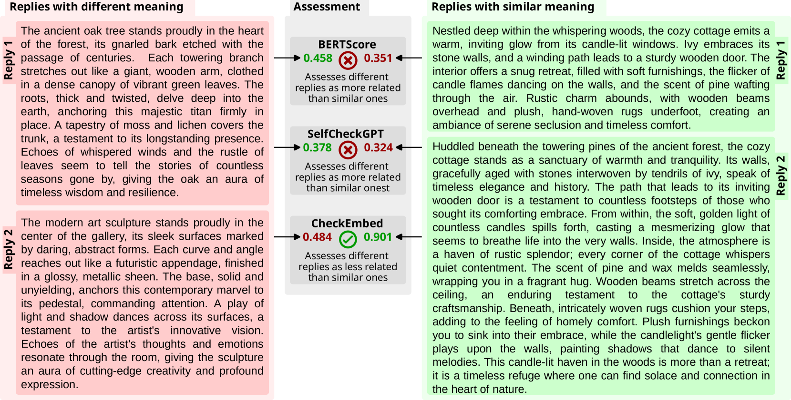
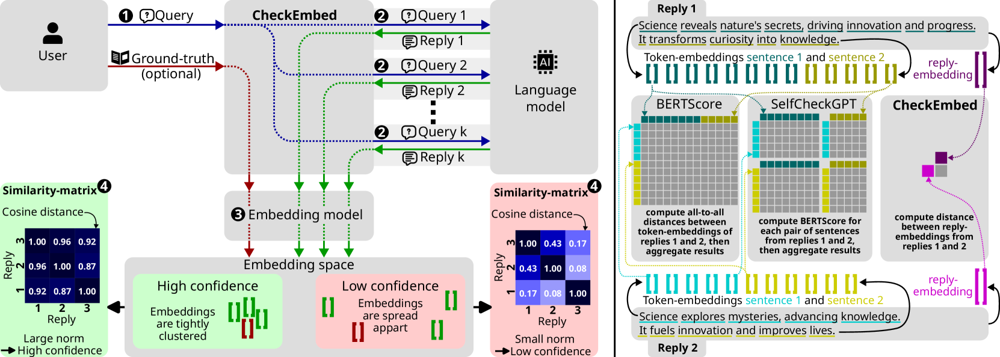
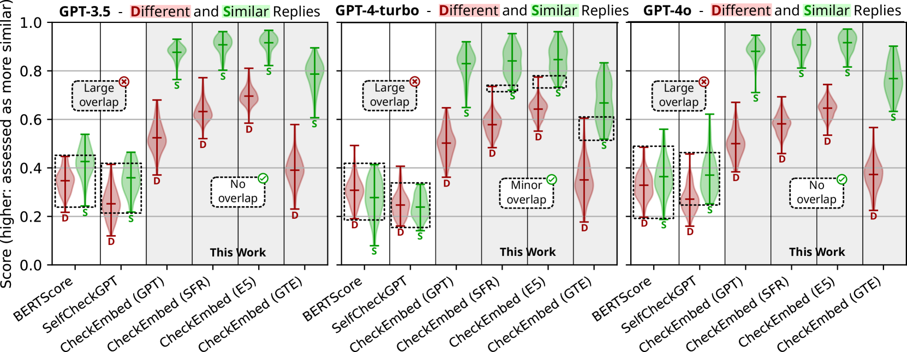
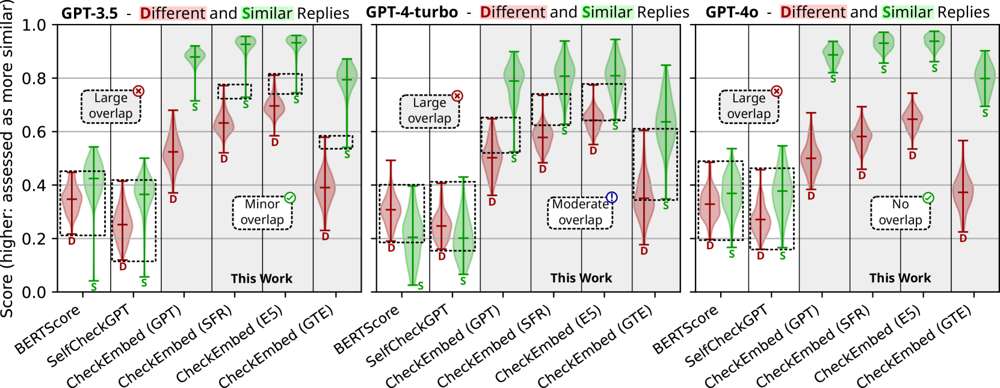
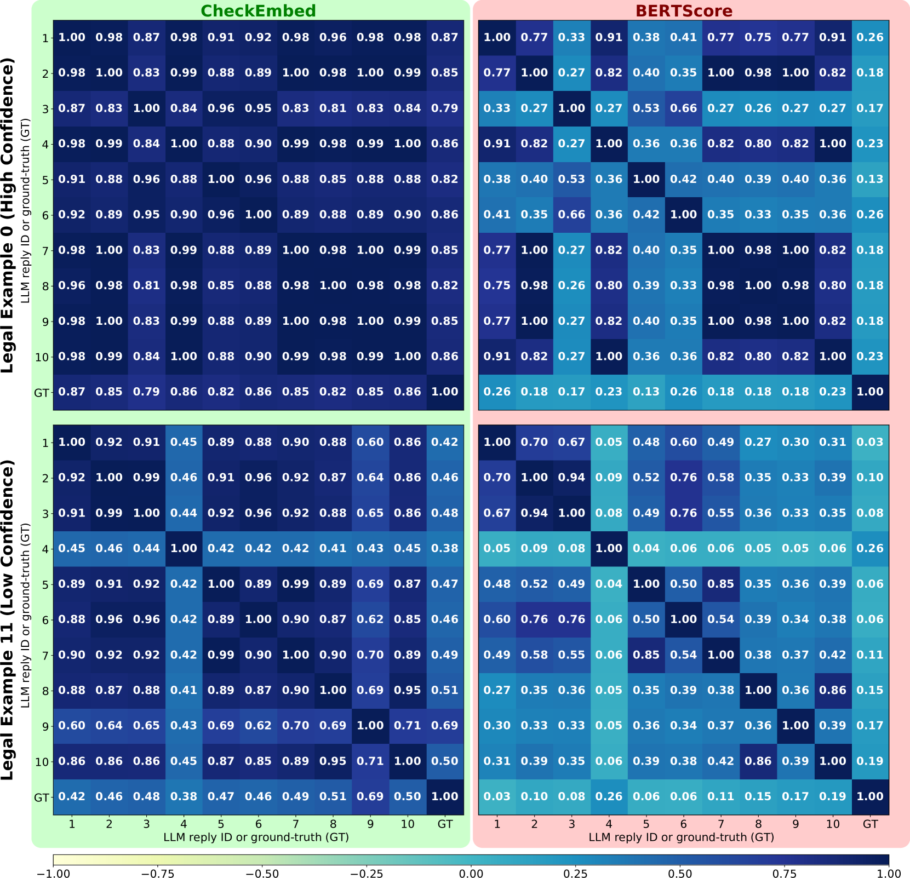
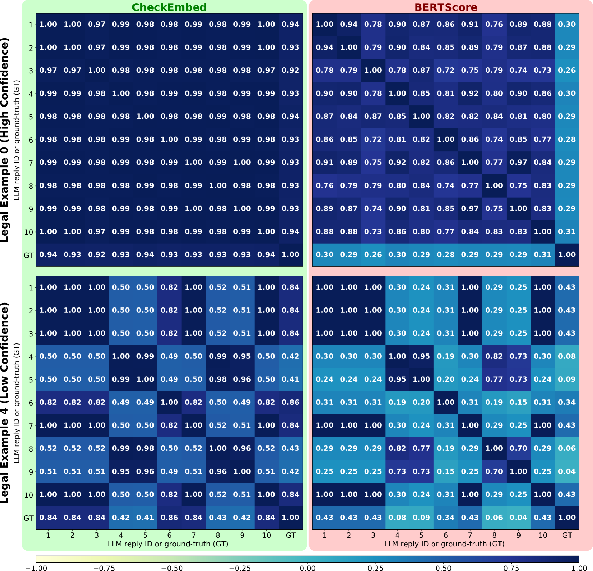
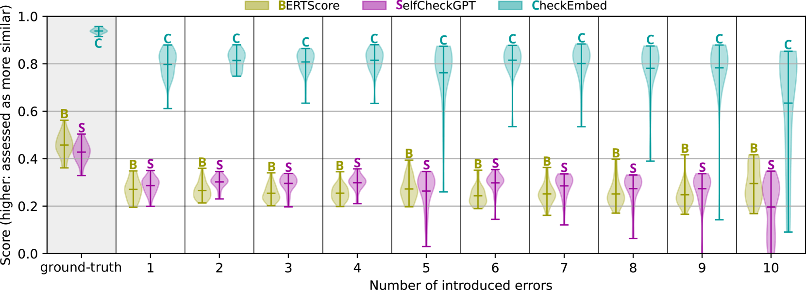
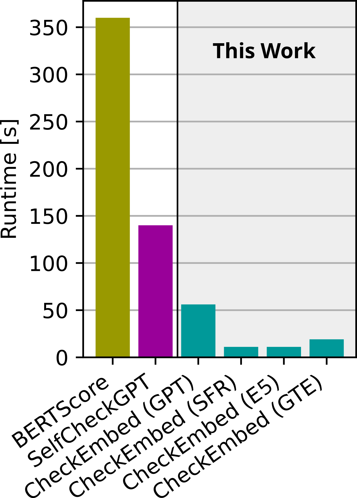

# CheckEmbed：大型语言模型开放式任务解决方案的有效验证工具

发布时间：2024年06月04日

`LLM应用

这篇论文介绍了一种名为CheckEmbed的验证方法，用于评估大型语言模型（LLMs）在复杂开放式任务中的答案准确性。该方法通过使用模型如GPT Text Embedding Large来获取答案级嵌入，并比较这些嵌入以验证LLM的答案。这种方法简化了文本验证过程，使其更为直接和高效。论文还构建了一个全面的验证流程，并提供了评估指标来判断LLM答案的真实性。在实际应用中，如术语提取和文档摘要，CheckEmbed方法显示出了优于现有方案的性能。因此，这篇论文属于LLM应用类别，因为它专注于开发和应用特定的技术来改进LLM的实际使用效果。` `文档分析` `知识验证`

> CheckEmbed: Effective Verification of LLM Solutions to Open-Ended Tasks

# 摘要

> 大型语言模型（LLMs）正革新多个领域，但验证其答案仍是一大挑战，尤其是在知识整合、总结和提取等复杂开放式任务中。为此，我们提出了CheckEmbed：一种既准确又可扩展且操作简便的LLM验证方法。CheckEmbed的核心理念简洁而高效：通过使用GPT Text Embedding Large等模型获取答案级嵌入，我们可以轻松比较LLM解决方案之间或与真实答案的差异。这一方法将复杂文本简化为单一嵌入，使得验证过程直接、迅速且富有意义。我们构建了一个全面的验证流程，采用CheckEmbed方法，并配备了评估LLM答案真实性的指标，如嵌入热图及其摘要。通过这些指标，我们能够部署实用引擎，判断LLM答案是否达标。在实际文档分析任务中，如术语提取和文档摘要，CheckEmbed流程展现了在准确性、成本效益和运行效率上对现有方案（如BERTScore或SelfCheckGPT）的显著超越。

> Large Language Models (LLMs) are revolutionizing various domains, yet verifying their answers remains a significant challenge, especially for intricate open-ended tasks such as consolidation, summarization, and extraction of knowledge. In this work, we propose CheckEmbed: an accurate, scalable, and simple LLM verification approach. CheckEmbed is driven by a straightforward yet powerful idea: in order to compare LLM solutions to one another or to the ground-truth, compare their corresponding answer-level embeddings obtained with a model such as GPT Text Embedding Large. This reduces a complex textual answer to a single embedding, facilitating straightforward, fast, and meaningful verification. We develop a comprehensive verification pipeline implementing the CheckEmbed methodology. The CheckEmbed pipeline also comes with metrics for assessing the truthfulness of the LLM answers, such as embedding heatmaps and their summaries. We show how to use these metrics for deploying practical engines that decide whether an LLM answer is satisfactory or not. We apply the pipeline to real-world document analysis tasks, including term extraction and document summarization, showcasing significant improvements in accuracy, cost-effectiveness, and runtime performance compared to existing token-, sentence-, and fact-level schemes such as BERTScore or SelfCheckGPT.

[Arxiv](https://arxiv.org/abs/2406.02524)